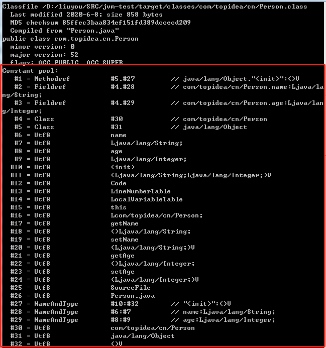

###Class文件结构

class文件结构说明
	 	 	
|类型|名称|数量|描述|
|---|---|---|---|
|u4|magic|1|魔数|
|u2|minor_version|1|次版本号|
|u2|major_version|1|主版本号|
|u2|constant_pool_count|1|常量个数|
|cp_info|constant_pool|constant_pool_count - 1|具体常量
|u2|access_flags|1|访问标志|
|u2|this_class|1|类索引|
|u2|super_class|1|父类索引|
|u2|interfaces_count|1|接口索引|
|u2|interfaces|interfaces_count|具体接口|
|u2|fields_count|1|字段个数|
|field_info|fields|fields_count|具体字段|
|u2|methods_count|1|方法个数|
|method_info|methods|methods_count|具体方法|
|u2|attributes_count|1|属性个数|
|attribute_info|attributes|attributes_count|具体属性|

常量池

|类型|名称|数量|
|---|---|---|
|CONSTANT_Utf8_info|1|UTF-8编码的字符串|
|CONSTANT_Integer_info|3|整形字面量|
|CONSTANT_Float_info|4|浮点型字面量|
|CONSTANT_Long_info|5|长整型字面量|
|CONSTANT_Double_info|6|双精度浮点型字面量|
|CONSTANT_Class_info|7|类或接口的符号引用|
|CONSTANT_String_info|8|字符串类型字面量|
|CONSTANT_Fieldref_info|9|字段的符号引用|
|CONSTANT_Methodref_info|10|类方法的符号引用|
|CONSTANT_InterfaceMehtodref_info|11|接口方法的符号引用|
|CONSTANT_NameAndType_info|12|字段或方法的部分符号引用|
|CONSTANT_MethodHandle_info|15|方法句柄|
|CONSTANT_MethodType_info|16|方法类型|
|CONSTANT_InvokeDynamic_info|18|动态方法调用点|


这14种常量的结构如下表所示：     
      

访问标志

|标志名称|标志值|描述|
|---|---|---|
|ACC_PUBLIC|0x0001|是否为public类型|
|ACC_FINAL|0x0010|是否为final类型|
|ACC_SUPER|0x0020|是否允许使用invokespcial字节码指令的新语义，jdk1.0.2之后编译出来的类，此标志都为真|
|ACC_INTERFACE|0x0200|是否为接口|
|ACC_ABSTRACT|0x0400|是否为abstract类型(对接口和抽象类来说，此标志都为真)|
|ACC_SYNTHETIC|0x1000|标识这个类并非由用户代码产生|
|ACC_ANNOTATION|0x2000|是否是注解|
|ACC_ENUM|0x4000|是否是枚举|

字段表集合

|标志名称|标志值|描述|
|---|---|---|
|ACC_PUBLIC|0x0001|是否为public类型|
|ACC_PRIVATE|0x0002|是否为private类型|
|ACC_PROTECTED|0x0004|是否为protected类型|
|ACC_STATIC|0x0008|是否为static类型|
|ACC_FINAL|0x0010|是否为final类型|
|ACC_VOLATILE|0x0040|是否volatile类型|
|ACC_TRANSIENT|0x0080|是否transient类型|
|ACC_SYNTHETIC|0x1000|是否由编译器自动产生|
|ACC_ENUM|0x4000|是否enum类型|

描述符

|描述符|含义|
|---|---|
|B|基本类型byte|
|C|基本类型char|
|D|基本类型double|
|F|基本类型float|
|I|基本类型int|
|J|基本类型long|
|S|基本类型short|
|Z|基本类型boolean||
|V|基本类型void|
|L|对象类型，如Ljava/lang/Object|

方法表集合

|标志名称|标志值|描述|
|---|---|---|
|ACC_PUBLIC|0x0001|是否为public类型|
|ACC_PRIVATE|0x0002|是否为final类型|
|ACC_PROTECTED|0x0004|是否为protected类型|
|ACC_STATIC|0x0008|是否为static类型|
|ACC_FINAL|0x0010|是否为final类型|
|ACC_SYNCHRONIZED|0x0020|是否synchronized类型|
|ACC_BRIDGE|0x0040|是否桥接方法|
|ACC_VARARGS|0x0080|是否接收不定参数|
|ACC_NATIVE|0x0100|是否native方法|
|ACC_ABSTRACT|0x0400|是否abstract|
|ACC_STRICTFP|0x0800|是否strictfp|
|ACC_SYNTHETIC|0x1000|是否由编译器自动产生|

属性表集合

|类型|名称|数量|
|---|---|---|
|u2|attribute_name_index|1|
|u4|attribute_length|1|
|u2|info|attribute_length|

虚拟机字节码指令表

|字节码|助记符|指令含义|
|---|---|---| 
|0x00|nop|什么都不做。|
|0x01|aconst_null|将 null 推送至栈顶。|
|0x02|iconst_m1|将 int 型-1 推送至栈顶。|
|0x03|iconst_0|将 int 型 0 推送至栈顶。|
|0x04|iconst_1|将 int 型 1 推送至栈顶。|
|0x05|iconst_2|将 int 型 2 推送至栈顶。|
|0x06|iconst_3|将 int 型 3 推送至栈顶。|
|0x07|iconst_4|将 int 型 4 推送至栈顶。|
|0x08|iconst_5|将 int 型 5 推送至栈顶。|
|0x09|lconst_0|将 long 型 0 推送至栈顶。|
|0x0a|lconst_1|将 long 型 1 推送至栈顶。|
|0x0b|fconst_0|将 float 型 0 推送至栈顶。|
|0x0c|fconst_1|将 float 型 1 推送至栈顶。|
|0x0d|fconst_2|将 float 型 2 推送至栈顶。|
|0x0e|dconst_0|将 double 型 0 推送至栈顶。|
|0x0f|dconst_1|将 double 型 1 推送至栈顶。|
|0x10|bipush|将单字节的常量值（-128~127） 推送至栈顶。|
|0x11|sipush|将一个短整型常量值（-32768~32767） 推送至栈顶。|
|0x12|ldc|将 int， float 或 String 型常量值从常量池中推送至栈顶。|
|0x13|ldc_w|将 int， float 或 String 型常量值从常量池中推送至栈顶（宽索引）。|
|0x14|ldc2_w|将 long 或 double 型常量值从常量池中推送至栈顶（宽索引）。|
|0x15|iload|将指定的 int 型局部变量推送至栈顶。|
|0x16|lload|将指定的 long 型局部变量推送至栈顶。|
|0x17|fload|将指定的 float 型局部变量推送至栈顶。|
|0x18|dload|将指定的 double 型局部变量推送至栈顶。|
|0x19|aload|将指定的引用类型局部变量推送至栈顶。|
|0x1a|iload_0|将第一个 int 型局部变量推送至栈顶。|
|0x1b|iload_1|将第二个 int 型局部变量推送至栈顶。|
|0x1c|iload_2|将第三个 int 型局部变量推送至栈顶。|
|0x1d|iload_3|将第四个 int 型局部变量推送至栈顶。|
|0x1e|lload_0|将第一个 long 型局部变量推送至栈顶。|
|0x1f|lload_1|将第二个 long 型局部变量推送至栈顶。|
|0x20|lload_2|将第三个 long 型局部变量推送至栈顶。|
|0x21|lload_3|将第四个 long 型局部变量推送至栈顶。|
|0x22|fload_0|将第一个 float 型局部变量推送至栈顶。|
|0x23|fload_1|将第二个 float 型局部变量推送至栈顶。|
|0x24|fload_2|将第三个 float 型局部变量推送至栈顶。|
|0x25|fload_3|将第四个 float 型局部变量推送至栈顶。|
|0x26|dload_0|将第一个 double 型局部变量推送至栈顶。|
|0x27|dload_1|将第二个 double 型局部变量推送至栈顶。|
|0x28|dload_2|将第三个 double 型局部变量推送至栈顶。|
|0x29|dload_3|将第四个 double 型局部变量推送至栈顶。|
|0x2a|aload_0|将第一个引用类型局部变量推送至栈顶。|
|0x2b|aload_1|将第二个引用类型局部变量推送至栈顶。|
|0x2c|aload_2|将第三个引用类型局部变量推送至栈顶。|
|0x2d|aload_3|将第四个引用类型局部变量推送至栈顶。|
|0x2e|iaload|将 int 型数组指定索引的值推送至栈顶。|
|0x2f|laload|将 long 型数组指定索引的值推送至栈顶。|
|0x30|faload|将 float 型数组指定索引的值推送至栈顶。|
|0x31|daload|将 double 型数组指定索引的值推送至栈顶。|
|0x32|aaload|将引用型数组指定索引的值推送至栈顶。|
|0x33|baload|将 boolean 或 byte 型数组指定索引的值推送至栈顶。|
|0x34|caload|将 char 型数组指定索引的值推送至栈顶。|
|0x35|saload|将 short 型数组指定索引的值推送至栈顶。|
|0x36|istore|将栈顶 int 型数值存入指定局部变量。|
|0x37|lstore|将栈顶 long 型数值存入指定局部变量。|
|0x38|fstore|将栈顶 float 型数值存入指定局部变量。|
|0x39|dstore|将栈顶 double 型数值存入指定局部变量。|
|0x3a|astore|将栈顶引用型数值存入指定局部变量。|
|0x3b|istore_0|将栈顶 int 型数值存入第一个局部变量。|
|0x3c|istore_1|将栈顶 int 型数值存入第二个局部变量。|
|0x3d|istore_2|将栈顶 int 型数值存入第三个局部变量。|
|0x3e|istore_3|将栈顶 int 型数值存入第四个局部变量。|
|0x3f|lstore_0|将栈顶 long 型数值存入第一个局部变量。|
|0x40|lstore_1|将栈顶 long 型数值存入第二个局部变量。|
|0x41|lstore_2|将栈顶 long 型数值存入第三个局部变量。|
|0x42|lstore_3|将栈顶 long 型数值存入第四个局部变量。|
|0x43|fstore_0|将栈顶 float 型数值存入第一个局部变量。|
|0x44|fstore_1|将栈顶 float 型数值存入第二个局部变量。|
|0x45|fstore_2|将栈顶 float 型数值存入第三个局部变量。|
|0x46|fstore_3|将栈顶 float 型数值存入第四个局部变量。|
|0x47|dstore_0|将栈顶 double 型数值存入第一个局部变量。|
|0x48|dstore_1|将栈顶 double 型数值存入第二个局部变量。|
|0x49|dstore_2|将栈顶 double 型数值存入第三个局部变量。|
|0x4a|dstore_3|将栈顶 double 型数值存入第四个局部变量。|
|0x4b|astore_0|将栈顶引用型数值存入第一个局部变量。|
|0x4c|astore_1|将栈顶引用型数值存入第二个局部变量。|
|0x4d|astore_2|将栈顶引用型数值存入第三个局部变量|
|0x4e|astore_3|将栈顶引用型数值存入第四个局部变量。|
|0x4f|iastore|将栈顶 int 型数值存入指定数组的指定索引位置|
|0x50|lastore|将栈顶 long 型数值存入指定数组的指定索引位置。|
|0x51|fastore|将栈顶 float 型数值存入指定数组的指定索引位置。|
|0x52|dastore|将栈顶 double 型数值存入指定数组的指定索引位置。|
|0x53|aastore|将栈顶引用型数值存入指定数组的指定索引位置。|
|0x54|bastore|将栈顶 boolean 或 byte 型数值存入指定数组的指定索引位置。|
|0x55|castore|将栈顶 char 型数值存入指定数组的指定索引位置|
|0x56|sastore|将栈顶 short 型数值存入指定数组的指定索引位置。|
|0x57|pop|将栈顶数值弹出（数值不能是 long 或 double 类型的）。|
|0x58|pop2|将栈顶的一个（long 或 double 类型的） 或两个数值弹出（其它）。|
|0x59|dup|复制栈顶数值并将复制值压入栈顶。|
|0x5a|dup_x1|复制栈顶数值并将两个复制值压入栈顶。|
|0x5b|dup_x2|复制栈顶数值并将三个（或两个）复制值压入栈顶。|
|0x5c|dup2|复制栈顶一个（long 或 double 类型的)或两个（其它）数值并将复制值压入栈顶。|
|0x5d|dup2_x1|dup_x1 指令的双倍版本。|
|0x5e|dup2_x2|dup_x2 指令的双倍版本。|
|0x5f|swap|将栈最顶端的两个数值互换（数值不能是 long 或 double 类型的）。|
|0x60|iadd|将栈顶两 int 型数值相加并将结果压入栈顶。|
|0x61|ladd|将栈顶两 long 型数值相加并将结果压入栈顶。|
|0x62|fadd|将栈顶两 float 型数值相加并将结果压入栈顶。|
|0x63|dadd|将栈顶两 double 型数值相加并将结果压入栈顶。|
|0x64|isub|将栈顶两 int 型数值相减并将结果压入栈顶。|
|0x65|lsub|将栈顶两 long 型数值相减并将结果压入栈顶。|
|0x66|fsub|将栈顶两 float 型数值相减并将结果压入栈顶。|
|0x67|dsub|将栈顶两 double 型数值相减并将结果压入栈顶。|
|0x68|imul|将栈顶两 int 型数值相乘并将结果压入栈顶。|
|0x69|lmul|将栈顶两 long 型数值相乘并将结果压入栈顶。|
|0x6a|fmul|将栈顶两 float 型数值相乘并将结果压入栈顶。|
|0x6b|dmul|将栈顶两 double 型数值相乘并将结果压入栈顶。|
|0x6c|idiv|将栈顶两 int 型数值相除并将结果压入栈顶。|
|0x6d|ldiv|将栈顶两 long 型数值相除并将结果压入栈顶。|
|0x6e|fdiv|将栈顶两 float 型数值相除并将结果压入栈顶。|
|0x6f|ddiv|将栈顶两 double 型数值相除并将结果压入栈顶。|
|0x70|irem|将栈顶两 int 型数值作取模运算并将结果压入栈顶。|
|0x71|lrem|将栈顶两 long 型数值作取模运算并将结果压入栈顶。|
|0x72|frem|将栈顶两 float 型数值作取模运算并将结果压入栈顶。|
|0x73|drem|将栈顶两 double 型数值作取模运算并将结果压入栈顶。|
|0x74|ineg|将栈顶 int 型数值取负并将结果压入栈顶。|
|0x75|lneg|将栈顶 long 型数值取负并将结果压入栈顶。|
|0x76|fneg|将栈顶 float 型数值取负并将结果压入栈顶。|
|0x77|dneg|将栈顶 double 型数值取负并将结果压入栈顶。|
|0x78|ishl|将 int 型数值左移位指定位数并将结果压入栈顶。|
|0x79|lshl|将 long 型数值左移位指定位数并将结果压入栈顶。|
|0x7a|ishr|将 int 型数值右（有符号）移位指定位数并将结果压入栈顶。|
|0x7b|lshr|将 long 型数值右（有符号）移位指定位数并将结果压入栈顶。|
|0x7c|iushr|将 int 型数值右（无符号）移位指定位数并将结果压入栈顶。|
|0x7d|lushr|将 long 型数值右（无符号）移位指定位数并将结果压入栈顶。|
|0x7e|iand|将栈顶两 int 型数值作“按位与”并将结果压入栈顶。|
|0x7f|land|将栈顶两 long 型数值作“按位与”并将结果压入栈顶。|
|0x80|ior|将栈顶两 int 型数值作“按位或”并将结果压入栈顶。|
|0x81|lor|将栈顶两 long 型数值作“按位或”并将结果压入栈顶。|
|0x82|ixor|将栈顶两 int 型数值作“按位异或”并将结果压入栈顶。
|0x83|lxor|将栈顶两 long 型数值作“按位异或”并将结果压入栈顶。
|0x84|iinc|将指定 int 型变量增加指定值。|
|0x85|i2l|将栈顶 int 型数值强制转换成 long 型数值并将结果压入栈顶。|
|0x86|i2f|将栈顶 int 型数值强制转换成 float 型数值并将结果压入栈顶。|
|0x87|i2d|将栈顶 int 型数值强制转换成 double 型数值并将结果压入栈顶。|
|0x88|l2i|将栈顶 long 型数值强制转换成 int 型数值并将结果压入栈顶。|
|0x89|l2f|将栈顶 long 型数值强制转换成 float 型数值并将结果压入栈顶。|
|0x8a|l2d|将栈顶 long 型数值强制转换成 double 型数值并将结果压入栈顶。|
|0x8b|f2i|将栈顶 float 型数值强制转换成 int 型数值并将结果压入栈顶。|
|0x8c|f2l|将栈顶 float 型数值强制转换成 long 型数值并将结果压入栈顶。|
|0x8d|f2d|将栈顶float型数值强制转换成double型数值并将结果压入栈顶。|
|0x8e|d2i|将栈顶 double 型数值强制转换成 int 型数值并将结果压入栈顶。|
|0x8f|d2l|将栈顶 double 型数值强制转换成 long 型数值并将结果压入栈顶。|
|0x90|d2f|将栈顶double型数值强制转换成float型数值并将结果压入栈顶。|
|0x91|i2b|将栈顶 int 型数值强制转换成 byte 型数值并将结果压入栈顶。|
|0x92|i2c|将栈顶 int 型数值强制转换成 char 型数值并将结果压入栈顶。|
|0x93|i2s|将栈顶 int 型数值强制转换成 short 型数值并将结果压入栈顶。|
|0x94|lcmp|比较栈顶两 long 型数值大小，并将结果（1， 0， -1）压入栈顶。|
|0x95|fcmpl|比较栈顶两 float 型数值大小，并将结果（1， 0， -1）压入栈顶；当其中一个数值为“NaN” 时，将-1 压入栈顶。|
|0x96|fcmpg|比较栈顶两 float 型数值大小，并将结果（1， 0， -1）压入栈顶；当其中一个数值为“NaN” 时，将 1 压入栈顶。|
|0x97|dcmpl|比较栈顶两 double 型数值大小，并将结果（1， 0， -1）压入栈顶；当其中一个数值为“NaN” 时，将-1 压入栈顶。|
|0x98|dcmpg|比较栈顶两 double 型数值大小，并将结果（1， 0， -1）压入栈顶；当其中一个数值为“NaN” 时，将 1 压入栈顶。|
|0x99|ifeq|当栈顶 int 型数值等于 0 时跳转。|
|0x9a|ifne|当栈顶 int 型数值不等于 0 时跳转。|
|0x9b|iflt|当栈顶 int 型数值小于 0 时跳转。|
|0x9c|ifge|当栈顶 int 型数值大于等于 0 时跳转。|
|0x9d|ifgt|当栈顶 int 型数值大于 0 时跳转。|
|0x9e|ifle|当栈顶 int 型数值小于等于 0 时跳转。|
|0x9f|if_icmpeq|比较栈顶两 int 型数值大小，当结果等于 0 时跳转。|
|0xa0|if_icmpne|比较栈顶两 int 型数值大小，当结果不等于 0 时跳转。|
|0xa1|if_icmplt|比较栈顶两 int 型数值大小，当结果小于 0 时跳转。|
|0xa2|if_icmpge|比较栈顶两 int 型数值大小，当结果大于等于 0 时跳转。|
|0xa3|if_icmpgt|比较栈顶两 int 型数值大小，当结果大于 0 时跳转|
|0xa4|if_icmple|比较栈顶两 int 型数值大小，当结果小于等于 0 时跳转。|
|0xa5|if_acmpeq|比较栈顶两引用型数值，当结果相等时跳转。|
|0xa6|if_acmpne|比较栈顶两引用型数值，当结果不相等时跳转。|
|0xa7|goto|无条件跳转。|
|0xa8|jsr|跳转至指定 16 位 offset 位置，并将 jsr 下一条指令地址压入栈顶。|
|0xa9|ret|返回至局部变量指定的 index 的指令位置（一般与 jsr， jsr_w联合使用）。|
|0xaa|tableswitch|用于 switch 条件跳转， case 值连续（可变长度指令）。|
|0xab|lookupswitch|用于 switch 条件跳转， case 值不连续（可变长度指令）。|
|0xac|ireturn|从当前方法返回 int。|
|0xad|lreturn|从当前方法返回 long。|
|0xae|freturn|从当前方法返回 float。|
|0xaf|dreturn|从当前方法返回 double。|
|0xb0|areturn|从当前方法返回对象引用。|
|0xb1|return|从当前方法返回 void。|
|0xb2|getstatic|获取指定类的静态域，并将其值压入栈顶。|
|0xb3|putstatic|为指定的类的静态域赋值。|
|0xb4|getfield|获取指定类的实例域，并将其值压入栈顶。|
|0xb5|putfield|为指定的类的实例域赋值。|
|0xb6|invokevirtual|调用实例方法。|
|0xb7|invokespecial|调用超类构造方法，实例初始化方法，私有方法。|
|0xb8|invokestatic|调用静态方法。|
|0xb9|“invokeinterface”|调用接口方法。|
|0xba|invokedynamic|调用动态链接方法①。|
|0xbb|new|创建一个对象，并将其引用值压入栈顶。|
|0xbc|newarray|创建一个指定原始类型（如 int、 float、 char??）的数组，并将其引用值压入栈顶。|
|0xbd|anewarray|创建一个引用型（如类，接口， 数组）的数组，并将其引用值压入栈顶。|
|0xbe|arraylength|获得数组的长度值并压入栈顶。|
|0xbf|athrow|将栈顶的异常抛出。|
|0xc0|checkcast|检验类型转换，检验未通过将抛出 ClassCastException。|
|0xc1|instanceof|检验对象是否是指定的类的实例，如果是将 1 压入栈顶，否则将0 压入栈顶。|
|0xc2|monitorenter|获得对象的 monitor，用于同步方法或同步块。|
|0xc3|monitorexit|释放对象的 monitor，用于同步方法或同步块。|
|0xc4|wide|扩展访问局部变量表的索引宽度。|
|0xc5|multianewarray|创建指定类型和指定维度的多维数组（执行该指令时，操作栈中必须包含各维度的长度值），并将其引用值压入栈顶。|
|0xc6|ifnull|为 null 时跳转。|
|0xc7|ifnonnull|不为 null 时跳转。|
|0xc8|goto_w|无条件跳转（宽索引）。|
|0xc9|jsr_w|跳转至指定 32 位地址偏移量位置，并将 jsr_w 下一条指令地址压入栈顶。|
|保留指令||| 		
|0xca|breakpoint|调试时的断点标志。|
|0xfe|impdep1|用于在特定硬件中使用的语言后门。|
|0xff|impdep1|用于在特定硬件中使用的语言后门。|


java 信息
```text
public class Person {
    private String name;
    private Integer age;

    public Person (String name, Integer age) {
        this.name = name;
        this.age = age;
    }

    public String getName () {
        return name;
    }

    public void setName (String name) {
        this.name = name;
    }

    public Integer getAge () {
        return age;
    }

    public void setAge (Integer age) {
        this.age = age;
    }
}
```
class信息
```text
CA FE BA BE 00 00 00 34  00 21 0A 00 05 00 1B 09  00 04 00 1C 09 00 04 00  1D 07 00 1E 07 00 1F 01 
00 04 6E 61 6D 65 01 00  12 4C 6A 61 76 61 2F 6C  61 6E 67 2F 53 74 72 69  6E 67 3B 01 00 03 61 67 
65 01 00 13 4C 6A 61 76  61 2F 6C 61 6E 67 2F 49  6E 74 65 67 65 72 3B 01  00 06 3C 69 6E 69 74 3E 
01 00 28 28 4C 6A 61 76  61 2F 6C 61 6E 67 2F 53  74 72 69 6E 67 3B 4C 6A  61 76 61 2F 6C 61 6E 67 
2F 49 6E 74 65 67 65 72  3B 29 56 01 00 04 43 6F  64 65 01 00 0F 4C 69 6E  65 4E 75 6D 62 65 72 54 
61 62 6C 65 01 00 12 4C  6F 63 61 6C 56 61 72 69  61 62 6C 65 54 61 62 6C  65 01 00 04 74 68 69 73 
01 00 17 4C 63 6F 6D 2F  74 6F 70 69 64 65 61 2F  63 6E 2F 50 65 72 73 6F  6E 3B 01 00 07 67 65 74 
4E 61 6D 65 01 00 14 28  29 4C 6A 61 76 61 2F 6C  61 6E 67 2F 53 74 72 69  6E 67 3B 01 00 07 73 65 
74 4E 61 6D 65 01 00 15  28 4C 6A 61 76 61 2F 6C  61 6E 67 2F 53 74 72 69  6E 67 3B 29 56 01 00 06 
67 65 74 41 67 65 01 00  15 28 29 4C 6A 61 76 61  2F 6C 61 6E 67 2F 49 6E  74 65 67 65 72 3B 01 00 
06 73 65 74 41 67 65 01  00 16 28 4C 6A 61 76 61  2F 6C 61 6E 67 2F 49 6E  74 65 67 65 72 3B 29 56 
01 00 0A 53 6F 75 72 63  65 46 69 6C 65 01 00 0B  50 65 72 73 6F 6E 2E 6A  61 76 61 0C 00 0A 00 20 
0C 00 06 00 07 0C 00 08  00 09 01 00 15 63 6F 6D  2F 74 6F 70 69 64 65 61  2F 63 6E 2F 50 65 72 73 
6F 6E 01 00 10 6A 61 76  61 2F 6C 61 6E 67 2F 4F  62 6A 65 63 74 01 00 03  28 29 56 00 21 00 04 00 
05 00 00 00 02 00 02 00  06 00 07 00 00 00 02 00  08 00 09 00 00 00 05 00  01 00 0A 00 0B 00 01 00 
0C 00 00 00 59 00 02 00  03 00 00 00 0F 2A B7 00  01 2A 2B B5 00 02 2A 2C  B5 00 03 B1 00 00 00 02 
00 0D 00 00 00 12 00 04  00 00 00 0E 00 04 00 0F  00 09 00 10 00 0E 00 11  00 0E 00 00 00 20 00 03 
00 00 00 0F 00 0F 00 10  00 00 00 00 00 0F 00 06  00 07 00 01 00 00 00 0F  00 08 00 09 00 02 00 01 
00 11 00 12 00 01 00 0C  00 00 00 2F 00 01 00 01  00 00 00 05 2A B4 00 02  B0 00 00 00 02 00 0D 00 
00 00 06 00 01 00 00 00  14 00 0E 00 00 00 0C 00  01 00 00 00 05 00 0F 00  10 00 00 00 01 00 13 00 
14 00 01 00 0C 00 00 00  3E 00 02 00 02 00 00 00  06 2A 2B B5 00 02 B1 00  00 00 02 00 0D 00 00 00 
0A 00 02 00 00 00 18 00  05 00 19 00 0E 00 00 00  16 00 02 00 00 00 06 00  0F 00 10 00 00 00 00 00 
06 00 06 00 07 00 01 00  01 00 15 00 16 00 01 00  0C 00 00 00 2F 00 01 00  01 00 00 00 05 2A B4 00 
03 B0 00 00 00 02 00 0D  00 00 00 06 00 01 00 00  00 1C 00 0E 00 00 00 0C  00 01 00 00 00 05 00 0F 
00 10 00 00 00 01 00 17  00 18 00 01 00 0C 00 00  00 3E 00 02 00 02 00 00  00 06 2A 2B B5 00 03 B1 
00 00 00 02 00 0D 00 00  00 0A 00 02 00 00 00 20  00 05 00 21 00 0E 00 00  00 16 00 02 00 00 00 06 
00 0F 00 10 00 00 00 00  00 06 00 08 00 09 00 01  00 01 00 19 00 00 00 02  00 1A 
```
```text
CA FE BA BE             #魔数
00 00                   #此版本号
00 34                   #主版本号
00 21                   #常量池数量2*16+3=33 常量池从1-32开始 0下标不存任何常量
0A 00 05 00 1B          #CONSTANT_Methodref_info 	10 	类方法的符号引用  
00 05                   #指向常量池5号下标位的常量
00 1B                   #指向常量池27号下标位的常量   
09 00 04 00 1C          #CONSTANT_Fieldref_info 	9 	字段的符号引用
00 04                   #指向常量池4号下标位的常量
00 1C                   #指向常量池28号下标位的常量
09 00 04 00  1D         #CONSTANT_Fieldref_info 	9 	字段的符号引用
00 04                   #指向常量池4号下标位的常量
00 1D                   #指向常量池29号下标位的常量
07 00 1E                #CONSTANT_Class_info 	7 	类或接口的符号引用
00 1E                   #指向常量池30号下标位的常量
07 00 1F                #CONSTANT_Class_info 	7 	类或接口的符号引用
00 1F                   #指向常量池31号下标位的常量
01 00 04                #CONSTANT_Utf8_info 	1 	UTF-8编码的字符串
6E 61 6D 65             #name
01 00 12                #CONSTANT_Utf8_info 	1 	UTF-8编码的字符串
4C 6A 61 76 61 2F 6C 61 6E 67 2F 53 74 72 69 6E 67 3B    #Ljava/lang/String;
01 00 03                #CONSTANT_Utf8_info 	1 	UTF-8编码的字符串
61 67 65                #age
01 00 13                #CONSTANT_Utf8_info 	1 	UTF-8编码的字符串
4C 6A 61 76 61 2F 6C 61 6E 67 2F 49 6E 74 65 67 65 72 3B        #Ljava/lang/Integer;
01 00 06                #CONSTANT_Utf8_info 	1 	UTF-8编码的字符串
3C 69 6E 69 74 3E       #<init>  
01 00 28                #CONSTANT_Utf8_info 	1 	UTF-8编码的字符串
28 4C 6A 61 76 61 2F 6C 61 6E 67 2F 53 74 72 69 6E 67 3B 4C 
6A 61 76 61 2F 6C 61 6E 67 2F 49 6E 74 65 67 65 72 3B 29 56  #(Ljava/lang/Integer;Ljava/lang/Integer;)V
01 00 04                #CONSTANT_Utf8_info 	1 	UTF-8编码的字符串
43 6F 64 65             #Code  
01 00 0F                #CONSTANT_Utf8_info 	1 	UTF-8编码的字符串
4C 69 6E 65 4E 75 6D 62 65 72 54 61 62 6C 65    #LineNumberTable
01 00 12                #CONSTANT_Utf8_info 	1 	UTF-8编码的字符串
4C 6F 63 61 6C 56 61 72 69 61 62 6C 65 54 61 62 6C 65       #LocalVarialeTable
01 00 04                #CONSTANT_Utf8_info 	1 	UTF-8编码的字符串
74 68 69 73             #this
01 00 17                #CONSTANT_Utf8_info 	1 	UTF-8编码的字符串
4C 63 6F 6D 2F 74 6F 70 69 64 65 61 2F 63 6E 2F 50 65 72 73 6F 6E 3B   #Lcom/topidea/cn/Person;
01 00 07                #CONSTANT_Utf8_info 	1 	UTF-8编码的字符串
67 65 74 4E 61 6D 65    #getName
01 00 14                #CONSTANT_Utf8_info 	1 	UTF-8编码的字符串
28 29 4C 6A 61 76 61 2F 6C 61 6E 67 2F 53 74 72 69 6E 67 3B     #()Ljava/lang/String;
01 00 07                #CONSTANT_Utf8_info 	1 	UTF-8编码的字符串 
73 65 74 4E 61 6D 65    #setName
01 00 15                #CONSTANT_Utf8_info 	1 	UTF-8编码的字符串 
28 4C 6A 61 76 61 2F 6C 61 6E 67 2F 53 74 72 69 6E 67 3B 29 56      #(Ljava/lang/String;)V      
01 00 06                #CONSTANT_Utf8_info 	1 	UTF-8编码的字符串 
67 65 74 41 67 65       #getAge    
01 00 15                #CONSTANT_Utf8_info 	1 	UTF-8编码的字符串 
28 29 4C 6A 61 76 61 2F 6C 61 6E 67 2F 49 6E 74 65 67 65 72 3B      #()Ljava/lang/Integer;
01 00 06                #CONSTANT_Utf8_info 	1 	UTF-8编码的字符串 
73 65 74 41 67 65       #setAge
01 00 16                #CONSTANT_Utf8_info 	1 	UTF-8编码的字符串 
28 4C 6A 61 76 61 2F 6C 61 6E 67 2F 49 6E 74 65 67 65 72 3B 29 56   #(Ljava/lang/Integer;)V
01 00 0A                #CONSTANT_Utf8_info 	1 	UTF-8编码的字符串 
53 6F 75 72 63 65 46 69 6C 65       #SourceFile  
01 00 0B                #CONSTANT_Utf8_info 	1 	UTF-8编码的字符串 
50 65 72 73 6F 6E 2E 6A 61 76 61        #Person.java     
0C 00 0A 00 20          #CONSTANT_NameAndType_info 	12 	字段或方法的部分符号引用 #10号常量 #32号常量
0C 00 06 00 07          #CONSTANT_NameAndType_info 	12 	字段或方法的部分符号引用 #6号常量  #7号常量
0C 00 08 00 09          #CONSTANT_NameAndType_info 	12 	字段或方法的部分符号引用 #8号常量  #9号常量
01 00 15                #CONSTANT_Utf8_info 	1 	UTF-8编码的字符串 
63 6F 6D 2F 74 6F 70 69 64 65 61 2F 63 6E 2F 50 65 72 73 6F 6E      #com/topidea/cn/Person
01 00 10                #CONSTANT_Utf8_info 	1 	UTF-8编码的字符串 
6A 61 76 61 2F 6C 61 6E 67 2F 4F 62 6A 65 63 74                    #java/lang/Object
01 00 03                #CONSTANT_Utf8_info 	1 	UTF-8编码的字符串 
28 29 56                #()V          
```
解析后的常量池
```text
CA FE BA BE                             #魔数
0                                       #此版本号
52                                      #主版本号
#1        CONSTANT_Methodref_info       #5,#27      
#2        CONSTANT_Fieldref_info        #4,#28    
#3        CONSTANT_Fieldref_info        #4,#29   
#4        CONSTANT_Class_info           #30     
#5        CONSTANT_Class_info           #31 
#6        CONSTANT_Utf8_info            #name
#7        CONSTANT_Utf8_info            #Ljava/lang/String;
#8        CONSTANT_Utf8_info            #age
#9        CONSTANT_Utf8_info            #Ljava/lang/Integer;
#10       CONSTANT_Utf8_info            #<init> 
#11       CONSTANT_Utf8_info            #(Ljava/lang/Integer;Ljava/lang/Integer;)V
#12       CONSTANT_Utf8_info            #Code
#13       CONSTANT_Utf8_info            #LineNumberTable
#14       CONSTANT_Utf8_info            #LocalVarialeTable
#15       CONSTANT_Utf8_info            #this
#16       CONSTANT_Utf8_info            #Lcom/topidea/cn/Person;
#17       CONSTANT_Utf8_info            #getName
#18       CONSTANT_Utf8_info            #()Ljava/lang/String;
#19       CONSTANT_Utf8_info            #setName
#20       CONSTANT_Utf8_info            #(Ljava/lang/String;)V 
#21       CONSTANT_Utf8_info            #getAge
#22       CONSTANT_Utf8_info            #()Ljava/lang/Integer;
#23       CONSTANT_Utf8_info            #setAge
#24       CONSTANT_Utf8_info            #(Ljava/lang/Integer;)V
#25       CONSTANT_Utf8_info            #SourceFile
#26       CONSTANT_Utf8_info            #Person.java
#27       CONSTANT_NameAndType_info     #10,#32
#28       CONSTANT_NameAndType_info     #6,#7
#29       CONSTANT_NameAndType_info     #8,#9
#30       CONSTANT_Utf8_info            #com/topidea/cn/Person
#31       CONSTANT_Utf8_info            #java/lang/Object
#32       CONSTANT_Utf8_info            #()V 
```
   

访问标识
```text
00 21      #access_flags  访问标志  0x0020 | 0x0001 ACC_PUBLIC | ACC_SUPER
``` 

当前类信息
```text
00 04      #this_class  当前类信息       #4 com/topidea/cn/Person
```
当前类的父类信息
```text
00 05      #super_class 父类信息        #5 java/lang/Object
```

当前类的接口数量
```text
00 00      #interfaces_count 接口数量
```

当前类的字段信息
```text
00 02      #fields_count两个字段

00 02      #修饰符 ACC_PRIVATE
00 06      #6号常量池
00 07      #7号常量池 
00 00      #无属性描述

00 02      #修饰符 ACC_PRIVATE 
00 08      #8号常量池 
00 09      #9号常量池 
00 00      #无属性描述 
```

当前类的方法信息
```text
00 05      #methods_count5个方法

00 01      #ACC_PUBLIC
00 0A      #10号常量池
00 0B      #11号常量池
00 01      #描述信息

00 0C      #12号常量池
00 00 00 59     #长度59=89
00 02           #max_stack=2
00 03           #max_locals=3
00 00 00 0F     #code_length=15
2A      #aload_0                0
B7      #invokespecial          1
00      #nop                    2
01      #aconst_null            3
2A      #aload_0                4
2B      #aload_1                5
B5      #putfield               6
00      #nop                    7
02      #iconst_m1              8
2A      #aload_0                9    
2C      #aload_2                10
B5      #putfield               11
00      #nop                    12
03      #iconst_0               13
B1      #return                 14
 
00 00               #异常信息
00 02               #描述信息
00 0D               #13号常量LineNumberTable
00 00 00 12         #长度18
00 04               #4
00 00 00 0E         #line_number14 0
00 04 00 0F         #line_number15 4      
00 09 00 10         #line_number16 9 
00 0E 00 11         #line_number17 14 

00 0E               #LocalVarialeTable
00 00 00 20         #长度32
00 03               #3
00 00 00 0F 00 0F 00 10 00 00  #start 0 len 15 name_index  #15号常量  desc #16号常量   index 0  
00 00 00 0F 00 06 00 07 00 01  #start 0 len 15 name_index  #6号常量   desc #7号常量    index 1     
00 00 00 0F 00 08 00 09 00 02  #start 0 len 15 name_index  #8号常量   desc #9号常量    index 2   


00 01   #ACC_PUBLIC
00 11   #17号常量池
00 12   #18号常量池
00 01   #描述信息

00 0C           #12号常量池 
00 00 00 2F     #长度2F=47    
00 01           #max_stack=1    
00 01           #max_locals=3
00 00 00 05     #code_length=5
2A      #aload_0
B4      #getfield
00      #nop
02      #iconst_m1
B0      #areturn

00 00   #异常信息
00 02   #描述信息
00 0D   #13号常量LineNumberTable
00 00 00 06     #长度6
00 01           #1
00 00 00 14     #line_number20 0  

00 0E           #LocalVarialeTable
00 00 00 0C     #12
00 01           #1
00 00 00 05 00 0F 00 10 00 00   #start 0 len 5 name_index  #15号常量  desc #16号常量   index 0  

00 01       #ACC_PUBLIC
00 13       #19号常量池 
00 14       #20号常量池 
00 01       #描述信息

00 0C           #12号常量池 
00 00 00 3E     #长度3E=62  
00 02           #max_stack=2
00 02           #max_locals=2
00 00 00 06     #code_length=6   
2A      #aload_0
2B      #aload_1
B5      #putfield 
00      #nop
02      #iconst_m1         
B1      #return  

00 00   #异常信息
00 02   #描述信息
00 0D   #13号常量LineNumberTable
00 00 00 0A     #长度10
00 02           #2
00 00 00 18     #line_number24 0
00 05 00 19     #line_number25 5

00 0E           #LocalVarialeTable  
00 00 00 16     #22
00 02           #2
00 00 00 06 00 0F 00 10 00 00   #start 0 len 6 name_index  #15号常量  desc #16号常量   index 0  
00 00 00 06 00 06 00 07 00 01   #start 0 len 6 name_index  #6号常量   desc #7号常量    index 1  

00 01   #ACC_PUBLIC
00 15   #21号常量
00 16   #22号常量
00 01   #描述信息 
00 0C   #12号常量池
00 00 00 2F  #长度2F=47    
00 01   #max_stack=1
00 01   #max_locals=1
00 00 00 05     #code_length=5  
2A      #aload_0
B4      #getfield
00      #nop
03      #iconst_0
B0      #areturn

00 00   #异常信息
00 02   #描述信息
00 0D   #13号常量LineNumberTable
00 00 00 06     #长度6
00 01           #1
00 00 00 1C     #line_number28 0

00 0E           #LocalVarialeTable
00 00 00 0C     #12 
00 01           #1
00 00 00 05 00 0F 00 10 00 00      #start 0 len 5 name_index  #15号常量  desc #16号常量   index 0  

00 01   #ACC_PUBLIC
00 17   #23号常量
00 18   #24号常量
00 01   #描述信息

00 0C           #12号常量池 
00 00 00 3E     #62
00 02           #max_stack=2
00 02           #max_locals=2
00 00 00 06     #6
2A          #aload_0
2B          #aload_1
B5          #putfield 
00          #nop
03          #iconst_0       
B1          #return

00 00       #异常信息 
00 02       #描述信息
00 0D       #13号常量LineNumberTable
00 00 00 0A #10
00 02       #2
00 00 00 20 
00 05 00 21 

00 0E       #LocalVarialeTable
00 00 00 16 #22
00 02 
00 00 00 06 00 0F 00 10 00 00       #start 0 len 6 name_index  #15号常量  desc #16号常量   index 0 
00 00 00 06 00 08 00 09 00 01       #start 0 len 6 name_index  #8号常量   desc #9号常量    index 1 
```
```text
CONSTANT_Methodref_info {
    u1 tag;    //u1表示占一个字节
    u2 class_index;    //u2表示占两个字节
    u2 name_and_type_index;    //u2表示占两个字节
 }
```
```text
CONSTANT_Fieldref_info {
    u1 tag;
    u2 class_index;
    u2 name_and_type_index;
}
```
```text
CONSTANT_Class_info {
    u1 tag;
    u2 name_index;
}
```
```text
CONSTANT_Utf8_info {
   u1 tag;
   u2 length;
   u1 bytes[length];
}
```
```text
field_info {
    u2 access_flags; 0002
    u2 name_index; 0005
    u2 descriptor_index; 0006
    u2 attributes_count; 0000
    attribute_info attributes[attributes_count];
}
```
```text
method_info {
     u2 access_flags;
     u2 name_index;
     u2 descriptor_index;
     u2 attributes_count;
     attribute_info attributes[attributes_count];
}
```
```text
Code_attribute {
    u2 attribute_name_index;
    u4 attribute_length;
    u2 max_stack;
    u2 max_locals;
    u4 code_length;
    u1 code[code_length];
    u2 exception_table_length;
    { 
        u2 start_pc;
        u2 end_pc;
        u2 handler_pc;
        u2 catch_type;
    } exception_table[exception_table_length];
    u2 attributes_count;
    attribute_info attributes[attributes_count];
}
```
```text
LineNumberTable_attribute {
    u2 attribute_name_index;
    u4 attribute_length;
    u2 line_number_table_length;
    {   u2 start_pc;
        u2 line_number;
    } line_number_table[line_number_table_length];
 }
```

attributes
```text
00 01       #attributes
00 19       #25号常量SourceFile
00 00 00 02 #2
00 1A       #26号常量Person.java
```
```text
attribute_info {
     u2 attribute_name_index;
     u4 attribute_length;
     u1 info[attribute_length];
}
```
```text
  SourceFile_attribute {
       u2 attribute_name_index;
       u4 attribute_length;
       u2 sourcefile_index;
  }
```

```text
Classfile /D:/liuyou/SRC/jvm-test/target/classes/com/topidea/cn/Person.class
  Last modified 2020-6-8; size 858 bytes
  MD5 checksum 85ffec3baa834ef151fd389dccecd209
  Compiled from "Person.java"
public class com.topidea.cn.Person
  minor version: 0
  major version: 52
  flags: ACC_PUBLIC, ACC_SUPER
Constant pool:
   #1 = Methodref          #5.#27         // java/lang/Object."<init>":()V
   #2 = Fieldref           #4.#28         // com/topidea/cn/Person.name:Ljava/lang/String;
   #3 = Fieldref           #4.#29         // com/topidea/cn/Person.age:Ljava/lang/Integer;
   #4 = Class              #30            // com/topidea/cn/Person
   #5 = Class              #31            // java/lang/Object
   #6 = Utf8               name
   #7 = Utf8               Ljava/lang/String;
   #8 = Utf8               age
   #9 = Utf8               Ljava/lang/Integer;
  #10 = Utf8               <init>
  #11 = Utf8               (Ljava/lang/String;Ljava/lang/Integer;)V
  #12 = Utf8               Code
  #13 = Utf8               LineNumberTable
  #14 = Utf8               LocalVariableTable
  #15 = Utf8               this
  #16 = Utf8               Lcom/topidea/cn/Person;
  #17 = Utf8               getName
  #18 = Utf8               ()Ljava/lang/String;
  #19 = Utf8               setName
  #20 = Utf8               (Ljava/lang/String;)V
  #21 = Utf8               getAge
  #22 = Utf8               ()Ljava/lang/Integer;
  #23 = Utf8               setAge
  #24 = Utf8               (Ljava/lang/Integer;)V
  #25 = Utf8               SourceFile
  #26 = Utf8               Person.java
  #27 = NameAndType        #10:#32        // "<init>":()V
  #28 = NameAndType        #6:#7          // name:Ljava/lang/String;
  #29 = NameAndType        #8:#9          // age:Ljava/lang/Integer;
  #30 = Utf8               com/topidea/cn/Person
  #31 = Utf8               java/lang/Object
  #32 = Utf8               ()V
{
  public com.topidea.cn.Person(java.lang.String, java.lang.Integer);
    descriptor: (Ljava/lang/String;Ljava/lang/Integer;)V
    flags: ACC_PUBLIC
    Code:
      stack=2, locals=3, args_size=3
         0: aload_0
         1: invokespecial #1                  // Method java/lang/Object."<init>":()V
         4: aload_0
         5: aload_1
         6: putfield      #2                  // Field name:Ljava/lang/String;
         9: aload_0
        10: aload_2
        11: putfield      #3                  // Field age:Ljava/lang/Integer;
        14: return
      LineNumberTable:
        line 14: 0
        line 15: 4
        line 16: 9
        line 17: 14
      LocalVariableTable:
        Start  Length  Slot  Name   Signature
            0      15     0  this   Lcom/topidea/cn/Person;
            0      15     1  name   Ljava/lang/String;
            0      15     2   age   Ljava/lang/Integer;

  public java.lang.String getName();
    descriptor: ()Ljava/lang/String;
    flags: ACC_PUBLIC
    Code:
      stack=1, locals=1, args_size=1
         0: aload_0
         1: getfield      #2                  // Field name:Ljava/lang/String;
         4: areturn
      LineNumberTable:
        line 20: 0
      LocalVariableTable:
        Start  Length  Slot  Name   Signature
            0       5     0  this   Lcom/topidea/cn/Person;

  public void setName(java.lang.String);
    descriptor: (Ljava/lang/String;)V
    flags: ACC_PUBLIC
    Code:
      stack=2, locals=2, args_size=2
         0: aload_0
         1: aload_1
         2: putfield      #2                  // Field name:Ljava/lang/String;
         5: return
      LineNumberTable:
        line 24: 0
        line 25: 5
      LocalVariableTable:
        Start  Length  Slot  Name   Signature
            0       6     0  this   Lcom/topidea/cn/Person;
            0       6     1  name   Ljava/lang/String;

  public java.lang.Integer getAge();
    descriptor: ()Ljava/lang/Integer;
    flags: ACC_PUBLIC
    Code:
      stack=1, locals=1, args_size=1
         0: aload_0
         1: getfield      #3                  // Field age:Ljava/lang/Integer;
         4: areturn
      LineNumberTable:
        line 28: 0
      LocalVariableTable:
        Start  Length  Slot  Name   Signature
            0       5     0  this   Lcom/topidea/cn/Person;

  public void setAge(java.lang.Integer);
    descriptor: (Ljava/lang/Integer;)V
    flags: ACC_PUBLIC
    Code:
      stack=2, locals=2, args_size=2
         0: aload_0
         1: aload_1
         2: putfield      #3                  // Field age:Ljava/lang/Integer;
         5: return
      LineNumberTable:
        line 32: 0
        line 33: 5
      LocalVariableTable:
        Start  Length  Slot  Name   Signature
            0       6     0  this   Lcom/topidea/cn/Person;
            0       6     1   age   Ljava/lang/Integer;
}
SourceFile: "Person.java"
```

参考文档：https://www.jianshu.com/p/247e2475fc3a
http://c.biancheng.net/c/ascii/
https://www.jianshu.com/p/0ddf610991a5
https://www.jianshu.com/p/0ddf610991a5

