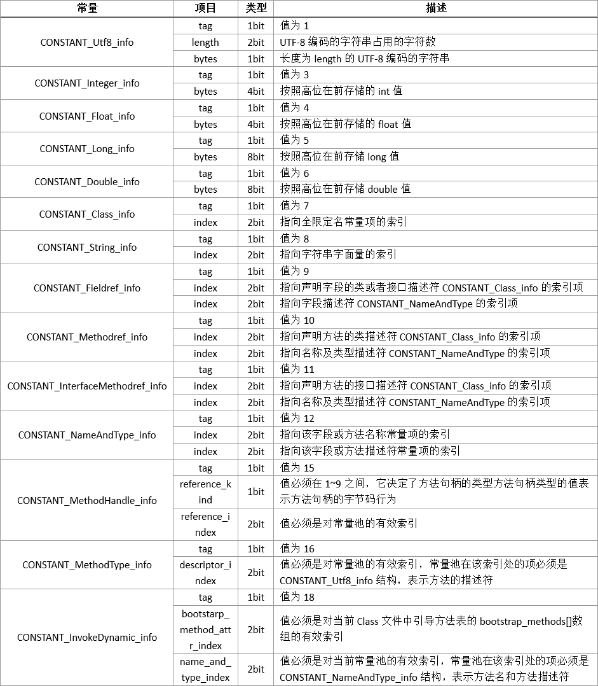

###Class文件结构

class文件结构说明
	 	 	
|类型|名称|数量|描述|
|---|---|---|---|
|u4|magic|1|魔数|
|u2|minor_version|1|次版本号|
|u2|major_version|1|主版本号|
|u2|constant_pool_count|1|常量个数|
|cp_info|constant_pool|constant_pool_count - 1|具体常量
|u2|access_flags|1|访问标志|
|u2|this_class|1|类索引|
|u2|super_class|1|父类索引|
|u2|interfaces_count|1|接口索引|
|u2|interfaces|interfaces_count|具体接口|
|u2|fields_count|1|字段个数|
|field_info|fields|fields_count|具体字段|
|u2|methods_count|1|方法个数|
|method_info|methods|methods_count|具体方法|
|u2|attributes_count|1|属性个数|
|attribute_info|attributes|attributes_count|具体属性|

常量池

|类型|名称|数量|
|---|---|---|
|CONSTANT_Utf8_info|1|UTF-8编码的字符串|
|CONSTANT_Integer_info|3|整形字面量|
|CONSTANT_Float_info|4|浮点型字面量|
|CONSTANT_Long_info|5|长整型字面量|
|CONSTANT_Double_info|6|双精度浮点型字面量|
|CONSTANT_Class_info|7|类或接口的符号引用|
|CONSTANT_String_info|8|字符串类型字面量|
|CONSTANT_Fieldref_info|9|字段的符号引用|
|CONSTANT_Methodref_info|10|类方法的符号引用|
|CONSTANT_InterfaceMehtodref_info|11|接口方法的符号引用|
|CONSTANT_NameAndType_info|12|字段或方法的部分符号引用|
|CONSTANT_MethodHandle_info|15|方法句柄|
|CONSTANT_MethodType_info|16|方法类型|
|CONSTANT_InvokeDynamic_info|18|动态方法调用点|


这14种常量的结构如下表所示：     
      

访问标志

|标志名称|标志值|描述|
|---|---|---|
|ACC_PUBLIC|0x0001|是否为public类型|
|ACC_FINAL|0x0010|是否为final类型|
|ACC_SUPER|0x0020|是否允许使用invokespcial字节码指令的新语义，jdk1.0.2之后编译出来的类，此标志都为真|
|ACC_INTERFACE|0x0200|是否为接口|
|ACC_ABSTRACT|0x0400|是否为abstract类型(对接口和抽象类来说，此标志都为真)|
|ACC_SYNTHETIC|0x1000|标识这个类并非由用户代码产生|
|ACC_ANNOTATION|0x2000|是否是注解|
|ACC_ENUM|0x4000|是否是枚举|

字段表集合

|标志名称|标志值|描述|
|---|---|---|
|ACC_PUBLIC|0x0001|是否为public类型|
|ACC_PRIVATE|0x0002|是否为private类型|
|ACC_PROTECTED|0x0004|是否为protected类型|
|ACC_STATIC|0x0008|是否为static类型|
|ACC_FINAL|0x0010|是否为final类型|
|ACC_VOLATILE|0x0040|是否volatile类型|
|ACC_TRANSIENT|0x0080|是否transient类型|
|ACC_SYNTHETIC|0x1000|是否由编译器自动产生|
|ACC_ENUM|0x4000|是否enum类型|

描述符

|描述符|含义|
|---|---|
|B|基本类型byte|
|C|基本类型char|
|D|基本类型double|
|F|基本类型float|
|I|基本类型int|
|J|基本类型long|
|S|基本类型short|
|Z|基本类型boolean||
|V|基本类型void|
|L|对象类型，如Ljava/lang/Object|

方法表集合

|标志名称|标志值|描述|
|---|---|---|
|ACC_PUBLIC|0x0001|是否为public类型|
|ACC_PRIVATE|0x0002|是否为final类型|
|ACC_PROTECTED|0x0004|是否为protected类型|
|ACC_STATIC|0x0008|是否为static类型|
|ACC_FINAL|0x0010|是否为final类型|
|ACC_SYNCHRONIZED|0x0020|是否synchronized类型|
|ACC_BRIDGE|0x0040|是否桥接方法|
|ACC_VARARGS|0x0080|是否接收不定参数|
|ACC_NATIVE|0x0100|是否native方法|
|ACC_ABSTRACT|0x0400|是否abstract|
|ACC_STRICTFP|0x0800|是否strictfp|
|ACC_SYNTHETIC|0x1000|是否由编译器自动产生|

属性表集合

|类型|名称|数量|
|---|---|---|
|u2|attribute_name_index|1|
|u4|attribute_length|1|
|u2|info|attribute_length|


java 信息
```text
public class Person {
    private String name;
    private Integer age;

    public Person (String name, Integer age) {
        this.name = name;
        this.age = age;
    }

    public String getName () {
        return name;
    }

    public void setName (String name) {
        this.name = name;
    }

    public Integer getAge () {
        return age;
    }

    public void setAge (Integer age) {
        this.age = age;
    }
}
```
class信息
```text
CA FE BA BE 00 00 00 34  00 21 0A 00 05 00 1B 09  00 04 00 1C 09 00 04 00  1D 07 00 1E 07 00 1F 01 
00 04 6E 61 6D 65 01 00  12 4C 6A 61 76 61 2F 6C  61 6E 67 2F 53 74 72 69  6E 67 3B 01 00 03 61 67 
65 01 00 13 4C 6A 61 76  61 2F 6C 61 6E 67 2F 49  6E 74 65 67 65 72 3B 01  00 06 3C 69 6E 69 74 3E 
01 00 28 28 4C 6A 61 76  61 2F 6C 61 6E 67 2F 53  74 72 69 6E 67 3B 4C 6A  61 76 61 2F 6C 61 6E 67 
2F 49 6E 74 65 67 65 72  3B 29 56 01 00 04 43 6F  64 65 01 00 0F 4C 69 6E  65 4E 75 6D 62 65 72 54 
61 62 6C 65 01 00 12 4C  6F 63 61 6C 56 61 72 69  61 62 6C 65 54 61 62 6C  65 01 00 04 74 68 69 73 
01 00 17 4C 63 6F 6D 2F  74 6F 70 69 64 65 61 2F  63 6E 2F 50 65 72 73 6F  6E 3B 01 00 07 67 65 74 
4E 61 6D 65 01 00 14 28  29 4C 6A 61 76 61 2F 6C  61 6E 67 2F 53 74 72 69  6E 67 3B 01 00 07 73 65 
74 4E 61 6D 65 01 00 15  28 4C 6A 61 76 61 2F 6C  61 6E 67 2F 53 74 72 69  6E 67 3B 29 56 01 00 06 
67 65 74 41 67 65 01 00  15 28 29 4C 6A 61 76 61  2F 6C 61 6E 67 2F 49 6E  74 65 67 65 72 3B 01 00 
06 73 65 74 41 67 65 01  00 16 28 4C 6A 61 76 61  2F 6C 61 6E 67 2F 49 6E  74 65 67 65 72 3B 29 56 
01 00 0A 53 6F 75 72 63  65 46 69 6C 65 01 00 0B  50 65 72 73 6F 6E 2E 6A  61 76 61 0C 00 0A 00 20 
0C 00 06 00 07 0C 00 08  00 09 01 00 15 63 6F 6D  2F 74 6F 70 69 64 65 61  2F 63 6E 2F 50 65 72 73 
6F 6E 01 00 10 6A 61 76  61 2F 6C 61 6E 67 2F 4F  62 6A 65 63 74 01 00 03  28 29 56 00 21 00 04 00 
05 00 00 00 02 00 02 00  06 00 07 00 00 00 02 00  08 00 09 00 00 00 05 00  01 00 0A 00 0B 00 01 00 
0C 00 00 00 59 00 02 00  03 00 00 00 0F 2A B7 00  01 2A 2B B5 00 02 2A 2C  B5 00 03 B1 00 00 00 02 
00 0D 00 00 00 12 00 04  00 00 00 0E 00 04 00 0F  00 09 00 10 00 0E 00 11  00 0E 00 00 00 20 00 03 
00 00 00 0F 00 0F 00 10  00 00 00 00 00 0F 00 06  00 07 00 01 00 00 00 0F  00 08 00 09 00 02 00 01 
00 11 00 12 00 01 00 0C  00 00 00 2F 00 01 00 01  00 00 00 05 2A B4 00 02  B0 00 00 00 02 00 0D 00 
00 00 06 00 01 00 00 00  14 00 0E 00 00 00 0C 00  01 00 00 00 05 00 0F 00  10 00 00 00 01 00 13 00 
14 00 01 00 0C 00 00 00  3E 00 02 00 02 00 00 00  06 2A 2B B5 00 02 B1 00  00 00 02 00 0D 00 00 00 
0A 00 02 00 00 00 18 00  05 00 19 00 0E 00 00 00  16 00 02 00 00 00 06 00  0F 00 10 00 00 00 00 00 
06 00 06 00 07 00 01 00  01 00 15 00 16 00 01 00  0C 00 00 00 2F 00 01 00  01 00 00 00 05 2A B4 00 
03 B0 00 00 00 02 00 0D  00 00 00 06 00 01 00 00  00 1C 00 0E 00 00 00 0C  00 01 00 00 00 05 00 0F 
00 10 00 00 00 01 00 17  00 18 00 01 00 0C 00 00  00 3E 00 02 00 02 00 00  00 06 2A 2B B5 00 03 B1 
00 00 00 02 00 0D 00 00  00 0A 00 02 00 00 00 20  00 05 00 21 00 0E 00 00  00 16 00 02 00 00 00 06 
00 0F 00 10 00 00 00 00  00 06 00 08 00 09 00 01  00 01 00 19 00 00 00 02  00 1A 
```
```text
CA FE BA BE             #魔数
00 00                   #此版本号
00 34                   #主版本号
00 21                   #常量池数量2*16+3=33 常量池从1-32开始 0下标不存任何常量
0A 00 05 00 1B          #CONSTANT_Methodref_info 	10 	类方法的符号引用  
00 05                   #指向常量池5号下标位的常量
00 1B                   #指向常量池27号下标位的常量   
09 00 04 00 1C          #CONSTANT_Fieldref_info 	9 	字段的符号引用
00 04                   #指向常量池4号下标位的常量
00 1C                   #指向常量池28号下标位的常量
09 00 04 00  1D         #CONSTANT_Fieldref_info 	9 	字段的符号引用
00 04                   #指向常量池4号下标位的常量
00 1D                   #指向常量池29号下标位的常量
07 00 1E                #CONSTANT_Class_info 	7 	类或接口的符号引用
00 1E                   #指向常量池30号下标位的常量
07 00 1F                #CONSTANT_Class_info 	7 	类或接口的符号引用
00 1F                   #指向常量池31号下标位的常量
01 00 04 6E             #CONSTANT_Utf8_info 	1 	UTF-8编码的字符串
61 6D 65 01 00  12 4C 6A 61 76 61 2F 6C  61 6E 67 2F 53 74 72 69  6E 67 3B 01 00 03 61 67 
65 01 00 13 4C 6A 61 76  61 2F 6C 61 6E 67 2F 49  6E 74 65 67 65 72 3B 01  00 06 3C 69 6E 69 74 3E 
01 00 28 28 4C 6A 61 76  61 2F 6C 61 6E 67 2F 53  74 72 69 6E 67 3B 4C 6A  61 76 61 2F 6C 61 6E 67 
2F 49 6E 74 65 67 65 72  3B 29 56 01 00 04 43 6F  64 65    #ame   
```


