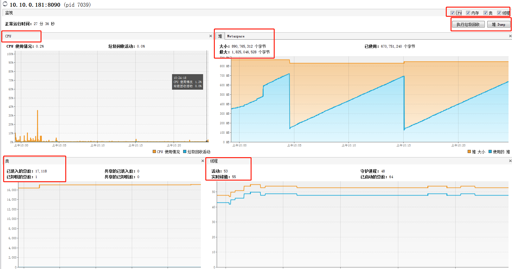
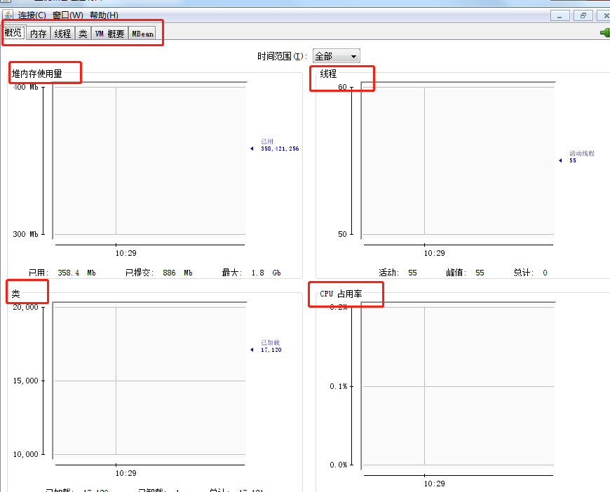

##java虚拟机监控工具

####配置    
启动脚本配置远程参数      
- SpringBoot应用
```text
-Djava.rmi.server.hostname=192.168.8.7  
-Dcom.sun.management.jmxremote
-Dcom.sun.management.jmxremote.port=8088  
-Dcom.sun.management.jmxremote.ssl=false  
-Dcom.sun.management.jmxremote.authenticate=false
```         
- tomcat应用      
```text
JAVA_OPTS="$JAVA_OPTS -Djava.rmi.server.hostname=192.168.8.7  
-Dcom.sun.management.jmxremote
-Dcom.sun.management.jmxremote.port=8088  
-Dcom.sun.management.jmxremote.ssl=false  
-Dcom.sun.management.jmxremote.authenticate=false"  
```
java.rmi.server.hostname:远程虚拟机ip        
com.sun.management.jmxremote:开启远程监控连接       
com.sun.management.jmxremote.port:远程监控的端口号，需要注意不是原应用的端口号，而是监控虚拟机的单独的窗口号         
com.sun.management.jmxremote.ssl:是否开启ssl连接          
com.sun.management.jmxremote.authenticate:是否开启用户验证          

- 案例配置文件
```text
#!/bin/bash
echo -e "\033[32m===start run xiaoan-urule===\033[0m"
TT=$(ps -ef | grep xiaoan-urule.jar | grep -v "grep" |awk '{print $2}')
if [ ! ${TT} ];then
	echo -e "\033[33m===xiaoan-urule未在运行===\033[0m"
else
	echo -e "\033[31m===关闭xiaoan-urule===\033[0m"
	kill -9 ${TT}
	sleep 2
fi
echo -e "\033[32m===启动xiaoan-urule===\033[0m"
nohup java -Djava.rmi.server.hostname=10.10.0.181 \
-Dcom.sun.management.jmxremote \
-Dcom.sun.management.jmxremote.port=8090 \
-Dcom.sun.management.jmxremote.ssl=false \
-Dcom.sun.management.jmxremote.authenticate=false \
 -jar /urule/xiaoan-urule.jar --spring.profiles.active=test &
echo -e "\033[32m===end===\033[0m"
```
[注意]:远程监控时需要注意防火墙，有时候配置正确但始终连接不上，即便是监控端口已经放开也无法登录时，有可能是防火墙的问题，可以尝试将整个防火墙关闭重新连接即可

####远程监控
          
- visualvm工具            
  
    
      
  
      
 
- jconsole工具
      
    
      
     
     
####本地监控
当本地虚拟机启动时，两个工具可以自动检测到虚拟机进程，并显示
- visualvm工具
  
双击连接对应进程即可

- jconsole工具