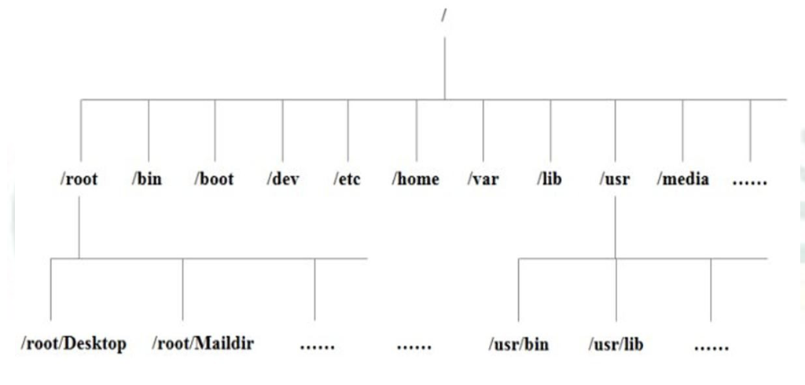

###Linux的目录结构

linux 的文件系统是采用级层式的树状目录结构，在此结构中的最上层是根目录“/”，然后在此目录下再创建其他的目录。

####具体的目录结构
- /bin [重点] (/usr/bin、/usr/local/bin)   
是Binary的缩写，这个目录存放着最经常使用的命令

- /sbin (/usr/sbin、/usr/local/sbin)     
s就是Super User的意思，这里存放的是系统管理员使用的系统管理程序

- /home [重点]    
存放普通用户的主目录，在Linux中每个用户都有一个自己的目录，一般该目录名是以用户的账号命名的

- /root [重点]  
该目录是系统管理员，也成为超级权限者的用户主目录

- /boot [重点]    
存放的是启动Linux时使用的一些核心文件，包括一些连接文件以及镜像文件

- /proc  
这个目录是一个虚拟的目录，它是系统内存的映射，访问这个目录来获取系统信息

- /srv  
service的缩写，该目录存放一些启动服务之后需要提取的数据

- /sys  
这是Linux2.6内核的一个很大的变化，该目录下安装了2.6内核中新出现的一个文件系统

- /tmp  
这个目录用来存放一些临时文件的

- /dev  
类似于windows的设备管理器，把所有的硬件用文件的形式存储，设备文件

- /media [重点]       
Linux系统会自动识别一些设备，例如U盘，光驱等，当识别后，Linux会把识别的设备挂载到这个目录下

- /mnt [重点]   
系统提供该目录是为了用户临时挂载别的文件系统的，我们可以将外部的存储挂载在/mnt/上，然后进入该目录就可以查看到里面的内容了

- /opt  
这是给主机额外安装软件所摆放的目录，如安装oracle数据库就可以放到该目录下

- /usr/local [重点]       
这是另一个给主机额外安装软件所安装的目录，一般是通过编译源码方式安装的程序

- /var [重点]  
这个目录中存放着不断扩充着的东西，习惯将经常被修改的目录放在该目录下，包括各种日志文件

- /selinx [security-enhanced linux] 360
SElinux是一种安全子系统，它能控制程序只访问特定文件

####Linux目录总结
1.linux 的目录中有且只要一个根目录 /     
2.linux 的各个目录存放的内容是规划好，不用乱放文件。          
3.linux 是以文件的形式管理我们的设备，因此 linux 系统，一切皆为文件。        
