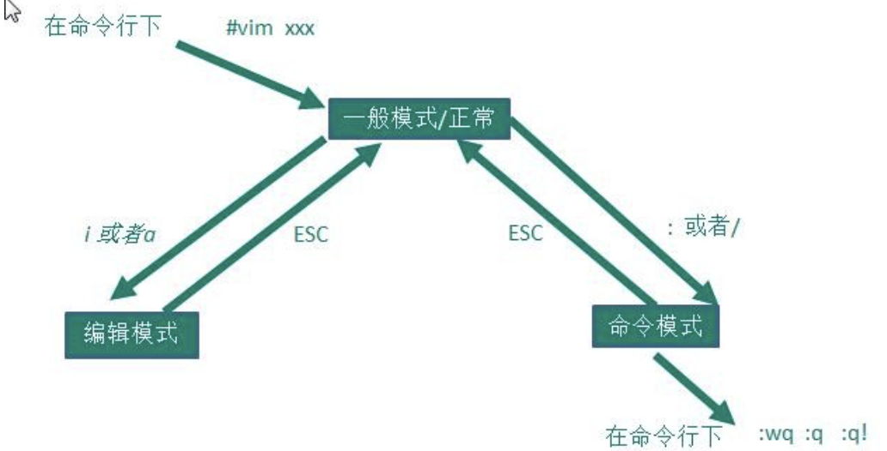
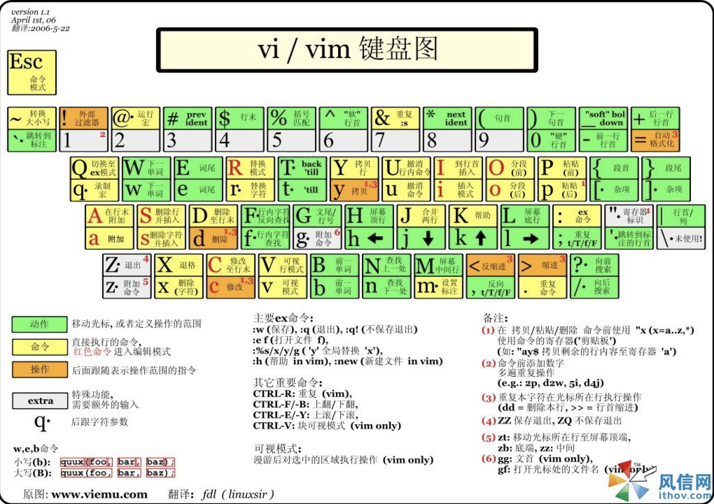

###Linux之vi和vim编辑器

####基本介绍
所有的 Linux 系统都会内建 vi 文本编辑器。
Vim 具有程序编辑的能力，可以看做是 Vi 的增强版本，可以主动的以字体颜色辨别语法的正确性，方便程序设计。代码补完、编译及错误跳转等方便编程的功能特别丰富，在程序员中被广泛使用。

####vi 和 vim 的三种常见模式
- 正常模式      
在正常模式下，我们可以使用快捷键。
以 vim 打开一个档案就直接进入一般模式了(这是默认的模式)。在这个模式中， 你可以使用『上下左右』按键来移动光标，你可以使用『删除字符』或『删除整行』来处理档案内容， 也可以使用
『复制、贴上』来处理你的文件数据。

- 插入模式/编辑模式        
在模式下，程序员可以输入内容。
按下 i, I, o, O, a, A, r, R 等任何一个字母之后才会进入编辑模式,  一般来说按 i 即可

- 命令行模式     
在这个模式当中， 可以提供你相关指令，完成读取、存盘、替换、离开 vim 、显示行号等的动作则是在此模式中达成的！

####vi 和 vim	三种模式的相互转化图

####快捷键的使用
- 拷贝当前行	yy ,  拷贝当前行向下的 5 行	5yy，并粘贴（p）。
- 删除当前行	dd	, 删除当前行向下的 5 行 5dd
- 在文件中查找某个单词  [命令行下  /关键字  ， 回车  查找  ,	输入 n 就是查找下一个 ],查询
hello.
- 设置文件的行号，取消文件的行号.[命令行下	:set nu  和	:set nonu]
- 编辑 /etc/profile 文件，使用快捷键到底文档的最末行[G]和最首行[gg],注意这些都是在正常模式下执行的。
- 在一个文件中输入  "hello" ,然后又撤销这个动作，再正常模式下输入	u
- 编辑	/etc/profile 文件，并将光标移动到	第 20 行	(shift+g)     
    1)第一步：显示行号 :set nu      
    2)第二步：输入 20 这个数     
    3)第三步:	输入 shift+g 
 
 
####vim 和 vi 的快捷键键盘一览图  
   
 