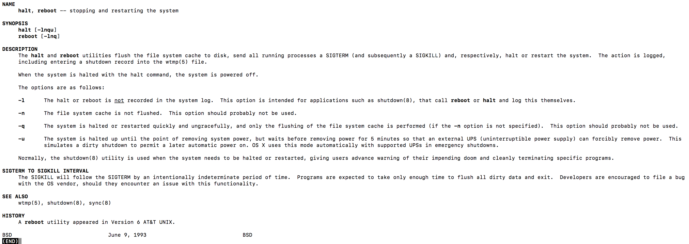

###Linux之系统开机关机重启

####关机&重启命令

- shutdown  
```text
-t sec :-t 后面加秒数，表示过几秒后关机
-k     :不是真的关机，只是发送警告信息出去
-r     :将系统的服务停掉之后就重启
-h     :将系统的服务停掉之后立即关机
-n     :不经过init程序，直接以shutdown的功能关机
-f     :关机并开机之后，强制略过fsck的磁盘检查
-F     :系统重启之后，强制进行fsck的磁盘检查
-c     :取消已经在进行的shutdown的命令内容
时间    :这是一定要加入的参数，指系统的关机时间
```
示例
```text
shutdown -h now //立刻关机
shutdown -h 20:25 //系统将在今天的20:25分关机，若该时间段之后才执行的命令，则会等待隔天这个时间段再执行
shutdown -h +10 //10分钟后系统自动关机
shutdown -r now //立即重启
shutdown -r +30 '30分钟后系统将自动重启' //30分钟后系统将自动重启,并将该信息推送给所有在线的用户
shutdown -k now '系统将重启' //仅发出警告信息，系统并不会关机
``` 

- halt

- reboot

通过指令man reboot more查看关于更多的reboot指令及说明


- poweroff

- init(系统的运行级别)
init 0


注意：当我们关机或者重启时，都应该先执行以下 sync 指令，把内存的数据写入磁盘，防止数据丢失。

####用户登录和注销
1）登录时尽量少用 root 帐号登录，因为它是系统管理员，最大的权限，避免操作失误。可以利用普通用户登录，登录后再用”su -  用户名’命令来切换成系统管理员身份.        
2）在提示符下输入 logout 即可注销用户

注意：logout 注销指令在图形运行级别无效，在 运行级别 3 下有效