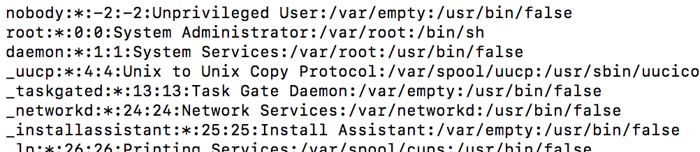
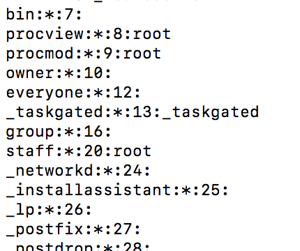

###Linux之用户、用户组、文件权限管理

####基本介绍
Linux 系统是一个多用户多任务的操作系统，任何一个要使用系统资源的用户，都必须首先向系统管理员申请一个账号，然后以这个账号的身份进入系统。
Linux 的用户需要至少要属于一个组。

####添加、删除、查询、切换用户
- 添加用户
useradd	[选项]	用户名

当创建用户成功后，会自动的创建和用户同名的家目录        
也可以通过  useradd -d	指定目录	新的用户名，给新创建的用户指定家目录

- 给用户指定或者修改密码     
passwd	用户名

- 删除用户      
userdel	用户名     
注意在删除用户时，我们一般不会将家目录删除。

- 查询用户信息        
id	用户名     
当用户不存在时，返回”无此用户”

- 切换用户  
su	–	切换用户名       
1）在操作 Linux 中，如果当前用户的权限不够，可以通过 su - 指令，切换到高权限用户，比如 root     
2）从权限高的用户切换到权限低的用户，不需要输入密码，反之需要。        
3）当需要返回到原来用户时，使用 exit 指令        

####添加、删除、查询用户组
- 添加用户组     
groupadd 组名

- 增加用户时直接加上组        
useradd	-g 用户组 用户名

- 删除用户组     
groupdel 组名

- 修改用户组
usermod	-g 用户组 用户名

####/etc/passwd、/etc/shadow、/etc/group三个文件
- /etc/passwd 文件        
用户（user）的配置文件，记录用户的各种信息
每行的含义：用户名:口令:用户标识号:组标识号:注释性描述:主目录:登录 Shell

- /etc/shadow       
口令的配置文件
每行的含义：登录名:加密口令:最后一次修改时间:最小时间间隔:最大时间间隔:警告时间:不活动时间:失效时间:标志

- /etc/group        
组(group)的配置文件，记录 Linux 包含的组的信息每行含义：组名:口令:组标识号:组内用户

#####文件系统权限