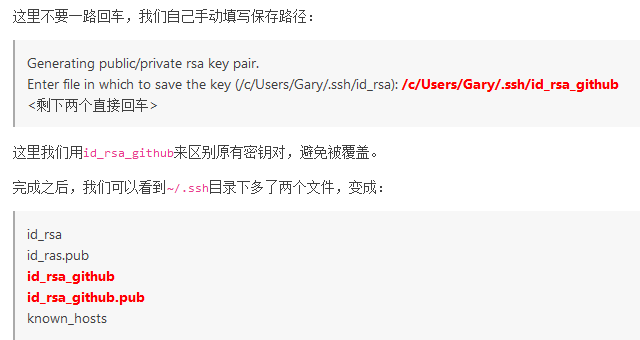
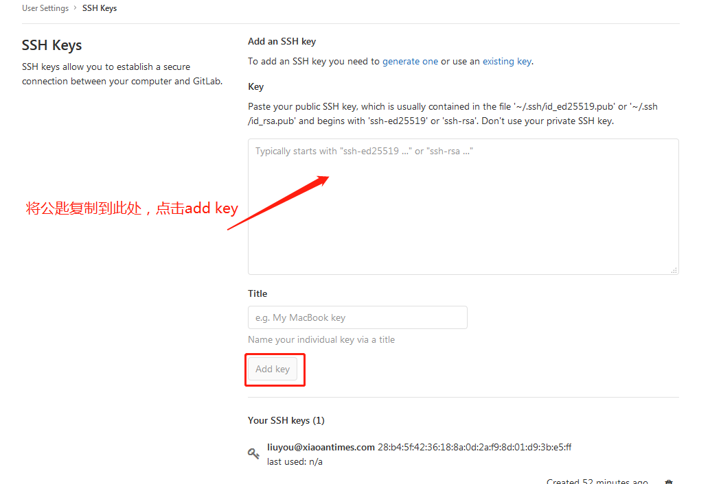

   ###Linux部署gitlab
   
   ###git和 svn的区别
   
   ###部署gitlab
   
- 基础配置      
```text
sudo yum install -y curl policycoreutils-python openssh-server
sudo systemctl enable sshd
sudo systemctl start sshd
#防火墙设置，如果防火墙已经关闭则可以不设置
sudo firewall-cmd --permanent --add-service=http
sudo systemctl reload firewalld
```

- 邮箱配置(可选)
```text
sudo yum install postfix
sudo systemctl enable postfix
sudo systemctl start postfix
```

- 添加仓库地址
```text
curl https://packages.gitlab.com/install/repositories/gitlab/gitlab-ee/script.rpm.sh | sudo bash
```

- 安装GitLab
```text
yum install -y gitlab-ee
```

- 安装成功
```text
Thank you for installing GitLab!
GitLab was unable to detect a valid hostname for your instance.
Please configure a URL for your GitLab instance by setting `external_url`
configuration in /etc/gitlab/gitlab.rb file.
Then, you can start your GitLab instance by running the following command:
  sudo gitlab-ctl reconfigure

For a comprehensive list of configuration options please see the Omnibus GitLab readme
https://gitlab.com/gitlab-org/omnibus-gitlab/blob/master/README.md

  Verifying  : gitlab-ee-12.3.5-ee.0.el7.x86_64                                                                                                                                                                      1/1 

Installed:
  gitlab-ee.x86_64 0:12.3.5-ee.0.el7                                                                                                                                                                                     

Complete!
```
出现上述内容则表示安装成功，只需要修改external_url配置并重启即可

- 配置external_url
```text
#修改/etc/gitlab/gitlab.rb
#external_url = ip+端口号
external_url 'http://localhost:7094'
```

- 重启服务
```text
gitlab-ctl restart
```

- 登录修改密码
```text
输入ip+端口进入服务后重置密码
用户名:root
密码：xiaoantimes20191014
liuyou@xiaoantimes.com
liuyou920623
```

- 配置ssh key
1.进入gitlab服务器输入一下命令
```text
ssh-keygen -t rsa -C 'liuyou@xiaoantimes.com' 然后一路回车(liuyou@xiaoantimes.com是你的邮箱地址)

-t 指定密钥类型，默认是 rsa ，可以省略。
-C 设置注释文字，比如邮箱。
-f 指定密钥文件存储文件名。
```
2.出现如下提示,回车键进入
```text
Enter file in which to save the key (/Users/yzq/.ssh/id_rsa): [这里可不填，不填默认保存到提示目录下，否则保存到指定目录]
```
 
3.如果你的.ssh/id_rsa已经，则会出现：/Users/yzq/.ssh/id_rsa already exists.
4.提示Overwrite (y/n)? y
```text
输入：y  （重新覆盖）
输入：n  （不覆盖）
```
5.设置密码并确认（位数不要太短，尽量设置6位）
```text
liuyou920623
```
6.提示如下信息成功
```text
Your identification has been saved in /root/.ssh/id_rsa.
Your public key has been saved in /root/.ssh/id_rsa.pub.
The key fingerprint is:
SHA256:MGZUC5jD4TFsJXViVlv+3IVL1muEnAWmUmmx3Lp8jrk liuyou@xiaoantimes.com
The key's randomart image is:
+---[RSA 2048]----+
|   o=*Oo+ .ooo.. |
|   .BB + =oo* +o |
|   ...= o.o+ =+.o|
|     o o  .o.+.o.|
|        S  .o oo |
|          . . .  |
|           o .   |
|            =    |
|           E..   |
+----[SHA256]-----+
```
7.查看本机ssh公钥
```text
cd ~/.ssh
ls（查看目录是否有id_rsa.pub文件）
查看公钥：cat id_rsa.pub    或者vim id_rsa.pub
```
8.登录10.10.0.237：7094(gitlab服务器)配置ssh keys，将id_rsa.pub中的信息复制到指定输入框，并点击add key完成添加    
  
参考文档：https://www.awaimai.com/2200.html
- 问题解决
1.502
```text
修改/etc/gitlab/gitlab.rb中的unicorn['port'] = 8080
netstat -tnlp | grep '北站端口' 查看被站端口的具体应用是哪个
配置unicorn['port'] = 其他未被占用的端口
执行sudo gitlab-ctl reconfigure
执行gitlab-ctl restart
参考文档：https://blog.csdn.net/qq_38348679/article/details/92597741
```
