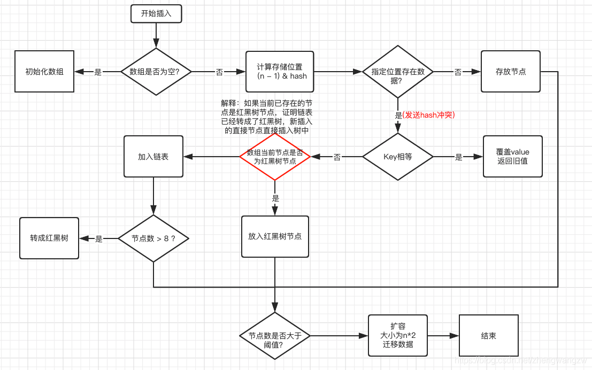

###java集合类型归纳总结


#####java集合框架的类图    
    

- ArrayList 源码分析
```text
public class ArrayList<E> extends AbstractList<E>
        implements List<E>, RandomAccess, Cloneable, java.io.Serializable
{
    private static final int DEFAULT_CAPACITY = 10;//默认初始容量
    private static final Object[] EMPTY_ELEMENTDATA = {};
    private static final Object[] DEFAULTCAPACITY_EMPTY_ELEMENTDATA = {};//默认空数组
    transient Object[] elementData; //存储数据的数组
    private int size;//当前数组的大小
    
    //自定义了初始容量
    public ArrayList(int initialCapacity) {
        if (initialCapacity > 0) {
        //初始化指定容量大小的数组
            this.elementData = new Object[initialCapacity];
        } else if (initialCapacity == 0) {
            this.elementData = EMPTY_ELEMENTDATA;//默认空数组
        } else {
            throw new IllegalArgumentException("Illegal Capacity: "+
                                               initialCapacity);
        }
    }
    
    //默认空数组
    public ArrayList() {
        this.elementData = DEFAULTCAPACITY_EMPTY_ELEMENTDATA;
    }
    
    //指定默认集合，尽心元素拷贝
    public ArrayList(Collection<? extends E> c) {
        elementData = c.toArray();
        if ((size = elementData.length) != 0) {
            // c.toArray might (incorrectly) not return Object[] (see 6260652)
            if (elementData.getClass() != Object[].class)
                elementData = Arrays.copyOf(elementData, size, Object[].class);
        } else {
            // replace with empty array.
            this.elementData = EMPTY_ELEMENTDATA;
        }
    }
    
    public boolean add(E e) {
        //数组的扩容
        ensureCapacityInternal(size + 1);  // Increments modCount!!
        elementData[size++] = e;//存入新增元素
        return true;
    }
    
    //比较容量大小，如果给定容量大于初始容量，则返回给定容量，否则初始容量
    private static int calculateCapacity(Object[] elementData, int minCapacity) {
        if (elementData == DEFAULTCAPACITY_EMPTY_ELEMENTDATA) {
            return Math.max(DEFAULT_CAPACITY, minCapacity);
        }
        return minCapacity;
    }
    
    private void ensureExplicitCapacity(int minCapacity) {
        modCount++;

        // overflow-conscious code
        if (minCapacity - elementData.length > 0)//如果给定容量已经超过数组容量时，则需要扩容
            grow(minCapacity);
    }
    
    private void grow(int minCapacity) {
        // overflow-conscious code
        int oldCapacity = elementData.length;//旧的数组长度
        int newCapacity = oldCapacity + (oldCapacity >> 1);//新数组长度=旧长度+旧长度/2
        if (newCapacity - minCapacity < 0)
            newCapacity = minCapacity;
        if (newCapacity - MAX_ARRAY_SIZE > 0)
            newCapacity = hugeCapacity(minCapacity);
        // minCapacity is usually close to size, so this is a win:
        elementData = Arrays.copyOf(elementData, newCapacity);//数组元素的拷贝
    }
}
```

- LinkedList源码分析
```text
public class LinkedList<E>
    extends AbstractSequentialList<E>
    implements List<E>, Deque<E>, Cloneable, java.io.Serializable
{
    transient int size = 0;
    transient Node<E> first;
    transient Node<E> last;
    
    //说明linkedList是一个双向链表的形式
    private static class Node<E> {
        E item;
        Node<E> next;
        Node<E> prev;

        Node(Node<E> prev, E element, Node<E> next) {
            this.item = element;
            this.next = next;
            this.prev = prev;
        }
    }
    
    //默认在队尾添加
    public boolean add(E e) {
        linkLast(e);
        return true;
    }
    
    void linkLast(E e) {
        final Node<E> l = last;
        final Node<E> newNode = new Node<>(l, e, null);
        last = newNode;//将尾节点指向当前节点
        if (l == null)//如果尾节点为null，则表明是一个空的链表
            first = newNode;//则将头节点指向当前节点
        else
            l.next = newNode;//否则就需要将旧的尾节点的下一个节点指向当前节点，即当前节点为队尾节点
        size++;
        modCount++;
    }
    
    public void addFirst(E e) {
        linkFirst(e);
    }
    
    private void linkFirst(E e) {
        final Node<E> f = first;//队首节点
        final Node<E> newNode = new Node<>(null, e, f);
        first = newNode;//将队首节点指向当前节点
        if (f == null)//空链表
            last = newNode;//将队尾节点指向当前节点
        else
            f.prev = newNode;//旧的队首节点的前一个节点指向当前节点
        size++;
        modCount++;
    }
}
```

需要说明一下的是，不论是LinkedList还是ArrayList也好，都是有序的且可以重复的，当是需要注意的是，他们不是线程安全的


- HashSet源码分析
```text
public class HashSet<E>
    extends AbstractSet<E>
    implements Set<E>, Cloneable, java.io.Serializable
{
    private transient HashMap<E,Object> map;//hashSet底层默认是用HashMap实现的
    private static final Object PRESENT = new Object();//默认的value
    
    public HashSet() {
        map = new HashMap<>();
    }
    
    public HashSet(Collection<? extends E> c) {
        map = new HashMap<>(Math.max((int) (c.size()/.75f) + 1, 16));
        addAll(c);
    }
    
    //这里是用LinkedHashMap构造有序的hashSet，这里主要是给LinkedHashSet使用的，外部人员是无法构造的，但是可以通过反射构造
    HashSet(int initialCapacity, float loadFactor, boolean dummy) {
        map = new LinkedHashMap<>(initialCapacity, loadFactor);
    }
}
```

- TreeSet源码分析
```text
public class TreeSet<E> extends AbstractSet<E>
    implements NavigableSet<E>, Cloneable, java.io.Serializable
{
    private transient NavigableMap<E,Object> m;
    private static final Object PRESENT = new Object();//默认的value
    
    TreeSet(NavigableMap<E,Object> m) {//NavigableMap要求是必须有需的
        this.m = m;
    }
    
    public TreeSet() {
        this(new TreeMap<E,Object>());//默认情况下TreeSet是采用TreeMap实现的
    }
    
    public boolean add(E e) {
        return m.put(e, PRESENT)==null;
    }

}
```

####java Map接口实现

- HashMap的源码分析
```text
public class HashMap<K,V> extends AbstractMap<K,V>
    implements Map<K,V>, Cloneable, Serializable {
    static final int DEFAULT_INITIAL_CAPACITY = 1 << 4;//默认的初始容量，思考为什么是16   
    static final int MAXIMUM_CAPACITY = 1 << 30; //最大的数组容量 1 << 30为为2的30次方，思考为什么是1 << 30
    static final float DEFAULT_LOAD_FACTOR = 0.75f;//扩容因子
    static final int TREEIFY_THRESHOLD = 8;//链表允许的最大长度，超过此长度即会将链表转化成红黑树 思考为什么是8
    static final int UNTREEIFY_THRESHOLD = 6;//缩容时，链表小于此长度，会将红黑树转成链表 思考为什么是6
    static final int MIN_TREEIFY_CAPACITY = 64;//链表转红黑树时，要求链表的长度大于等于8，且数组的元素个数超过64才可以 思考为什么是64
    
    //返回一个最接近给定数的2的幂次方
    static final int tableSizeFor(int cap) {
        int n = cap - 1;
        n |= n >>> 1;
        n |= n >>> 2;
        n |= n >>> 4;
        n |= n >>> 8;
        n |= n >>> 16;
        return (n < 0) ? 1 : (n >= MAXIMUM_CAPACITY) ? MAXIMUM_CAPACITY : n + 1;
    }
        
    static class Node<K,V> implements Map.Entry<K,V> {
        final int hash;
        final K key;
        V value;
        Node<K,V> next;//从这里可以看出针对hash碰撞，HashMap采用的是链地址法

        Node(int hash, K key, V value, Node<K,V> next) {
            this.hash = hash;
            this.key = key;
            this.value = value;
            this.next = next;
        }

        public final K getKey()        { return key; }
        public final V getValue()      { return value; }
        public final String toString() { return key + "=" + value; }

        public final int hashCode() {
            return Objects.hashCode(key) ^ Objects.hashCode(value);  //Node的hash实际上就是key的hash亦或value的hash，其用意就是为了hash散列的更均匀
        }

        public final V setValue(V newValue) {
            V oldValue = value;
            value = newValue;
            return oldValue;
        }

        public final boolean equals(Object o) {
            if (o == this)
                return true;
            if (o instanceof Map.Entry) {
                Map.Entry<?,?> e = (Map.Entry<?,?>)o;
                if (Objects.equals(key, e.getKey()) && //Objects.equals()比较的就是地址或者是对象的equals()方法
                    Objects.equals(value, e.getValue()))
                    return true;
            }
            return false;
        }
    }
    
    transient Node<K,V>[] table;//从这里可以看出我们HashMap的底层就是数组+链表或者红黑树
    
    transient int size;//当前存入数组的元素大小
    
    public V put(K key, V value) {
        return putVal(hash(key), key, value, false, true);
    }
    
    static final int hash(Object key) {
        int h;//实际上是32位int值
        return (key == null) ? 0 : (h = key.hashCode()) ^ (h >>> 16);//高16位亦或低16位，得到的这个散列值更加的均匀
    }
    
    final V putVal(int hash, K key, V value, boolean onlyIfAbsent,
                       boolean evict) {
        Node<K,V>[] tab; Node<K,V> p; int n, i;
        if ((tab = table) == null || (n = tab.length) == 0)
            n = (tab = resize()).length;//第一次put时，初始化数组，默认大小16，默认扩容值12
        if ((p = tab[i = (n - 1) & hash]) == null) //获取元素在数组中的下标
            tab[i] = newNode(hash, key, value, null);//如果当前下标没有元素，则存入当前下标
        else {
            Node<K,V> e; K k;
            if (p.hash == hash &&
                ((k = p.key) == key || (key != null && key.equals(k))))//如果当前下标就是该元素
                e = p;
            else if (p instanceof TreeNode)//如果当前下标是红黑树
                e = ((TreeNode<K,V>)p).putTreeVal(this, tab, hash, key, value);
            else {
                for (int binCount = 0; ; ++binCount) {//否则就是链表，需要遍历
                    if ((e = p.next) == null) {//从队尾加入元素
                        p.next = newNode(hash, key, value, null);
                        if (binCount >= TREEIFY_THRESHOLD - 1) // -1 for 1st 队尾元素超过7
                            treeifyBin(tab, hash);//进行红黑树转化
                        break;
                    }
                    if (e.hash == hash && //遍历找到当前元素，则在后面的操作中修改
                        ((k = e.key) == key || (key != null && key.equals(k))))
                        break;
                    p = e;//在链表中找到了当前元素
                }
            }
            if (e != null) { // existing mapping for key 如果找到当前元素
                V oldValue = e.value;
                if (!onlyIfAbsent || oldValue == null)//!onlyIfAbsent put操作返回的是false
                    e.value = value;//替换旧的值
                afterNodeAccess(e);//给子类一个在put后的操作的机会
                return oldValue;//返回旧的值
            }
        }
        ++modCount;
        if (++size > threshold) //如果当前数组的元素个数超过了容量值则扩容
            resize();
        afterNodeInsertion(evict);////给子类一个在put后的操作的机会
        return null;
    }
    
    final Node<K,V>[] resize() {
        Node<K,V>[] oldTab = table;
        int oldCap = (oldTab == null) ? 0 : oldTab.length;//旧的容量
        int oldThr = threshold;//旧的容量值
        int newCap, newThr = 0;
        if (oldCap > 0) {
            if (oldCap >= MAXIMUM_CAPACITY) {//超过最大容器
                threshold = Integer.MAX_VALUE;
                return oldTab;
            }
            else if ((newCap = oldCap << 1) < MAXIMUM_CAPACITY &&
                     oldCap >= DEFAULT_INITIAL_CAPACITY)
                newThr = oldThr << 1; // double threshold  否则就扩容一倍
        }
        else if (oldThr > 0) // initial capacity was placed in threshold
            newCap = oldThr;
        else {               // zero initial threshold signifies using defaults
            //第一次初始化
            newCap = DEFAULT_INITIAL_CAPACITY;
            newThr = (int)(DEFAULT_LOAD_FACTOR * DEFAULT_INITIAL_CAPACITY);
        }
        if (newThr == 0) {
            float ft = (float)newCap * loadFactor;
            newThr = (newCap < MAXIMUM_CAPACITY && ft < (float)MAXIMUM_CAPACITY ?
                      (int)ft : Integer.MAX_VALUE);
        }
        threshold = newThr;
        @SuppressWarnings({"rawtypes","unchecked"})
        Node<K,V>[] newTab = (Node<K,V>[])new Node[newCap];//构建数组
        table = newTab;
        if (oldTab != null) {//如果是扩容，则需要对数据进行迁移
            for (int j = 0; j < oldCap; ++j) {
                Node<K,V> e;
                if ((e = oldTab[j]) != null) {//当前下标没有数据，不进行迁移
                    oldTab[j] = null;
                    if (e.next == null) //如果当前下标只有一个元素，没有链式结构
                        newTab[e.hash & (newCap - 1)] = e;//重新计算元素的下标，进行数据迁移
                    else if (e instanceof TreeNode)//如果当前是红黑树结构，则需要对红黑树进行拆分
                        ((TreeNode<K,V>)e).split(this, newTab, j, oldCap);
                    else { // preserve order 否则就是链表结构
                        Node<K,V> loHead = null, loTail = null;//低位的头，尾节点
                        Node<K,V> hiHead = null, hiTail = null;//高位的头，尾节点
                        Node<K,V> next;
                        do {
                            next = e.next;
                            //oldCap旧的容量值，以16为例...01 0000 e.hash & oldCap) == 0，如果该值为0，则表明，则表明第五位一定是0，
                            //其他位可能是1也可能是0，也即在新的数组中，如果再去进行hash计算下标，该元素一定在低位，
                            //(e.hash & oldCap) == 0 这里只有两种情况要为为1要么为0，因为oldCap是2的幂次方 以16为例 01000 ，所以任何
                            //数与oldCap进行与运算一定是0或者是1，也即用这个来区别高位和低位，即扩容期的下标，和扩容后的下标
                            if ((e.hash & oldCap) == 0) {//低位迁移 构建低位的链表
                                if (loTail == null)//如果低位尚未迁移，即低位的尾节点为空，
                                    loHead = e;//则将低位的头节点指向当前元素
                                else
                                    loTail.next = e;//从低位队尾加入元素
                                loTail = e;
                            }
                            else {//高位迁移
                                if (hiTail == null)//如果高位尚未迁移，即高位的尾节点为空
                                    hiHead = e;//则将高位的头节点指向当前元素
                                else
                                    hiTail.next = e;
                                hiTail = e;
                            }
                        } while ((e = next) != null);
                        if (loTail != null) {
                            loTail.next = null;
                            newTab[j] = loHead;//低位迁移，只要将链好的链表存入指定的桶中即可
                        }
                        if (hiTail != null) {
                            hiTail.next = null;
                            newTab[j + oldCap] = hiHead;//高位则需要将桶的下标+旧容量的数量作为新桶的下标
                        }
                    }
                }
            }
        }
        return newTab;
    }
    
    public V get(Object key) {
        Node<K,V> e;
        return (e = getNode(hash(key), key)) == null ? null : e.value;
    }
    
    final Node<K,V> getNode(int hash, Object key) {
        Node<K,V>[] tab; Node<K,V> first, e; int n; K k;
        if ((tab = table) != null && (n = tab.length) > 0 &&
            (first = tab[(n - 1) & hash]) != null) {//获取当前桶的第一个元素，如果找到并且是当前要找的，就返回
            if (first.hash == hash && // always check first node
                ((k = first.key) == key || (key != null && key.equals(k))))
                return first;
            if ((e = first.next) != null) {//如果当前是链式结构
                if (first instanceof TreeNode)//是红黑树，则遍历红黑树
                    return ((TreeNode<K,V>)first).getTreeNode(hash, key);
                do {
                    if (e.hash == hash && //否则就链式遍历查找元素
                        ((k = e.key) == key || (key != null && key.equals(k))))
                        return e;
                } while ((e = e.next) != null);
            }
        }
        return null;
    }
    
}
```
HashMap的数据结构
    

resize扩容高低位迁移示意图        
    

HashMap的操作流程图
    


一般如果new HashMap() 不传值，默认大小是16，负载因子是0.75， 如果自己传入初始大小k，初始化大小为 大于k的 2的整数次方，例如如果传10，大小为16。
（补充说明:实现代码如下）
```text
static final int tableSizeFor(int cap) {
    int n = cap - 1;
    n |= n >>> 1;
    n |= n >>> 2;
    n |= n >>> 4;
    n |= n >>> 8;
    n |= n >>> 16;
    return (n < 0) ? 1 : (n >= MAXIMUM_CAPACITY) ? MAXIMUM_CAPACITY : n + 1;
}
```
补充说明：下图是详细过程，算法就是让初始二进制右移1，2，4，8，16位，分别与自己位或，把高位第一个为1的数通过不断右移，把高位为1的后面全变为1，最后再
进行+1操作，111111 + 1 = 1000000 = 2的6次方（符合大于50并且是2的整数次幂 ）   
 


hash函数是先拿到 key 的hashcode，是一个32位的int值，然后让hashcode的高16位和低16位进行异或操作
这个也叫扰动函数，这么设计有二点原因：
1.一定要尽可能降低hash碰撞，越分散越好；
2.算法一定要尽可能高效，因为这是高频操作, 因此采用位运算；
```text
static final int hash(Object key) {
    int h;
    return (key == null) ? 0 : (h = key.hashCode()) ^ (h >>> 16);
}
```
为什么不直接采用对象的hashcode呢？
因为key.hashCode()函数调用的是key键值类型自带的哈希函数，返回int型散列值。int值范围为**-2147483648~2147483647**，前后加起来大概40亿的映射
空间。只要哈希函数映射得比较均匀松散，一般应用是很难出现碰撞的。但问题是一个40亿长度的数组，内存是放不下的。你想，如果HashMap数组的初始大小才16，用
之前需要对数组的长度取模运算，得到的余数才能用来访问数组下标
源码中模运算就是把散列值和数组长度-1做一个"与"操作，位运算比取余%运算要快。
```text
(n - 1) & hash
```
顺便说一下，这也正好解释了为什么HashMap的数组长度要取2的整数幂。因为这样（数组长度-1）正好相当于一个“低位掩码”。“与”操作的结果就是散列值的高位全部
归零，只保留低位值，用来做数组下标访问。以初始长度16为例，16-1=15。2进制表示是00000000 00000000 00001111。和某散列值做“与”操作如下，结果就是
截取了最低的四位值。
```text
  10100101 11000100 00100101
& 00000000 00000000 00001111
----------------------------------
  00000000 00000000 00000101    //高位全部归零，只保留末四位
```
但这时候问题就来了，这样就算我的散列值分布再松散，要是只取最后几位的话，碰撞也会很严重。更要命的是如果散列本身做得不好，分布上成等差数列的漏洞，如果正
好让最后几个低位呈现规律性重复，就无比蛋疼。

这个时候“扰动函数”的价值就体现出来了，说到这里大家应该猜出来了。看下面这个图，
 
右移16位，正好是32bit的一半，自己的高半区和低半区做异或，就是为了混合原始哈希码的高位和低位，以此来加大低位的随机性。而且混合后的低位掺杂了高位的部分
特征，这样高位的信息也被变相保留下来。
后我们来看一下Peter Lawley的一篇专栏文章《An introduction to optimising a hashing strategy》里的的一个实验：他随机选取了352个字符串，在
他们散列值完全没有冲突的前提下，对它们做低位掩码，取数组下标。
 
结果显示，当HashMap数组长度为512的时候（2的9次方），也就是用掩码取低9位的时候，在没有扰动函数的情况下，发生了103次碰撞，接近30%。而在使用了扰动函
数之后只有92次碰撞。碰撞减少了将近10%。看来扰动函数确实还是有功效的。
另外Java1.8相比1.7做了调整，1.7做了四次移位和四次异或，但明显Java 8觉得扰动做一次就够了，做4次的话，多了可能边际效用也不大，所谓为了效率考虑就改
成一次了。

下面是1.7的hash代码
```text
static int hash(int h) {
    h ^= (h >>> 20) ^ (h >>> 12);
    return h ^ (h >>> 7) ^ (h >>> 4);
}
```

1.8还有三点主要的优化：
1.数组+链表改成了数组+链表或红黑树；
2.链表的插入方式从头插法改成了尾插法，简单说就是插入时，如果数组位置上已经有元素，1.7将新元素放到数组中，原始节点作为新节点的后继节点，1.8遍历链表，将元素放置到链表的最后；
3.扩容的时候1.7需要对原数组中的元素进行重新hash定位在新数组的位置，1.8采用更简单的判断逻辑，位置不变或索引+旧容量大小；
4.在插入时，1.7先判断是否需要扩容，再插入，1.8先进行插入，插入完成再判断是否需要扩容；

优化的原因
1.防止发生hash冲突，链表长度过长，将时间复杂度由O(n)降为O(logn);
2.因为1.7头插法扩容时，头插法会使链表发生反转，多线程环境下会产生环；A线程在插入节点B，B线程也在插入，遇到容量不够开始扩容，重新hash，放置元素，采用
头插法，后遍历到的B节点放入了头部，这样形成了环，如下图所示：
 

1.7的扩容调用transfer代码，如下所示：
```text
void transfer(Entry[] newTable, boolean rehash) {
  int newCapacity = newTable.length;
  for (Entry<K,V> e : table) {
    while(null != e) {
      Entry<K,V> next = e.next;//A线程如果执行到这一行挂起，B线程开始进行扩容
      if (rehash) {
        e.hash = null == e.key ? 0 : hash(e.key);
      }
      int i = indexFor(e.hash, newCapacity);
      e.next = newTable[i]; 
      newTable[i] = e;
      e = next;
    }
  }
}
```
扩容的时候为什么1.8 不用重新hash就可以直接定位原节点在新数据的位置呢?
这是由于扩容是扩大为原数组大小的2倍，用于计算数组位置的掩码仅仅只是高位多了一个1，怎么理解呢？
扩容前长度为16，用于计算(n-1) & hash 的二进制n-1为0000 1111，扩容为32后的二进制就高位多了1，为0001 1111。
因为是& 运算，1和任何数 & 都是它本身，那就分二种情况，如下图：原数据hashcode高位第4位为0和高位为1的情况；

第四位高位为0，重新hash数值不变，第四位为1，重新hash数值比原来大16（旧数组的容量
 

那HashMap是线程安全的吗？
不是，在多线程环境下，1.7 会产生死循环、数据丢失、数据覆盖的问题，1.8 中会有数据覆盖的问题，以1.8为例，当A线程判断index位置为空后正好挂起，B线程开
始往index位置的写入节点数据，这时A线程恢复现场，执行赋值操作，就把A线程的数据给覆盖了；还有++size这个地方也会造成多线程同时扩容等问题。

你前面提到链表转红黑树是链表长度达到阈值，这个阈值是多少？
阈值是8，红黑树转链表阈值为6
为什么是8，不是16，32甚至是7 ？又为什么红黑树转链表的阈值是6，不是8了呢？
因为经过计算，在hash函数设计合理的情况下，发生hash碰撞8次的几率为百万分之6，概率说话。。因为8够用了，至于为什么转回来是6，因为如果hash碰撞次数在8
附近徘徊，会一直发生链表和红黑树的互相转化，为了预防这种情况的发生。


jdk1.7关于put时resize循环然后get操作死循环的说明
当hash桶中的链表是链表为A-B-C时，当线程1put操作时，读取首元素A，以及next=B的时候，此时正好被挂起，而线程二，正好被调度，即读取首元素A，以及next
元素B，然后执行循环，最后数组迁移后成为C-B-A，这需要说明迁移前后，元素A、B、C均位于同一个桶中，这个时候线程1又被调度，此时元素e=A,next=B，第一次
循环后，队首元素指向A，进入下一次循环，此时e=B，而next原本指向C的，但由于线程二已经反转了链表，导致B的next指向A，A的next为null，所以此时的e=B，
而next则等于A，因此这一操作便会形成B-A，当下一轮循环时，e=A，而next=null，因此就会将链表变成A-B-A的环形，导致后面的get操作变成死循环。
```text
void transfer(Entry[] newTable, boolean rehash) {
  int newCapacity = newTable.length;
  for (Entry<K,V> e : table) {
    while(null != e) {
      Entry<K,V> next = e.next;//A线程如果执行到这一行挂起，B线程开始进行扩容
      if (rehash) {
        e.hash = null == e.key ? 0 : hash(e.key);
      }
      int i = indexFor(e.hash, newCapacity);
      e.next = newTable[i]; 
      newTable[i] = e;
      e = next;
    }
  }
}
```
 
https://blog.csdn.net/pange1991/article/details/82377980
https://blog.csdn.net/maohoo/article/details/81531925

补充知识hash冲突的四种解决方案
- 开放地址法
    1.线性
    2.平方
    3.随机
开放地址法存在的问题，线性探测存在一次聚集的问题，在线性探测中, 函数f是i的线性函数, 一般情况下f(i) = i, 这相当于逐个探测每个单元(使用回绕)来查找出
空单元，这种方法会使一些占据的单元形成区块(即hash冲突后，在其后的单元连成片), 其结果成为一次聚集(primary clustering)。平方探测，虽然平方探测排除
了一次聚集, 但是散列到同一位置上的那些元素将探测相同的设备单元, 这称为二次聚集(secondary clustering). 二次聚集理论上是小缺憾。

- 拉链法(链地址法)

- 再hash(类比布隆过滤器，维护多个hash函数)

- 暂存溢区

- LinkedHashMap的源码分析
```text
transient LinkedHashMap.Entry<K,V> head;
transient LinkedHashMap.Entry<K,V> tail;

static class Entry<K,V> extends HashMap.Node<K,V> {
    Entry<K,V> before, after;//双向链表
    Entry(int hash, K key, V value, Node<K,V> next) {
        super(hash, key, value, next);
    }
}

final boolean accessOrder;//访问顺序，默认false即插入顺序，也即元素是按照插入的顺序排序的

public LinkedHashMap(int initialCapacity,
                         float loadFactor,
                         boolean accessOrder) {
    super(initialCapacity, loadFactor);
    this.accessOrder = accessOrder;
}

Node<K,V> newNode(int hash, K key, V value, Node<K,V> e) {
    LinkedHashMap.Entry<K,V> p =
        new LinkedHashMap.Entry<K,V>(hash, key, value, e);
    linkNodeLast(p);
    return p;
}

private void linkNodeLast(LinkedHashMap.Entry<K,V> p) {
        LinkedHashMap.Entry<K,V> last = tail;
    tail = p;//队尾插入
    if (last == null)
        head = p;
    else {
        p.before = last;
        last.after = p;
    }
}

//LinkedHashMap是继承自HashMap，其并没有重写put方法，而是在插入后重写了afterNodeAccess方法，如果是执行反问顺序，则会将元素移动到队首
void afterNodeAccess(Node<K,V> e) { // move node to last
        LinkedHashMap.Entry<K,V> last;
    if (accessOrder && (last = tail) != e) {
        LinkedHashMap.Entry<K,V> p =
            (LinkedHashMap.Entry<K,V>)e, b = p.before, a = p.after;
        p.after = null;
        if (b == null)
            head = a;
        else
            b.after = a;
        if (a != null)
            a.before = b;
        else
            last = b;
        if (last == null)
            head = p;
        else {
            p.before = last;
            last.after = p;
        }
        tail = p;
        ++modCount;
    }
}

void afterNodeInsertion(boolean evict) { // possibly remove eldest
    LinkedHashMap.Entry<K,V> first;
    if (evict && (first = head) != null && removeEldestEntry(first)) {
        K key = first.key;
        removeNode(hash(key), key, null, false, true);
    }
}

//移除队列最早的元素
protected boolean removeEldestEntry(Map.Entry<K,V> eldest) {
    return false;
}

final Node<K,V> removeNode(int hash, Object key, Object value,
                               boolean matchValue, boolean movable) {
        Node<K,V>[] tab; Node<K,V> p; int n, index;
    if ((tab = table) != null && (n = tab.length) > 0 &&
        (p = tab[index = (n - 1) & hash]) != null) {
        Node<K,V> node = null, e; K k; V v;
        if (p.hash == hash &&
            ((k = p.key) == key || (key != null && key.equals(k))))
            node = p;
        else if ((e = p.next) != null) {
            if (p instanceof TreeNode)
                node = ((TreeNode<K,V>)p).getTreeNode(hash, key);
            else {
                do {
                    if (e.hash == hash &&
                        ((k = e.key) == key ||
                         (key != null && key.equals(k)))) {
                        node = e;
                        break;
                    }
                    p = e;
                } while ((e = e.next) != null);
            }
        }
        if (node != null && (!matchValue || (v = node.value) == value ||
                             (value != null && value.equals(v)))) {
            if (node instanceof TreeNode)
                ((TreeNode<K,V>)node).removeTreeNode(this, tab, movable);
            else if (node == p)
                tab[index] = node.next;
            else
                p.next = node.next;
            ++modCount;
            --size;
            afterNodeRemoval(node);
            return node;
        }
    }
    return null;
}
```
LinkedHashMap是继承自HashMap，并重写了HashMap中的方法，其中最重要的就是在afterNodeAccess实现了按照访问顺序排序的功能，以及afterNodeInsertion
移除超出大小的元素，基于这两个特性可以实现LRU算法

- LinkedHashSet源码分析
```text
public class LinkedHashSet<E>
    extends HashSet<E> //继承自HashSet
    implements Set<E>, Cloneable, java.io.Serializable {
    
    public LinkedHashSet(int initialCapacity) {
        super(initialCapacity, .75f, true);//底层实现是LinkedHashMap
    }  
    
}

```
```text
public class HashSet<E>
    extends AbstractSet<E>
    implements Set<E>, Cloneable, java.io.Serializable
{
    HashSet(int initialCapacity, float loadFactor, boolean dummy) {
        map = new LinkedHashMap<>(initialCapacity, loadFactor);
    }
}
```

- TreeMap的源码分析
```text
public class TreeMap<K,V>
    extends AbstractMap<K,V>
    implements NavigableMap<K,V>, Cloneable, java.io.Serializable
{
    private final Comparator<? super K> comparator;
    private transient Entry<K,V> root;
    
    static final class Entry<K,V> implements Map.Entry<K,V> {
        K key;
        V value;
        Entry<K,V> left;
        Entry<K,V> right;
        Entry<K,V> parent;
        boolean color = BLACK;

        /**
         * Make a new cell with given key, value, and parent, and with
         * {@code null} child links, and BLACK color.
         */
        Entry(K key, V value, Entry<K,V> parent) {
            this.key = key;
            this.value = value;
            this.parent = parent;
        }
    }
    
    
    public V put(K key, V value) {
        Entry<K,V> t = root;
        if (t == null) {
            compare(key, key); // type (and possibly null) check

            root = new Entry<>(key, value, null);
            size = 1;
            modCount++;
            return null;
        }
        int cmp;
        Entry<K,V> parent;
        // split comparator and comparable paths
        Comparator<? super K> cpr = comparator;
        if (cpr != null) {
            do {
                parent = t;
                cmp = cpr.compare(key, t.key);
                if (cmp < 0)
                    t = t.left;
                else if (cmp > 0)
                    t = t.right;
                else
                    return t.setValue(value);
            } while (t != null);
        }
        else {
            if (key == null)
                throw new NullPointerException();
            @SuppressWarnings("unchecked")
                Comparable<? super K> k = (Comparable<? super K>) key;
            do {
                parent = t;
                cmp = k.compareTo(t.key);
                if (cmp < 0)
                    t = t.left;
                else if (cmp > 0)
                    t = t.right;
                else
                    return t.setValue(value);
            } while (t != null);
        }
        Entry<K,V> e = new Entry<>(key, value, parent);
        if (cmp < 0)
            parent.left = e;
        else
            parent.right = e;
        fixAfterInsertion(e);
        size++;
        modCount++;
        return null;
    }
    
    public V get(Object key) {
        Entry<K,V> p = getEntry(key);
        return (p==null ? null : p.value);
    }
    
    final Entry<K,V> getEntry(Object key) {
        // Offload comparator-based version for sake of performance
        if (comparator != null)
            return getEntryUsingComparator(key);
        if (key == null)
            throw new NullPointerException();
        @SuppressWarnings("unchecked")
            Comparable<? super K> k = (Comparable<? super K>) key;
        Entry<K,V> p = root;
        while (p != null) {
            int cmp = k.compareTo(p.key);
            if (cmp < 0)
                p = p.left;
            else if (cmp > 0)
                p = p.right;
            else
                return p;
        }
        return null;
    }
}
```
可以看出TreeMap是用树来实现的，其内部维护了一个比较器或者是对象元素本身的比较器，实现有序排序