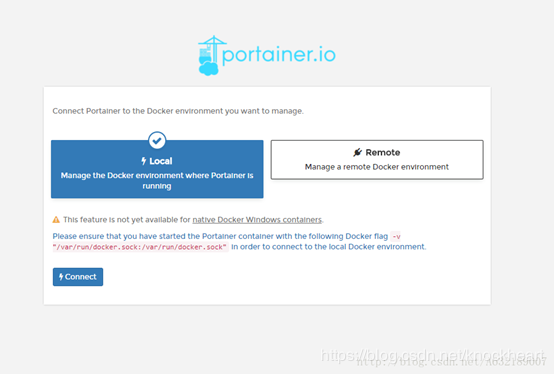

####docker搭建本地dockerUI管理界面

- 从dokcerHub拉取镜像
```text
docker search portainer     
```     
        
```text
docker pull portainer/portainer     
```
[注意：portainer本身也是镜像]        
- 启动容器
```text
docker run -d -p 9002:9000 --restart=always  -v /var/run/docker.sock:/var/run/docker.sock  --name prtainer  portainer/portainer
```

- 登录管理界面
浏览器输入：`http://ip:9002       
首次登录时需要创建用户及密码          
              
   

     
        
点击红色框进入详情
            
本地镜像等的详细信息


        
本地容器列表信息-可单击进入每个容器查看详情信息

        
容器的详细信息及操作界面

        
镜像的列表信息

    
镜像的相信信息及操作界面

