###docker 部署urule
#####安装docker环境(以win7为例)
- 下载                  
从阿里云镜像下载`docker toolbox`[http://mirrors.aliyun.com/docker-toolbox/windows/docker-toolbox/]      
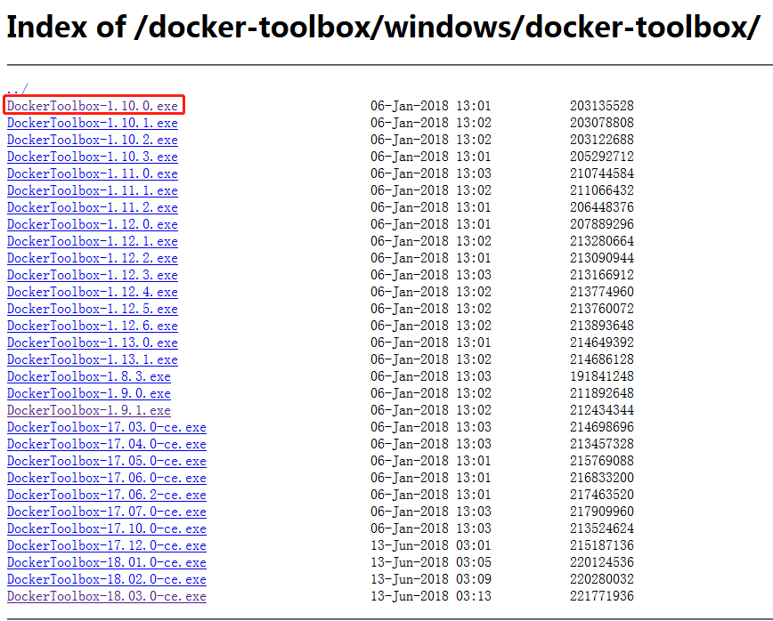            
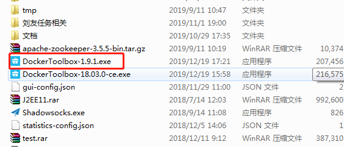            

- 安装           
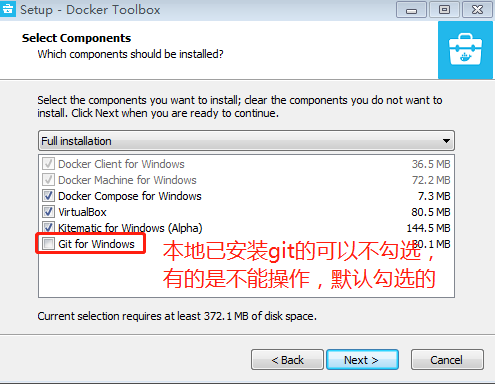            
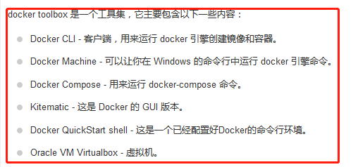            
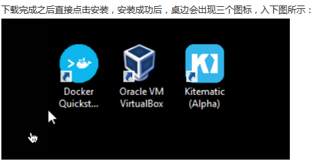            
        
[注意：win10相对比win7安装要容易点，可以直接到官网下载安装包安装]
到此安装成功

- 初始化docker         
双击图标`Docker Quickstart Terminal`
初始化过程中可能出现一下情况
情况1：              
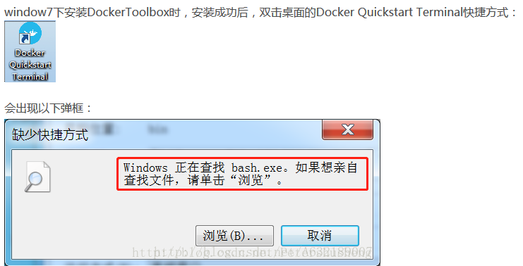                       
这主要是因为在安装过程中因为本地之前已经安装过git环境，而默认安装的git环境与本地之前的git环境的路径不同导致的         
右键点击图标`Docker Quickstart Terminal`找到git的安装目录替换成实际的git安装目录即可             
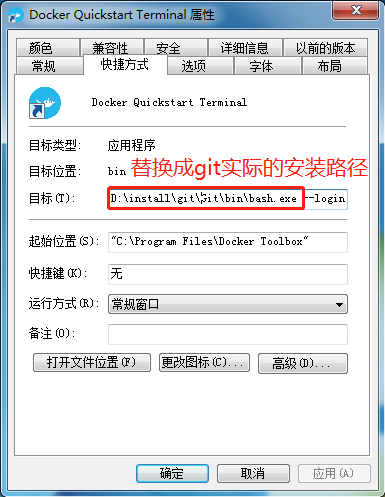                           
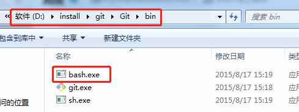                               

情况2：            
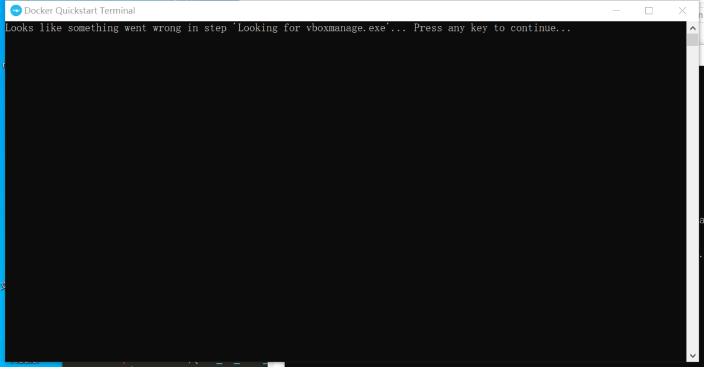                 
正常情况下下载安装`docker toolbox`时是三个软件一起安装的,但在操作第一步的时候，由于出现了情况1的状况或者因为不恰当的方式
导致直接出现情况2，又或者安装时出现其他错误又卸载了(见下图说明)               
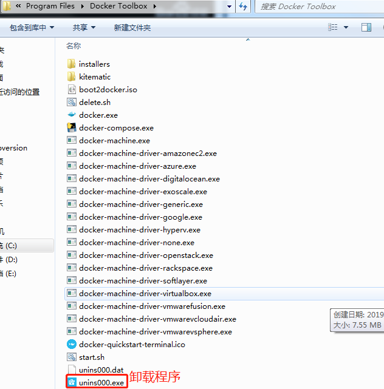                       
单击此卸载程序，但提醒的是该卸载程序只能卸载`Kitematic (Alpha)`和`Docker Quickstart Terminal`不能卸载虚拟机程序，而后又去
下载其他版本的重新安装，所以才会导致上述情况2的状态出现                
[安装好`docker toolbox`出现情况1后因为不知道是git环境造成的，然后又按照上述的方式卸载了`docker toolbox`，导致虚拟机程序没
有卸载，然后又去安装其他版本的`docker toolbox`是导致情况2出现的重要原因]             
[作者自己犯的，当然网上其他的情况也有可能导致这种情况，可以参考去修复bug]         

- 启动docker                   
双击`Docker Quickstart Terminal`图标，等待程序启动                   
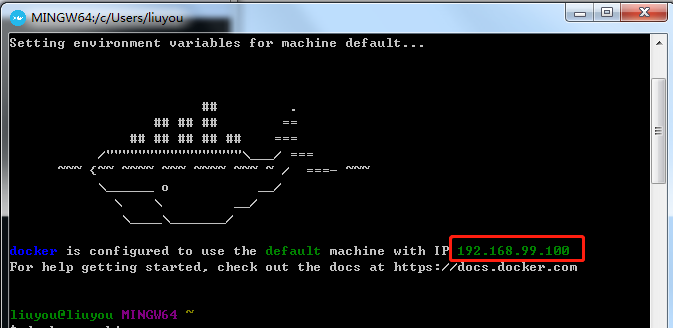                 
出现上述情况则表明启动成功                   
双击`Oracle VM VirtualBox`图标，启动虚拟机                 
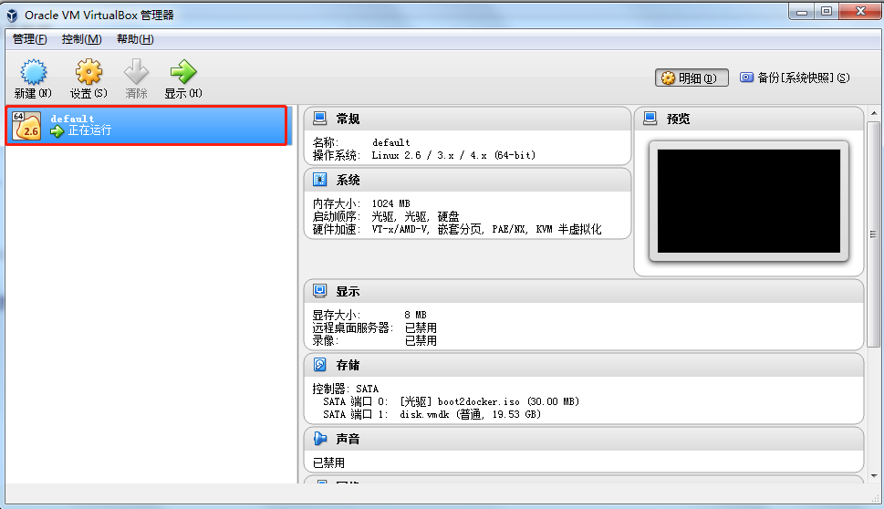                       
双击该虚拟机后启动虚拟机进入docker服务               
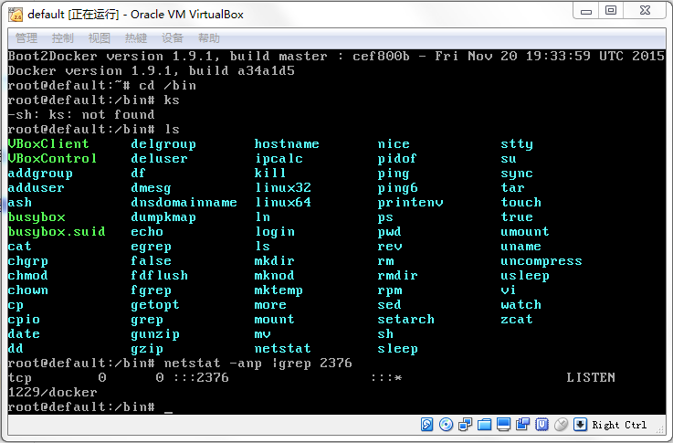                            
此处需要注意的是docker虚拟机上的如无的ip和端口，这个在maven本地打包docker镜像时需要用            
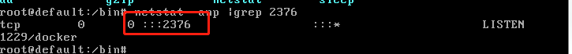                              
图12和图14构成的ip和端口号就是我们maven构建docker镜像时访问的docker服务器的ip和端口          
到此docker服务已经全部搞定            

- maven构建docker镜像       
pom.xml配置一下信息
```text
<plugin>
    <groupId>com.spotify</groupId>
    <artifactId>docker-maven-plugin</artifactId>
    <version>1.0.0</version>
    <configuration>
        <imageName>${project.artifactId}</imageName>
        <dockerDirectory>./</dockerDirectory>
        <dockerHost>https://192.168.99.100:2376</dockerHost> //图12和图14构成的ip和端口号
        <dockerCertPath>C:\Users\liuyou\.docker\machine\machines\default</dockerCertPath>  //需要根据实际情况配置
    </configuration>
</plugin>
```
执行构建命令
```text
mvn package docker:build
```                 
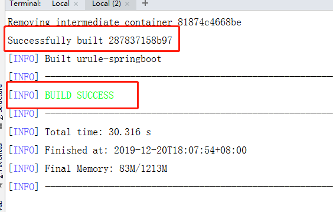                     
出现上述描述则表示docker镜像成功               
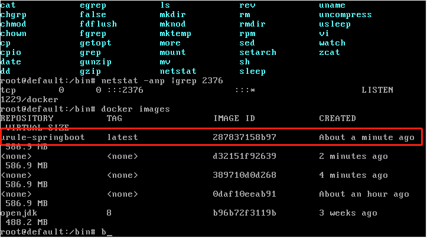                 
镜像成功在docker服务器上(私服仓库)                    
[配置好私服仓库地址后即可拉取镜像]               

- 服务器构建docker镜像(推荐使用这种方式)           
1.上次jar包到服务器
2.编辑Dockerfile文件
```text
FROM openjdk:8
VOLUME /urule
COPY ./*.jar /urule/xiaoan-urule.jar
COPY ./restart-xiaoan-urule /urule/restart-xiaoan-urule
EXPOSE 8091
CMD ["/bin/bash","-g","daemon off;"]
```
3.执行docker构建命令
```text
docker build -t urule/xiaoan-urule:v1 .
```
4.启动容器
```text
docker run -p 8092:8091 -dit --name xiaoan-urule 3c914ac88924 /bin/bash    //3c914ac88924镜像id
```
