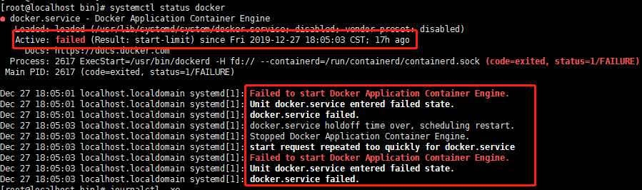
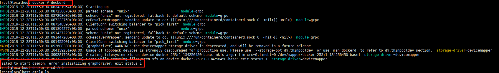
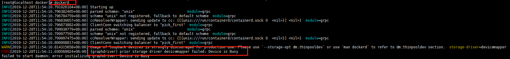

###Linux系统安装docker应用以centos7为例
- 内核版本和系统版本确定
```text
uname -r  #查看内核版本  docker对linux内核版本要求高于3.10
cat /etc/redhat-release  #查看系统版本，系统版本最好centos7及以上
```
- 执行安装脚本
```text
yum install -y gcc
yum install -y gcc-c++
yum remove docker docker-client docker-client-latest docker-common docker-latest docker-latest-logrotate docker-logrotate docker-engine #卸载旧版本
yum install -y yum-utils device-mapper-persistent-data lvm2  
yum-config-manager --add-repo https://download.docker.com/linux/centos/docker-ce.repo #配置官方镜像仓库
#yum-config-manager --add-repo https://mirrors.aliyun.com/docker-ce/linux/centos/docker-ce.repo #配置国内镜像需要在后续步骤增加镜像加速配置文件
yum makecache fast  #更新yum软件包索引
yum install -y docker-ce  #安装社区办docker
systemctl start docker  #启动docker
```
- 配置镜像加速(配置国内镜像仓库)
```text
mkdir -p /etc/docker
vim /etc/docker/daemon.json
systemctl daemon-reload
systemctl restart docker 
```

- 安装过程出现问题
docker启动失败
 
```text
journalctl -xe    #查看想起信息
dockerd           #查看docker日志

```
 

```text
yum update xfsprogs  #mkfs.xfs版本太低
```