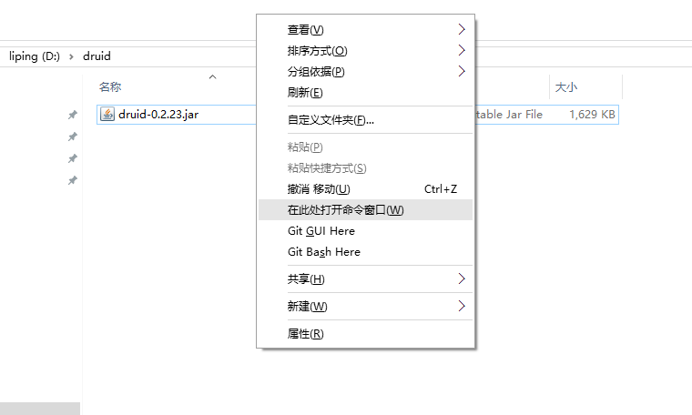
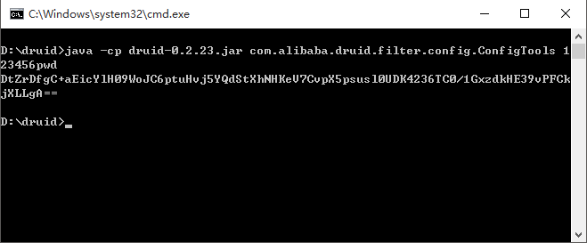
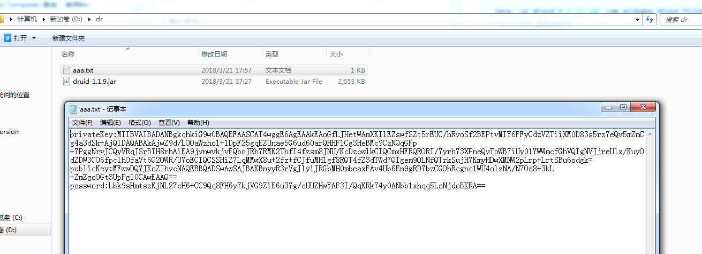

###阿里druid数据源配置及数据库密码加密

```text
    1.阿里默认只对用户密码解密
    2.druid 1.0.16版本及以上的解密时需要同时配置publicKey
```

一.生成密文密码    
1 前提:已经配置了jdk环境
```text
    1.生成密文密码需要准备druid的jar包.然后通过命令行生成,如下步骤:
```
1.1准备jar包
```text
    (示例使用 druid-0.2.23.jar),放到某目录下,且打开命令窗口(win用户可以在目录的空白处 shift+鼠标右键 打开命令窗口);
```


1.2.输入命令:
```text
    1.java -cp druid-0.2.23.jar com.alibaba.druid.filter.config.ConfigTools you_password
```
我要加密的密码是:123456pwd  
注意：druid 1.0.16之前
```text
    1.java -cp druid-0.2.23.jar com.alibaba.druid.filter.config.ConfigTools 123456pwd 
```


注意：druid 1.0.16及以后
```text
    1.java -cp druid-1.1.9.jar com.alibaba.druid.filter.config.ConfigTools 123456pwd >aaa.txt
```
