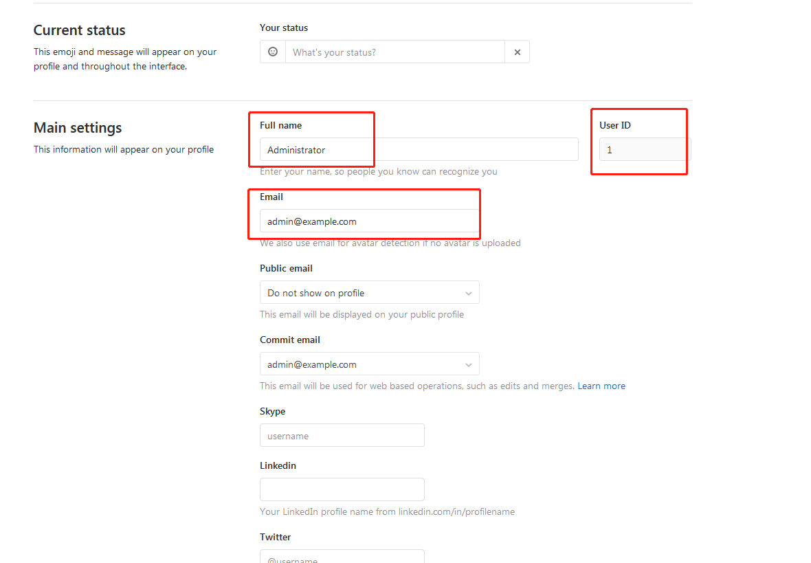

##gitlab重置密码

####重置密码
```text
http://10.10.0.237:7094/help/security/reset_root_password.md

#第一步控制台执行命令
gitlab-rails console -e production  
#出现错误/opt/gitlab/embedded/lib/ruby/2.6.0/tmpdir.rb:35:in `tmpdir': could not find a temporary directory (ArgumentError)时执行如下命令
#chmod +t /tmp

#第二步控制台执行命令
user = User.where(id: 1).first

#第三步查找用户
user = User.find_by(email: 'admin@example.com')

#第四步更新密码
user.password = 'secret_pass'
user.password_confirmation = 'secret_pass'

#保存
user.save!
```

在用户设置界面查看用户id，用户name等信息
    

