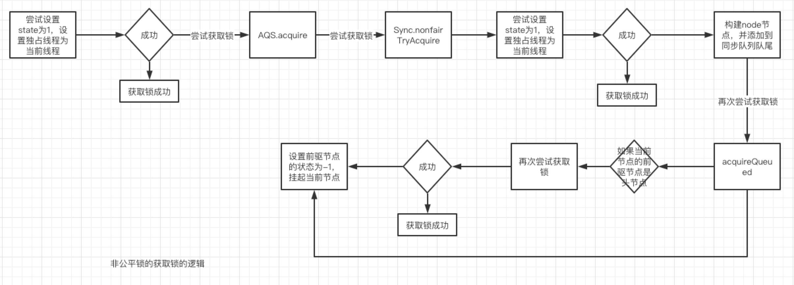

###AQS底层原理分析

//ReentrantLock公平锁的原理
```text
//加锁逻辑
lock.lock()//加锁
sync.lock()//同步静态类实现
acquire(1)//state状态加1 FairSync公平锁
```
```text
//加锁
public final void acquire(int arg) {
    //尝试获取锁
    if (!tryAcquire(arg) &&
        //获取锁失败后 构建当前线程的Note节点，加入同步队列中并挂起当前线程
        acquireQueued(addWaiter(Node.EXCLUSIVE), arg))
        selfInterrupt();
}
```
```text
//尝试获取锁
protected final boolean tryAcquire(int acquires) {
    //获取当前线程
    final Thread current = Thread.currentThread();
    //获取锁的标志状态
    int c = getState();
    //如果当前状态为0表示没有线程占有锁
    if (c == 0) {
        //公平锁逻辑，查询同步队列中是否存在其他等待获取锁的线程
        //如果当前同步队列中存在等待获取锁的线程，那么返回true，否则是false
        //首次进入时，head=tail，同步队列尚未初始化，此时一定没有，所以线程可以获得锁
        //其他线程进入时，如果不是之前被阻塞的线程唤醒后再次进入时，头节点一定不是尾节点，且头节点的下一个节点既不为空也不是当前线程
        //所以此时一定是true，所以尝试获取锁一定会失败，之后就会将当前线程挂起
        //如果是被挂起的线程被唤醒后再次尝试获取锁时，首先头节点一定不是尾节点，且头节点的下一个节点一定不为空，且是当前线程，所以此时返回的是false
        //那么这个时候就会获得锁，并占有锁，从公平的角度来说，也是这个逻辑，当前一个节点释放锁之后，一定是唤醒同步队列中head节点的下一个节点
        if (!hasQueuedPredecessors() &&
            //如果同步队列中没有其他等待获取锁的线程，那么直接将当前线程设置为锁独占
            //如果同步队列中有其他等待获取锁的线程，那么直接获取锁失败，返回false
            compareAndSetState(0, acquires)) {
            setExclusiveOwnerThread(current);
            //尝试获取锁成功
            return true;
        }
    }
    //否则就是已有线程占有锁，那么需要判断是否是同一线程占有锁，是的话就是可重入锁，状态+1
    else if (current == getExclusiveOwnerThread()) {
        int nextc = c + acquires;
        if (nextc < 0)
            throw new Error("Maximum lock count exceeded");
        setState(nextc);
        //尝试获取锁成功
        return true;
    }
    //尝试获取锁失败
    return false;
}
```
```text
//判断当前同步队列中是否存在其他等待获取锁的线程，如果存在则返回true否则返回false
public final boolean hasQueuedPredecessors() {
    Node t = tail; // 尾节点
    Node h = head; // 头节点
    Node s; // 头节点的下一个节点
    //如果当前头节点不等于尾节点 如果头节点的下一个节点不为空或者下一个节点不是当前节点 这种情况只出现在被挂起的线程又再次被唤醒后
    //这里是第一次进入逻辑判断，那么头节点一定等于尾节点 因为同步队列还没有其他等待线程
    return h != t &&
        ((s = h.next) == null || s.thread != Thread.currentThread());
}
```
```text
//构建当前线程的note节点，锁独占
private Node addWaiter(Node mode) {
    Node node = new Node(Thread.currentThread(), mode);
    Node pred = tail;
    //整个if的逻辑就是将当前note节点加入到队尾
    if (pred != null) {//如果同步队列已存在
        node.prev = pred;//将当前note节点的前一个节点置为tail节点
        if (compareAndSetTail(pred, node)) {//将当前note节点设置为tail节点
            pred.next = node;//将原tail节点的下一个节点设置为note节点
            return node;
        }
    }
    //首次尝试获取锁失败，初始化AQS同步队列
    enq(node);
    return node;
}
```
```text
//首次初始化AQS同步队列
private Node enq(final Node node) {
    //自旋的方式
    for (;;) {
        Node t = tail;//尾节点
        if (t == null) { // 为节点不存在，即同步队列未初始化，此时需要初始化同步队列
            if (compareAndSetHead(new Node()))//初始化AQS同步队列，构建head节点
                tail = head;//初始化的同步队列，head节点也是tail节点，也即头节点也是尾节点，然后进入下一次循环
        } else {
            //这里的逻辑就是将新构建的note节点加入到队尾
            node.prev = t;//note节点的前一个节点设置为tail节点
            if (compareAndSetTail(t, node)) {//将note节点设置为tail节点
                t.next = node;//将原tail节点的下一个节点设置为note节点
                return t;
            }
        }
    }
}
```
```text
final boolean acquireQueued(final Node node, int arg) {
    boolean failed = true;
    try {
        boolean interrupted = false;
        //自旋方式
        for (;;) {
            //当前note节点的前一个节点
            //如果是首次获取锁失败，则当前节点的前一个节点为head节点，否则进入下一个if将会挂起当前线程
            //另外还有一种就是被挂起的线程再次唤醒时，因为唤醒的总是head节点的下一个节点
            //如果当前节点的前一个节点是head节点，也就是当前要获的锁的线程就是最早加入等同步列的
            final Node p = node.predecessor();
            //再次尝试获取锁
            if (p == head && tryAcquire(arg)) {
                //如果获取锁成功，那么将当前节点设置为head节点，同时移除原head节点
                setHead(node);
                p.next = null; // help GC
                failed = false;
                return interrupted;
            }
            //当前节点的前一个节点不是head节点，也就是同步队列还有其他等待线程或者是尝试获取锁失败后
            //这个时候就要将当前note节点的前一个节点的waitStatus设置为-1，且挂起当前note节点的线程
            if (shouldParkAfterFailedAcquire(p, node) &&
                //挂起当前线程
                parkAndCheckInterrupt())
                interrupted = true;
        }
    } finally {
        if (failed)
            cancelAcquire(node);
    }
}
```
```text
//释放锁逻辑
lock.unlock()//释放锁
sync.release(1) //state状态减1
//尝试释放锁
public final boolean release(int arg) {
    //尝试释放锁
    if (tryRelease(arg)) {
        //释放锁成功
        Node h = head;
        //判断当前head节点是否存在，或者head节点的waitStatus状态不为0
        //如果当前head节点存在，则说明同步队列中还有需要唤醒的线程
        //如果头节点的waitStatus不等于0是因为每一次有线程获取锁失败后，加入同步队列时，都会将前一个节点的waitStatus状态设置为-1
        //如果头节点不为空且其状态waitStatus不等于0这个时候在同步队列中一定有等待线程
        //不能只单纯判断头节点不为空，还有一种情况是第一个线程获得了锁，第二个线程尝试获取锁失败后，会构建note对象并加入同步队列，在挂起线程前
        //还是会再次尝试获取锁，如果此次获取锁成功，那么就会将当前note节点替换成head节点，此时note节点的waitStatus状态为0，只有在获取锁再次失败后
        //被挂起之前，它才会去将head节点的waitStatus设置为-1，并挂起当前线程，所以仅靠h != null这一条件显然是不够的
        if (h != null && h.waitStatus != 0)
            //唤醒同步队列中的等待线程
            unparkSuccessor(h);
        return true;
    }
    return false;
}
```
```text
protected final boolean tryRelease(int releases) {
    //直接将state状态减1
    int c = getState() - releases;
    //判断释放锁的线程是否是当前占有锁的线程，如果不是直接报错
    if (Thread.currentThread() != getExclusiveOwnerThread())
        throw new IllegalMonitorStateException();
    boolean free = false;
    if (c == 0) {//如果state复位到无锁状态，则释放锁成功，否则是可重入锁，需要多次unlock操作
        free = true;
        setExclusiveOwnerThread(null);
    }
    setState(c);
    return free;
}
```
```text
private void unparkSuccessor(Node node) {
    //如果head节点状态小于0则更新为0
    int ws = node.waitStatus;
    if (ws < 0)
        //挂起线程前，会将当前节点的前一个节点的waitStatus设置为-1 这也是if (h != null && h.waitStatus != 0)条件判断的原因所在
        compareAndSetWaitStatus(node, ws, 0);

    //获取当前head节点的下一个节点
    Node s = node.next;
    //head节点的下一个节点为null，这个所有可能是setHead节点时出现的并发情况，所以这种情况需要从tail节点从后往前遍历，
    //找到最后一个waitStatus小于等于0的note节点进行唤醒
    if (s == null || s.waitStatus > 0) {
        s = null;
        for (Node t = tail; t != null && t != node; t = t.prev)
            if (t.waitStatus <= 0)
                s = t;
    }
    //如果下一个节点存在，则唤醒head节点的下一个线程 释放锁的流程结束
    if (s != null)
        LockSupport.unpark(s.thread);
}
```
```text
//线程被唤醒的流程
final boolean acquireQueued(final Node node, int arg) {
    boolean failed = true;
    try {
        boolean interrupted = false;
        for (;;) {
            //线程被唤醒后会再次判断，因为唤醒的线程是head节点的下一个note节点
            final Node p = node.predecessor();
            if (p == head && tryAcquire(arg)) {//此时p == head成立，会再次尝试获取锁 一定会获得锁成功
                //将当前note节点替换head
                setHead(node);
                p.next = null; // help GC
                failed = false;
                return interrupted;
            }
            if (shouldParkAfterFailedAcquire(p, node) &&
                //此处线程被挂起，释放锁后线程被唤醒
                parkAndCheckInterrupt())
                interrupted = true;
        }
    } finally {
        if (failed)
            cancelAcquire(node);
    }
}
```
```text
//被唤醒的线程再次尝试获取锁
protected final boolean tryAcquire(int acquires) {
    final Thread current = Thread.currentThread();//当前线程
    int c = getState();//锁的状态 此时肯定是0 因为前一个线程释放了锁
    if (c == 0) {
        //还是会去判断同步队列的等待情况 此时一定是false
        if (!hasQueuedPredecessors() &&
            //占有锁成功
            compareAndSetState(0, acquires)) {
            setExclusiveOwnerThread(current);
            return true;
        }
    }
    else if (current == getExclusiveOwnerThread()) {
        int nextc = c + acquires;
        if (nextc < 0)
            throw new Error("Maximum lock count exceeded");
        setState(nextc);
        return true;
    }
    return false;
}
```
```text
public final boolean hasQueuedPredecessors() {
    Node t = tail;
    Node h = head;
    Node s;
    //此时h != t成立，同步队列里已经存在等待锁的线程，s = h.next) == null不成立，s.thread != Thread.currentThread()也不成立
    //因为唤醒的就是head节点的下一个节点，所以一定不为空，且一定是当前线程 因此返回的一定是false
    return h != t &&
        ((s = h.next) == null || s.thread != Thread.currentThread());
}
```

非公平锁获取流程


非公平锁的解锁流程


https://mp.weixin.qq.com/s?__biz=MzUzMTA2NTU2Ng==&mid=2247484040&idx=1&sn=60633c2dc4814b26dc4b39bb2bb5d4dd&chksm=fa497d39cd3ef42f539cd0576c1a3575ee27307048248571e954f0ff21a5a9b1ddfab522c834&scene=21#wechat_redirect


