###nexus搭建本地maven私服仓库

##### 传统部署nexus
- 下载nexus安装包
下载地址：https://www.sonatype.com/download-oss-sonatype

- 解压缩本地nexus压缩包
```text
tar -zxvf nexus-xxx.tar.gz
```
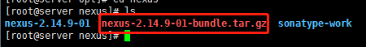 

- 基础配置
```text
cd /opt/nexus/nexus-2.14.9-01/conf #本地解压缩目录
vim nexus.properties #修改默认配置信息，如端口等(可以省略)
```
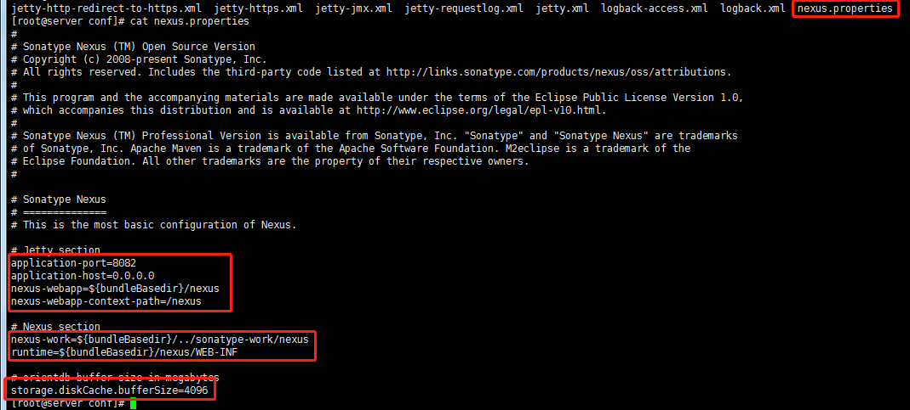 

- 启动nexus服务
```text
cd /opt/nexus/nexus-2.14.9-01/bin #本地解压缩目录
./nexus start #启动服务  [start|stop|status|restart]
```
[启动服务时，由于nexus默认是没有指定在root用户下运行，启动服务会报错无法启动，只需要编辑vi ~/.bash_profile中添加全局变量export RUN_AS_USER=root即可
或者编辑切换到/usr/local/nexus/nexus-2.14.9-01/bin 编辑nexus文件设置RUN_AS_USER=root(两个配置一个即可)]
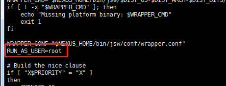

- 设置软链接
```text
ln -s /usr/local/nexus/nexus-2.14.9-01/bin/nexus /etc/init.d/nexus #/usr/local/nexus/nexus-2.14.9-01本地解压缩目录
cd /usr/local/nexus/nexus-2.14.9-01/bin #切换bin目录
./nexus restart #重启nexus服务
```
设置软链接后可以直接在任意地方执行 service命令操作nexus，而不需要再切换到nexus的bin目录执行nexus脚本
```text
service nexus status|start|stop|restart
```
```text
chkconfig nexus on/off #设置nexus服务开机自启动或者开机不启动
```

- 注意防火墙开放8081端口，否则无法访问
```text
firewall-cmd --permanent --add-port=8091/tcp
firewall-cmd --reload
```

- jar包管理及上传
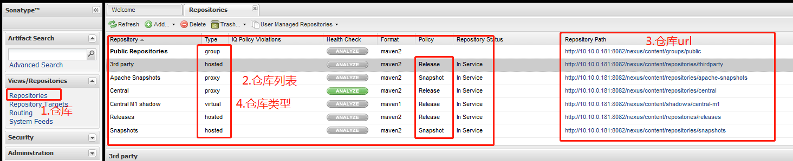
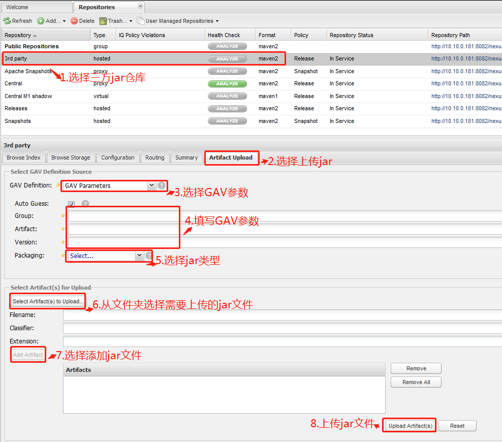
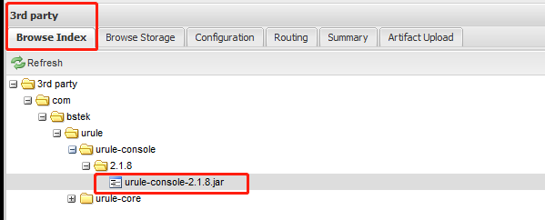
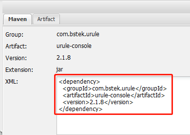


##### docker部署nexus
- 下载docker的nexus镜像
```text
docker search nexus
```
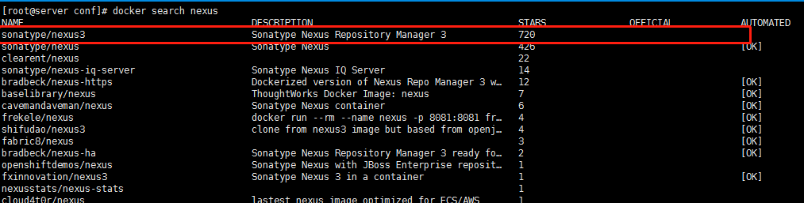 
```text
docker pull sonatype/nexus3
```
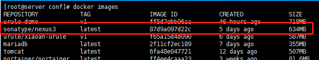 

- 启动nexus服务
```text
docker run -d -p 8081:8081 --name nexus -v /srv/nexus-data:/nexus-data --restart=always sonatype/nexus3
```
查看日志
```text
docker logs -f nexus
```
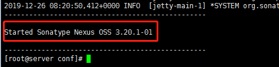 
出现了Started Sonatype Nexus OSS说明启动成功，通过http://ip:8081访问即可

- 登录
点击右上角Sign in进行登录，账号为admin，密码需要去镜像中查看
```text
# 进入镜像
docker exec -it nexus bash
# 查看密码，路径在登录框会提示，然后复制即可，登陆成功后会让你修改密码
cat /nexus-data/admin.password
```
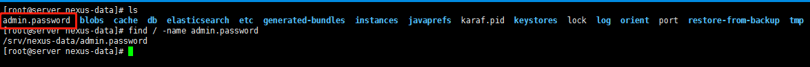 
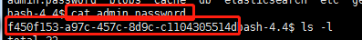 
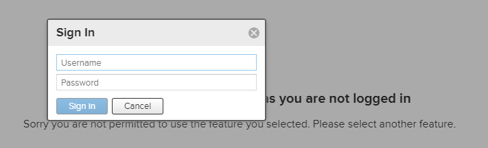
输入用户名密码第一次登录时需要重置密码，过后原admin.password将会被删除

##### nexus仓库
- 仓库类型
Nexus有四种仓库和四种仓库类型           

a、仓库
   
|仓库名|描述|
|---|---|
|maven-central|maven中央库，默认从https://repo1.maven.org/maven2/拉取jar|
|maven-releases| 	私库发行版jar|
|maven-snapshots|私库快照（调试版本）jar|
|maven-public|仓库分组，把上面三个仓库组合在一起对外提供服务，在本地maven基础配置settings.xml中使用|

b、类型

|类型|描述|
|---|---|
|group(仓库组类型)|用于方便开发人员自己设定的仓库|
|hosted(宿主类型)|内部项目的发布仓库（内部开发人员，发布上去存放的仓库）|
|proxy(代理类型)|从远程中央仓库中寻找数据的仓库（可以点击对应的仓库的Configuration页签下Remote Storage Location属性的值即被代理的远程仓库的路径）|
|virtual(虚拟类型)|虚拟仓库（这个基本用不到，重点关注上面三个仓库的使用）|

- 拉取jar包流程
Maven可直接从宿主仓库下载构件，也可以从代理仓库下载构件，而代理仓库间接的从远程仓库下载并缓存构件，为了方便，
Maven可以从仓库组下载构件，而仓库组并没有实际的内容(下图中用虚线表示，它会转向包含的宿主仓库或者代理仓库获得实际构件的内容)


- 创建仓库
进过上面的讲解，我们对仓库已经有了了解，接下来我们进行创建仓库，分为是`代理仓库(proxy)`、`宿主仓库(hosted)`、`仓库组(group)`，
点击主页上面的小螺丝然后在选择`Repositories`进入仓库管理列表，然后就可以开始创建我们的仓库啦，选择仓库类型的时候一定要选择`maven2`

a、proxy代理仓库
我们使用阿里的中央仓库
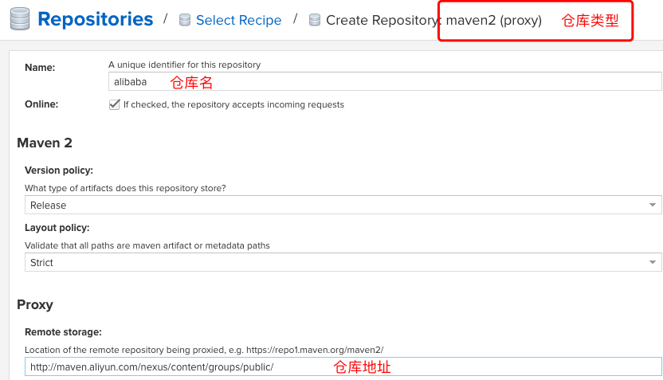

b、hosted宿主仓库
这里可以创建releases和snapshot类型的仓库，这里就演示一种
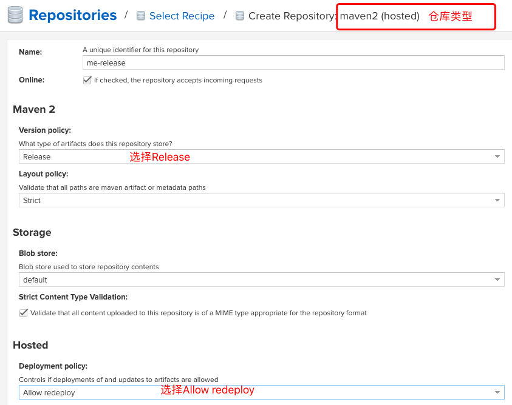

c、group仓库组
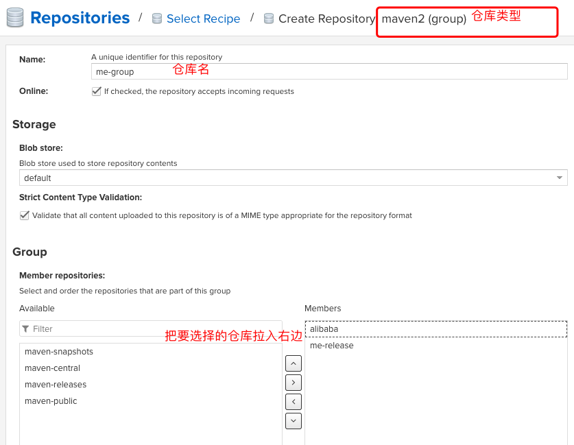

- 项目配置
a、pom文件修改
```text
<distributionManagement>
    <repository>
        <!--ID可以随便写，但是要与maven的setting文件中一致-->
        <id>releases</id>
        <!--指向仓库类型为hosted(宿主仓库）的储存类型为Release的仓库---->
        <url>http://你nexus仓库的IP:8081/repository/me-release/</url>
    </repository>
</distributionManagement>
```
b、setting.xml修改
```text
<mirrors>
    <mirror>
        <id>mynexus</id>
        <name>myself nexus repository</name>
        <url>http://xxx:8081/repository/me-group/</url>
        <mirrorOf>central</mirrorOf>
    </mirror>
</mirrors>

<servers>
    <server>
      <id>releases</id><!--对应项目pom文件中设置的-->
      <username>admin</username>
      <password>admin123</password>
    </server>
</servers>
```

c、发布
如果使用的是IDEA开发工具可以直接在右边工具栏Maven工具点击deploy，也可以直接在命令行进入本项目根目录进行mvn deploy
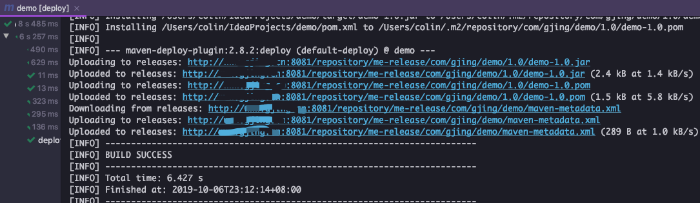
这时nexus私服上也会出现我们的jar包
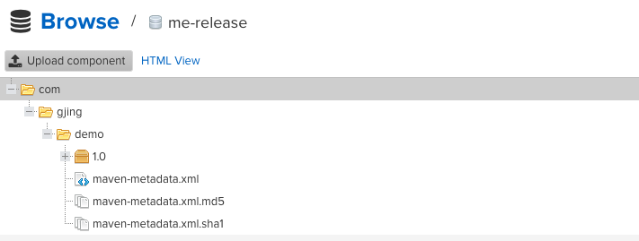

参考文档：https://yq.aliyun.com/articles/720033?spm=a2c4e.11155472.0.0.645576f5nVJuOq