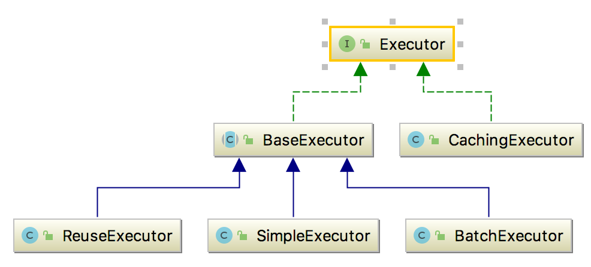

##mybatis之四大对象及作用域


|对象|作用域|    
|---|---|
|SqlSessionFactoryBuilder|方法级别|
|SqlSessionFactory|应用级别|
|SqlSession|请求或操作级别|
|Mapper实例|请求或操作级别|

- SqlSessionFactoryBuilder
这个类可以被实例化、使用和丢弃，一旦创建了 SqlSessionFactory，就不再需要它了。 因此 SqlSessionFactoryBuilder 实例的最佳作用域是方法作用域
（也就是局部方法变量）。 你可以重用 SqlSessionFactoryBuilder 来创建多个 SqlSessionFactory 实例，但最好还是不要一直保留着它，以保证所有的 
XML 解析资源可以被释放给更重要的事情。

- SqlSessionFactory
SqlSessionFactory 一旦被创建就应该在应用的运行期间一直存在，没有任何理由丢弃它或重新创建另一个实例。 使用 SqlSessionFactory 的最佳实践是在应
用运行期间不要重复创建多次，多次重建 SqlSessionFactory 被视为一种代码“坏习惯”。因此 SqlSessionFactory 的最佳作用域是应用作用域。 有很多方法
可以做到，最简单的就是使用单例模式或者静态单例模式。

- SqlSession
每个线程都应该有它自己的 SqlSession 实例。SqlSession 的实例不是线程安全的，因此是不能被共享的，所以它的最佳的作用域是请求或方法作用域。 绝对不
能将 SqlSession 实例的引用放在一个类的静态域，甚至一个类的实例变量也不行。 也绝不能将 SqlSession 实例的引用放在任何类型的托管作用域中，比如 
Servlet 框架中的 HttpSession。 如果你现在正在使用一种 Web 框架，考虑将 SqlSession 放在一个和 HTTP 请求相似的作用域中。 换句话说，每次收到 
HTTP 请求，就可以打开一个 SqlSession，返回一个响应后，就关闭它。 这个关闭操作很重要，为了确保每次都能执行关闭操作，你应该把这个关闭操作放到 
finally 块中。 下面的示例就是一个确保 SqlSession 关闭的标准模式：
```text
try (SqlSession session = sqlSessionFactory.openSession()) {
  // 你的应用逻辑代码
}
```
在所有代码中都遵循这种使用模式，可以保证所有数据库资源都能被正确地关闭。

- 映射器实例
映射器是一些绑定映射语句的接口。映射器接口的实例是从 SqlSession 中获得的。虽然从技术层面上来讲，任何映射器实例的最大作用域与请求它们的 SqlSession 
相同。但方法作用域才是映射器实例的最合适的作用域。 也就是说，映射器实例应该在调用它们的方法中被获取，使用完毕之后即可丢弃。 映射器实例并不需要被显式地
关闭。尽管在整个请求作用域保留映射器实例不会有什么问题，但是你很快会发现，在这个作用域上管理太多像 SqlSession 的资源会让你忙不过来。 因此，最好将映
射器放在方法作用域内。就像下面的例子一样：
```text
try (SqlSession session = sqlSessionFactory.openSession()) {
  BlogMapper mapper = session.getMapper(BlogMapper.class);
  // 你的应用逻辑代码
}
```

###Mybatis之四大对象
- Excutor   

```text
public interface SqlSessionFactory {

  SqlSession openSession();//创建Excutor对象

}
```
```text
public class DefaultSqlSessionFactory implements SqlSessionFactory {

  ...

  @Override
  public SqlSession openSession() {
    //configuration.getDefaultExecutorType()配置默认的执行器。SIMPLE 就是普通的执行器；REUSE 执行器会重用预处理语句（PreparedStatement）；
    //BATCH 执行器不仅重用语句还会执行批量更新。默认情况下如果什么都不配置就是SIMPLE
    return openSessionFromDataSource(configuration.getDefaultExecutorType(), null, false);
  }
}
```
```text
private SqlSession openSessionFromDataSource(ExecutorType execType, TransactionIsolationLevel level, boolean autoCommit) {
    Transaction tx = null;
    try {
      //创建了事务工厂和数据库连接
      final Environment environment = configuration.getEnvironment();
      //拿到事务工厂，根据工厂创建对象创建对应的事务对象 抽象工厂模式
      final TransactionFactory transactionFactory = getTransactionFactoryFromEnvironment(environment);
      //根据对应的工厂创建对应的事务处理对象
      tx = transactionFactory.newTransaction(environment.getDataSource(), level, autoCommit);
      //创建四大对象之一的Excutor对象
      final Executor executor = configuration.newExecutor(tx, execType);
      return new DefaultSqlSession(configuration, executor, autoCommit);
    } catch (Exception e) {
      closeTransaction(tx); // may have fetched a connection so lets call close()
      throw ExceptionFactory.wrapException("Error opening session.  Cause: " + e, e);
    } finally {
      ErrorContext.instance().reset();
    }
}
```
```text
public class Configuration {
    public Executor newExecutor(Transaction transaction, ExecutorType executorType) {
        executorType = executorType == null ? defaultExecutorType : executorType;
        executorType = executorType == null ? ExecutorType.SIMPLE : executorType;
        Executor executor;
        //默认情况下SIMPLE
        if (ExecutorType.BATCH == executorType) {
          //重用和批处理
          executor = new BatchExecutor(this, transaction);
        } else if (ExecutorType.REUSE == executorType) {
          //重用statement
          executor = new ReuseExecutor(this, transaction);
        } else {
          //简单statement
          executor = new SimpleExecutor(this, transaction);
        }
        if (cacheEnabled) {
          executor = new CachingExecutor(executor);
        }
        executor = (Executor) interceptorChain.pluginAll(executor);
        return executor;
    }
}
```
```text
public class BatchExecutor extends BaseExecutor {
    @Override
    public int doUpdate(MappedStatement ms, Object parameterObject) throws SQLException {
        final Configuration configuration = ms.getConfiguration();
        final StatementHandler handler = configuration.newStatementHandler(this, ms, parameterObject, RowBounds.DEFAULT, null, null);
        ...
        handler.batch(stmt);
        return BATCH_UPDATE_RETURN_VALUE;
    }
}

public class PreparedStatementHandler extends BaseStatementHandler {
    @Override
    public void batch(Statement statement) throws SQLException {
        PreparedStatement ps = (PreparedStatement) statement;//可重用的statement
        ps.addBatch();//批处理
    }
}
public class SimpleStatementHandler extends BaseStatementHandler {
    @Override
    public void batch(Statement statement) throws SQLException {
        String sql = boundSql.getSql();
        statement.addBatch(sql);
    }
}
```
```text
public class ReuseExecutor extends BaseExecutor {
    @Override
    public int doUpdate(MappedStatement ms, Object parameter) throws SQLException {
        Configuration configuration = ms.getConfiguration();
        StatementHandler handler = configuration.newStatementHandler(this, ms, parameter, RowBounds.DEFAULT, null, null);
        Statement stmt = prepareStatement(handler, ms.getStatementLog());
        return handler.update(stmt);
    }
    
    
    private Statement prepareStatement(StatementHandler handler, Log statementLog) throws SQLException {
        Statement stmt;
        BoundSql boundSql = handler.getBoundSql();
        String sql = boundSql.getSql();
        if (hasStatementFor(sql)) {//重用statement
          stmt = getStatement(sql);
          applyTransactionTimeout(stmt);
        } else {
          Connection connection = getConnection(statementLog);
          stmt = handler.prepare(connection, transaction.getTimeout());
          putStatement(sql, stmt);
        }
        handler.parameterize(stmt);
        return stmt;
    }
    
    private boolean hasStatementFor(String sql) {
        try {
           //通过sql缓存statement
          return statementMap.keySet().contains(sql) && !statementMap.get(sql).getConnection().isClosed();
        } catch (SQLException e) {
          return false;
        }
    }
    
    private void putStatement(String sql, Statement stmt) {
        statementMap.put(sql, stmt);
    }
}
```
```text
public class SimpleExecutor extends BaseExecutor {
    @Override
    public int doUpdate(MappedStatement ms, Object parameter) throws SQLException {
        Statement stmt = null;
        try {
            Configuration configuration = ms.getConfiguration();
            StatementHandler handler = configuration.newStatementHandler(this, ms, parameter, RowBounds.DEFAULT, null, null);
            stmt = prepareStatement(handler, ms.getStatementLog());
            return handler.update(stmt);
        } finally {
            closeStatement(stmt);
        }
    } 
    
    private Statement prepareStatement(StatementHandler handler, Log statementLog) throws SQLException {
        Statement stmt;
        Connection connection = getConnection(statementLog);
        stmt = handler.prepare(connection, transaction.getTimeout());
        handler.parameterize(stmt);
        return stmt;
    }
}
```
```text
public class SimpleStatementHandler extends BaseStatementHandler {
    @Override
    protected Statement instantiateStatement(Connection connection) throws SQLException {
        if (mappedStatement.getResultSetType() == ResultSetType.DEFAULT) {
          return connection.createStatement();
        } else {
          return connection.createStatement(mappedStatement.getResultSetType().getValue(), ResultSet.CONCUR_READ_ONLY);
        }
    }
}
```   

- StatementHandler
```text
public class SimpleExecutor extends BaseExecutor {
    @Override
    public <E> List<E> doQuery(MappedStatement ms, Object parameter, RowBounds rowBounds, ResultHandler resultHandler, BoundSql boundSql) throws SQLException {
        Statement stmt = null;
        try {
          Configuration configuration = ms.getConfiguration();
          StatementHandler handler = configuration.newStatementHandler(wrapper, ms, parameter, rowBounds, resultHandler, boundSql);
          stmt = prepareStatement(handler, ms.getStatementLog());
          return handler.query(stmt, resultHandler);
        } finally {
          closeStatement(stmt);
        }
    }
}

public class Configuration {
    public StatementHandler newStatementHandler(Executor executor, MappedStatement mappedStatement, Object parameterObject, RowBounds rowBounds, ResultHandler resultHandler, BoundSql boundSql) {
        StatementHandler statementHandler = new RoutingStatementHandler(executor, mappedStatement, parameterObject, rowBounds, resultHandler, boundSql);
        statementHandler = (StatementHandler) interceptorChain.pluginAll(statementHandler);
        return statementHandler;
    }
}
public class RoutingStatementHandler implements StatementHandler {
    public RoutingStatementHandler(Executor executor, MappedStatement ms, Object parameter, RowBounds rowBounds, ResultHandler resultHandler, BoundSql boundSql) {
        
        //默认情况下是PREPARED
        switch (ms.getStatementType()) {
            case STATEMENT:
                delegate = new SimpleStatementHandler(executor, ms, parameter, rowBounds, resultHandler, boundSql);
                break;
            case PREPARED:
                delegate = new PreparedStatementHandler(executor, ms, parameter, rowBounds, resultHandler, boundSql);
                break;
            case CALLABLE:
                delegate = new CallableStatementHandler(executor, ms, parameter, rowBounds, resultHandler, boundSql);
                break;
            default:
                throw new ExecutorException("Unknown statement type: " + ms.getStatementType());
        }
    
    }
}
```

- ParameterHandler
```text
public class SimpleExecutor extends BaseExecutor {
    @Override
    public <E> List<E> doQuery(MappedStatement ms, Object parameter, RowBounds rowBounds, ResultHandler resultHandler, BoundSql boundSql) throws SQLException {
        Statement stmt = null;
        try {
            Configuration configuration = ms.getConfiguration();
            StatementHandler handler = configuration.newStatementHandler(wrapper, ms, parameter, rowBounds, resultHandler, boundSql);
            stmt = prepareStatement(handler, ms.getStatementLog());
            return handler.query(stmt, resultHandler);
        } finally {
            closeStatement(stmt);
        }
    }
    
    private Statement prepareStatement(StatementHandler handler, Log statementLog) throws SQLException {
        Statement stmt;
        Connection connection = getConnection(statementLog);
        stmt = handler.prepare(connection, transaction.getTimeout());
        handler.parameterize(stmt);
        return stmt;
    }
}

public abstract class BaseStatementHandler implements StatementHandler {
    ...
    protected final ParameterHandler parameterHandler;
    ...
    
    protected BaseStatementHandler(Executor executor, MappedStatement mappedStatement, Object parameterObject, RowBounds rowBounds, ResultHandler resultHandler, BoundSql boundSql) {
        ...
        this.parameterHandler = configuration.newParameterHandler(mappedStatement, parameterObject, boundSql);
        ...
    }
      
}

public class Configuration {
    public ParameterHandler newParameterHandler(MappedStatement mappedStatement, Object parameterObject, BoundSql boundSql) {
        ParameterHandler parameterHandler = mappedStatement.getLang().createParameterHandler(mappedStatement, parameterObject, boundSql);
        parameterHandler = (ParameterHandler) interceptorChain.pluginAll(parameterHandler);
        return parameterHandler;
    }
}

public class XMLLanguageDriver implements LanguageDriver {
    @Override
    public ParameterHandler createParameterHandler(MappedStatement mappedStatement, Object parameterObject, BoundSql boundSql) {
        return new DefaultParameterHandler(mappedStatement, parameterObject, boundSql);
    }
}


public class PreparedStatementHandler extends BaseStatementHandler {
    @Override
    public void parameterize(Statement statement) throws SQLException {
        parameterHandler.setParameters((PreparedStatement) statement);
    }
}

public class DefaultParameterHandler implements ParameterHandler {
    @Override
    public void setParameters(PreparedStatement ps) {
        ErrorContext.instance().activity("setting parameters").object(mappedStatement.getParameterMap().getId());
        List<ParameterMapping> parameterMappings = boundSql.getParameterMappings();
        if (parameterMappings != null) {
            for (int i = 0; i < parameterMappings.size(); i++) {
                ParameterMapping parameterMapping = parameterMappings.get(i);
                if (parameterMapping.getMode() != ParameterMode.OUT) {
                    Object value;
                    String propertyName = parameterMapping.getProperty();
                    if (boundSql.hasAdditionalParameter(propertyName)) { // issue #448 ask first for additional params
                        value = boundSql.getAdditionalParameter(propertyName);
                    } else if (parameterObject == null) {
                        value = null;
                    } else if (typeHandlerRegistry.hasTypeHandler(parameterObject.getClass())) {
                        value = parameterObject;
                    } else {
                        MetaObject metaObject = configuration.newMetaObject(parameterObject);
                        value = metaObject.getValue(propertyName);
                    }
                        TypeHandler typeHandler = parameterMapping.getTypeHandler();
                        JdbcType jdbcType = parameterMapping.getJdbcType();
                    if (value == null && jdbcType == null) {
                        jdbcType = configuration.getJdbcTypeForNull();
                    }
                    try {
                        typeHandler.setParameter(ps, i + 1, value, jdbcType);
                    } catch (TypeException | SQLException e) {
                        throw new TypeException("Could not set parameters for mapping: " + parameterMapping + ". Cause: " + e, e);
                    }
                }
            }
        }
    }
}

```
- ResultSetHandler
```text
public abstract class BaseStatementHandler implements StatementHandler {
    ...
    protected final ResultSetHandler resultSetHandler;
    ...
    
    protected BaseStatementHandler(Executor executor, MappedStatement mappedStatement, Object parameterObject, RowBounds rowBounds, ResultHandler resultHandler, BoundSql boundSql) {
        ....
        this.resultSetHandler = configuration.newResultSetHandler(executor, mappedStatement, rowBounds, parameterHandler, resultHandler, boundSql);
    }
}
public class Configuration {
    public ResultSetHandler newResultSetHandler(Executor executor, MappedStatement mappedStatement, RowBounds rowBounds, ParameterHandler parameterHandler,
        ResultHandler resultHandler, BoundSql boundSql) {
        ResultSetHandler resultSetHandler = new DefaultResultSetHandler(executor, mappedStatement, parameterHandler, resultHandler, boundSql, rowBounds);
        resultSetHandler = (ResultSetHandler) interceptorChain.pluginAll(resultSetHandler);
        return resultSetHandler;
    }
}

public class PreparedStatementHandler extends BaseStatementHandler {
    @Override
    public <E> List<E> query(Statement statement, ResultHandler resultHandler) throws SQLException {
        PreparedStatement ps = (PreparedStatement) statement;
        ps.execute();
        return resultSetHandler.handleResultSets(ps);
    }
}

public class DefaultResultSetHandler implements ResultSetHandler {
    @Override
    public List<Object> handleResultSets(Statement stmt) throws SQLException {
        ErrorContext.instance().activity("handling results").object(mappedStatement.getId());
        
        final List<Object> multipleResults = new ArrayList<>();
        
        int resultSetCount = 0;
        //结果集的第一个结果
        ResultSetWrapper rsw = getFirstResultSet(stmt);
        //拿到Mapper的xml文件中配置的ResultMap配置信息
        List<ResultMap> resultMaps = mappedStatement.getResultMaps();//当前的sql的MappedStatement对应的ResultMap对象，正常来说一个MappedStatement对应的肯定是一个ResultMap对象
        int resultMapCount = resultMaps.size();
        validateResultMapsCount(rsw, resultMapCount);
        while (rsw != null && resultMapCount > resultSetCount) {
            ResultMap resultMap = resultMaps.get(resultSetCount);//挨个去匹配Mapper的xml文件中配置的ResultMap和结果集返回的ResultSet
            //根据resultMap处理rsw生成java对象
            handleResultSet(rsw, resultMap, multipleResults, null);
            //获取结果集的下一个结果
            rsw = getNextResultSet(stmt);
            cleanUpAfterHandlingResultSet();
            resultSetCount++;
        }
        
        String[] resultSets = mappedStatement.getResultSets();
        if (resultSets != null) {
            while (rsw != null && resultSetCount < resultSets.length) {
                ResultMapping parentMapping = nextResultMaps.get(resultSets[resultSetCount]);
                if (parentMapping != null) {
                    String nestedResultMapId = parentMapping.getNestedResultMapId();
                    ResultMap resultMap = configuration.getResultMap(nestedResultMapId);
                    handleResultSet(rsw, resultMap, null, parentMapping);
                }
                rsw = getNextResultSet(stmt);
                cleanUpAfterHandlingResultSet();
                resultSetCount++;
            }
        }
        
        return collapseSingleResultList(multipleResults);
    }
    
    private void handleResultSet(ResultSetWrapper rsw, ResultMap resultMap, List<Object> multipleResults, ResultMapping parentMapping) throws SQLException {
        try {
          if (parentMapping != null) {
            handleRowValues(rsw, resultMap, null, RowBounds.DEFAULT, parentMapping);
          } else {
            if (resultHandler == null) {//return executor.query(ms, wrapCollection(parameter), rowBounds, Executor.NO_RESULT_HANDLER); resultHandler默认为null
              DefaultResultHandler defaultResultHandler = new DefaultResultHandler(objectFactory);
              handleRowValues(rsw, resultMap, defaultResultHandler, rowBounds, null);//rowBounds=RowBounds.DEFAULT
              multipleResults.add(defaultResultHandler.getResultList());
            } else {
              handleRowValues(rsw, resultMap, resultHandler, rowBounds, null);
            }
          }
        } finally {
          // issue #228 (close resultsets)
          closeResultSet(rsw.getResultSet());
        }
    }
    
    
    public void handleRowValues(ResultSetWrapper rsw, ResultMap resultMap, ResultHandler<?> resultHandler, RowBounds rowBounds, ResultMapping parentMapping) throws SQLException {
        // <association property="author" resultMap="authorResult" />
        if (resultMap.hasNestedResultMaps()) {//关联结果集
          ensureNoRowBounds();
          checkResultHandler();
          handleRowValuesForNestedResultMap(rsw, resultMap, resultHandler, rowBounds, parentMapping);
        } else {
          handleRowValuesForSimpleResultMap(rsw, resultMap, resultHandler, rowBounds, parentMapping);
        }
    }
    
    private void handleRowValuesForNestedResultMap(ResultSetWrapper rsw, ResultMap resultMap, ResultHandler<?> resultHandler, RowBounds rowBounds, ResultMapping parentMapping) throws SQLException {
        final DefaultResultContext<Object> resultContext = new DefaultResultContext<>();
        ResultSet resultSet = rsw.getResultSet();
        skipRows(resultSet, rowBounds);
        Object rowValue = previousRowValue;
        while (shouldProcessMoreRows(resultContext, rowBounds) && !resultSet.isClosed() && resultSet.next()) {
          //通过解析鉴别器拿到合适的ResultMap对象
          final ResultMap discriminatedResultMap = resolveDiscriminatedResultMap(resultSet, resultMap, null);
          final CacheKey rowKey = createRowKey(discriminatedResultMap, rsw, null);
          Object partialObject = nestedResultObjects.get(rowKey);
          // issue #577 && #542
          if (mappedStatement.isResultOrdered()) {
            ...
          } else {
            rowValue = getRowValue(rsw, discriminatedResultMap, rowKey, null, partialObject);
            if (partialObject == null) {
              storeObject(resultHandler, resultContext, rowValue, parentMapping, resultSet);
            }
          }
        }
        if (rowValue != null && mappedStatement.isResultOrdered() && shouldProcessMoreRows(resultContext, rowBounds)) {
          storeObject(resultHandler, resultContext, rowValue, parentMapping, resultSet);
          previousRowValue = null;
        } else if (rowValue != null) {
          previousRowValue = rowValue;
        }
    }
    
    private Object getRowValue(ResultSetWrapper rsw, ResultMap resultMap, CacheKey combinedKey, String columnPrefix, Object partialObject) throws SQLException {
        final String resultMapId = resultMap.getId();
        Object rowValue = partialObject;
        if (rowValue != null) {
          ...
        } else {
          //缓存延迟加载的类，关联查询时为了解决N+1的问题时，往往会设置延迟加载和按需加载
          final ResultLoaderMap lazyLoader = new ResultLoaderMap();
          //通过反射创建对象实例
          rowValue = createResultObject(rsw, resultMap, lazyLoader, columnPrefix);
          if (rowValue != null && !hasTypeHandlerForResultObject(rsw, resultMap.getType())) {
            final MetaObject metaObject = configuration.newMetaObject(rowValue);
            boolean foundValues = this.useConstructorMappings;
            if (shouldApplyAutomaticMappings(resultMap, true)) {
              foundValues = applyAutomaticMappings(rsw, resultMap, metaObject, columnPrefix) || foundValues;
            }
            foundValues = applyPropertyMappings(rsw, resultMap, metaObject, lazyLoader, columnPrefix) || foundValues;
            putAncestor(rowValue, resultMapId);
            foundValues = applyNestedResultMappings(rsw, resultMap, metaObject, columnPrefix, combinedKey, true) || foundValues;
            ancestorObjects.remove(resultMapId);
            foundValues = lazyLoader.size() > 0 || foundValues;
            rowValue = foundValues || configuration.isReturnInstanceForEmptyRow() ? rowValue : null;
          }
          if (combinedKey != CacheKey.NULL_CACHE_KEY) {
            nestedResultObjects.put(combinedKey, rowValue);
          }
        }
        return rowValue;
    }
    
    private Object createResultObject(ResultSetWrapper rsw, ResultMap resultMap, ResultLoaderMap lazyLoader, String columnPrefix) throws SQLException {
        this.useConstructorMappings = false; // reset previous mapping result
        final List<Class<?>> constructorArgTypes = new ArrayList<>();
        final List<Object> constructorArgs = new ArrayList<>();
        //通过反射创建对象实例
        Object resultObject = createResultObject(rsw, resultMap, constructorArgTypes, constructorArgs, columnPrefix);
        if (resultObject != null && !hasTypeHandlerForResultObject(rsw, resultMap.getType())) {
          final List<ResultMapping> propertyMappings = resultMap.getPropertyResultMappings();//拿到对象的所有属性
          for (ResultMapping propertyMapping : propertyMappings) {
            // issue gcode #109 && issue #149
            if (propertyMapping.getNestedQueryId() != null && propertyMapping.isLazy()) {//如果是关联查询，且是懒加载的 则会创建爱你代理对象
              //ProxyFactory proxyFactory = new JavassistProxyFactory(); resultObject就需要创建一个代理对象 这里就是后面的懒加载和按需加载的实现逻辑
              //如果是懒加载且是按需加载的，那么这里就返回的是代理对象，之后就是用代理对象操作了
              resultObject = configuration.getProxyFactory().createProxy(resultObject, lazyLoader, configuration, objectFactory, constructorArgTypes, constructorArgs);
              break;
            }
          }
        }
        this.useConstructorMappings = resultObject != null && !constructorArgTypes.isEmpty(); // set current mapping result
        return resultObject;
    }
    
     private boolean applyPropertyMappings(ResultSetWrapper rsw, ResultMap resultMap, MetaObject metaObject, ResultLoaderMap lazyLoader, String columnPrefix)
          throws SQLException {
        final List<String> mappedColumnNames = rsw.getMappedColumnNames(resultMap, columnPrefix);//拿到所有又映射关系的字段
        boolean foundValues = false;
        final List<ResultMapping> propertyMappings = resultMap.getPropertyResultMappings();//拿到所有ResultMap配置的属性字段
        for (ResultMapping propertyMapping : propertyMappings) {
          String column = prependPrefix(propertyMapping.getColumn(), columnPrefix);
          if (propertyMapping.getNestedResultMapId() != null) {//如果是关联结果
            // the user added a column attribute to a nested result map, ignore it
            column = null;//数据库字段肯定是为空
          }
          if (propertyMapping.isCompositeResult() //关联映射或关联结果的
              || (column != null && mappedColumnNames.contains(column.toUpperCase(Locale.ENGLISH)))//如果数据库返回的字段和ResultMap配置的一直
              || propertyMapping.getResultSet() != null) {//如果是多结果集的
            Object value = getPropertyMappingValue(rsw.getResultSet(), metaObject, propertyMapping, lazyLoader, columnPrefix);
            // issue #541 make property optional
            final String property = propertyMapping.getProperty();//拿到属性
            if (property == null) {
              continue;
            } else if (value == DEFERRED) {
              foundValues = true;
              continue;
            }
            if (value != null) {
              foundValues = true;
            }
            //如果value不为空，或者value为空且不是基本类型
            if (value != null || (configuration.isCallSettersOnNulls() && !metaObject.getSetterType(property).isPrimitive())) {
              // gcode issue #377, call setter on nulls (value is not 'found')
              metaObject.setValue(property, value);
            }
          }
        }
        return foundValues;
     }
     
     private Object getPropertyMappingValue(ResultSet rs, MetaObject metaResultObject, ResultMapping propertyMapping, ResultLoaderMap lazyLoader, String columnPrefix)
           throws SQLException {
         if (propertyMapping.getNestedQueryId() != null) {//如果是关联查询的
           return getNestedQueryMappingValue(rs, metaResultObject, propertyMapping, lazyLoader, columnPrefix);
         } else if (propertyMapping.getResultSet() != null) {//如果是多结果集的
           addPendingChildRelation(rs, metaResultObject, propertyMapping);   // TODO is that OK?
           return DEFERRED;
         } else {
           final TypeHandler<?> typeHandler = propertyMapping.getTypeHandler();//否则拿到对应的类型处理器
           final String column = prependPrefix(propertyMapping.getColumn(), columnPrefix);
           return typeHandler.getResult(rs, column);//获取结果集
         }
     }
     
     private Object getNestedQueryMappingValue(ResultSet rs, MetaObject metaResultObject, ResultMapping propertyMapping, ResultLoaderMap lazyLoader, String columnPrefix)
           throws SQLException {
         //<association property="author" column="author_id" javaType="Author" select="selectAuthor"/>
         final String nestedQueryId = propertyMapping.getNestedQueryId();//关联查询id
         final String property = propertyMapping.getProperty();//属性
         final MappedStatement nestedQuery = configuration.getMappedStatement(nestedQueryId);
         final Class<?> nestedQueryParameterType = nestedQuery.getParameterMap().getType();//大部分情况下都是null
         final Object nestedQueryParameterObject = prepareParameterForNestedQuery(rs, propertyMapping, nestedQueryParameterType, columnPrefix);
         Object value = null;
         if (nestedQueryParameterObject != null) {
           final BoundSql nestedBoundSql = nestedQuery.getBoundSql(nestedQueryParameterObject);
           final CacheKey key = executor.createCacheKey(nestedQuery, nestedQueryParameterObject, RowBounds.DEFAULT, nestedBoundSql);
           final Class<?> targetType = propertyMapping.getJavaType();
           if (executor.isCached(nestedQuery, key)) {//如果是走缓存的
             executor.deferLoad(nestedQuery, metaResultObject, property, key, targetType);//加入到队列this.deferredLoads = new ConcurrentLinkedQueue<>();
             value = DEFERRED;
           } else {
             final ResultLoader resultLoader = new ResultLoader(configuration, executor, nestedQuery, nestedQueryParameterObject, targetType, key, nestedBoundSql);
             if (propertyMapping.isLazy()) {
                //加入懒加载中 注意lazyLoader对象实际上在创建代理对象时已经传入到代理对象中去了
               lazyLoader.addLoader(property, metaResultObject, resultLoader);
               value = DEFERRED;
             } else {
                //直接加载结果
               value = resultLoader.loadResult();
             }
           }
         }
         return value;
      }
}
```

####Mybatis懒加载的实现原理之cglib代理
```text
private Object getRowValue(ResultSetWrapper rsw, ResultMap resultMap, CacheKey combinedKey, String columnPrefix, Object partialObject) throws SQLException {
    final String resultMapId = resultMap.getId();
    Object rowValue = partialObject;
    if (rowValue != null) {
      final MetaObject metaObject = configuration.newMetaObject(rowValue);
      putAncestor(rowValue, resultMapId);
      applyNestedResultMappings(rsw, resultMap, metaObject, columnPrefix, combinedKey, false);
      ancestorObjects.remove(resultMapId);
    } else {
      //缓存所有需要懒加载的属性
      final ResultLoaderMap lazyLoader = new ResultLoaderMap();
      rowValue = createResultObject(rsw, resultMap, lazyLoader, columnPrefix);
      ...
    }
}
  
private Object getNestedQueryMappingValue(ResultSet rs, MetaObject metaResultObject, ResultMapping propertyMapping, ResultLoaderMap lazyLoader, String columnPrefix)
      throws SQLException {
    //<association property="author" column="author_id" javaType="Author" select="selectAuthor"/>
    final String nestedQueryId = propertyMapping.getNestedQueryId();//关联查询id
    final String property = propertyMapping.getProperty();//属性
    final MappedStatement nestedQuery = configuration.getMappedStatement(nestedQueryId);
    final Class<?> nestedQueryParameterType = nestedQuery.getParameterMap().getType();//大部分情况下都是null
    final Object nestedQueryParameterObject = prepareParameterForNestedQuery(rs, propertyMapping, nestedQueryParameterType, columnPrefix);
    Object value = null;
    if (nestedQueryParameterObject != null) {
      final BoundSql nestedBoundSql = nestedQuery.getBoundSql(nestedQueryParameterObject);
      final CacheKey key = executor.createCacheKey(nestedQuery, nestedQueryParameterObject, RowBounds.DEFAULT, nestedBoundSql);
      final Class<?> targetType = propertyMapping.getJavaType();
      if (executor.isCached(nestedQuery, key)) {//如果是走缓存的
        executor.deferLoad(nestedQuery, metaResultObject, property, key, targetType);//加入到队列this.deferredLoads = new ConcurrentLinkedQueue<>();
        value = DEFERRED;
      } else {
        final ResultLoader resultLoader = new ResultLoader(configuration, executor, nestedQuery, nestedQueryParameterObject, targetType, key, nestedBoundSql);
        if (propertyMapping.isLazy()) {
          //判断是关联查询的时候加入到lazyLoader
          lazyLoader.addLoader(property, metaResultObject, resultLoader);
          value = DEFERRED;
        } else {
          value = resultLoader.loadResult();
        }
      }
    }
    return value;
}
private Object createResultObject(ResultSetWrapper rsw, ResultMap resultMap, ResultLoaderMap lazyLoader, String columnPrefix) throws SQLException {
    this.useConstructorMappings = false; // reset previous mapping result
    final List<Class<?>> constructorArgTypes = new ArrayList<>();
    final List<Object> constructorArgs = new ArrayList<>();
    Object resultObject = createResultObject(rsw, resultMap, constructorArgTypes, constructorArgs, columnPrefix);
    if (resultObject != null && !hasTypeHandlerForResultObject(rsw, resultMap.getType())) {
      final List<ResultMapping> propertyMappings = resultMap.getPropertyResultMappings();//拿到对象的所有属性
      for (ResultMapping propertyMapping : propertyMappings) {
        // issue gcode #109 && issue #149
        if (propertyMapping.getNestedQueryId() != null && propertyMapping.isLazy()) {//如果是关联查询，且是懒加载的 则会创建爱你代理对象
          //ProxyFactory proxyFactory = new JavassistProxyFactory(); resultObject就需要创建一个代理对象 这里就是后面的懒加载和按需加载的实现逻辑
          //如果是懒加载且是按需加载的，那么这里就返回的是代理对象，之后就是用代理对象操作了
          resultObject = configuration.getProxyFactory().createProxy(resultObject, lazyLoader, configuration, objectFactory, constructorArgTypes, constructorArgs);
          break;
        }
      }
    }
    this.useConstructorMappings = resultObject != null && !constructorArgTypes.isEmpty(); // set current mapping result
    return resultObject;
}

@Override
public Object createProxy(Object target, ResultLoaderMap lazyLoader, Configuration configuration, ObjectFactory objectFactory, List<Class<?>> constructorArgTypes, List<Object> constructorArgs) {
    return EnhancedResultObjectProxyImpl.createProxy(target, lazyLoader, configuration, objectFactory, constructorArgTypes, constructorArgs);
}
  
  
public static Object createProxy(Object target, ResultLoaderMap lazyLoader, Configuration configuration, ObjectFactory objectFactory, List<Class<?>> constructorArgTypes, List<Object> constructorArgs) {
  final Class<?> type = target.getClass();
  EnhancedResultObjectProxyImpl callback = new EnhancedResultObjectProxyImpl(type, lazyLoader, configuration, objectFactory, constructorArgTypes, constructorArgs);
  Object enhanced = crateProxy(type, callback, constructorArgTypes, constructorArgs);
  PropertyCopier.copyBeanProperties(type, target, enhanced);
  return enhanced;
} 

@Override
public Object intercept(Object enhanced, Method method, Object[] args, MethodProxy methodProxy) throws Throwable {
  final String methodName = method.getName();
  try {
    synchronized (lazyLoader) {
      if (WRITE_REPLACE_METHOD.equals(methodName)) {
        Object original;
        if (constructorArgTypes.isEmpty()) {
          original = objectFactory.create(type);
        } else {
          original = objectFactory.create(type, constructorArgTypes, constructorArgs);
        }
        PropertyCopier.copyBeanProperties(type, enhanced, original);
        if (lazyLoader.size() > 0) {
          return new CglibSerialStateHolder(original, lazyLoader.getProperties(), objectFactory, constructorArgTypes, constructorArgs);
        } else {
          return original;
        }
      } else {
        if (lazyLoader.size() > 0 && !FINALIZE_METHOD.equals(methodName)) {
          if (aggressive || lazyLoadTriggerMethods.contains(methodName)) {
            lazyLoader.loadAll();
          } else if (PropertyNamer.isSetter(methodName)) {
            final String property = PropertyNamer.methodToProperty(methodName);
            lazyLoader.remove(property);
          } else if (PropertyNamer.isGetter(methodName)) {
            //获取懒加载的属性
            final String property = PropertyNamer.methodToProperty(methodName);
            if (lazyLoader.hasLoader(property)) {
              //加载
              lazyLoader.load(property);
            }
          }
        }
      }
    }
    return methodProxy.invokeSuper(enhanced, args);
  } catch (Throwable t) {
    throw ExceptionUtil.unwrapThrowable(t);
  }
}

public boolean load(String property) throws SQLException {
    LoadPair pair = loaderMap.remove(property.toUpperCase(Locale.ENGLISH));
    if (pair != null) {
      pair.load();
      return true;
    }
    return false;
}

public void load() throws SQLException {
      /* These field should not be null unless the loadpair was serialized.
       * Yet in that case this method should not be called. */
      if (this.metaResultObject == null) {
        throw new IllegalArgumentException("metaResultObject is null");
      }
      if (this.resultLoader == null) {
        throw new IllegalArgumentException("resultLoader is null");
      }

      this.load(null);
}


public void load(final Object userObject) throws SQLException {
      if (this.metaResultObject == null || this.resultLoader == null) {
        if (this.mappedParameter == null) {
          throw new ExecutorException("Property [" + this.property + "] cannot be loaded because "
                  + "required parameter of mapped statement ["
                  + this.mappedStatement + "] is not serializable.");
        }

        final Configuration config = this.getConfiguration();
        final MappedStatement ms = config.getMappedStatement(this.mappedStatement);
        if (ms == null) {
          throw new ExecutorException("Cannot lazy load property [" + this.property
                  + "] of deserialized object [" + userObject.getClass()
                  + "] because configuration does not contain statement ["
                  + this.mappedStatement + "]");
        }

        this.metaResultObject = config.newMetaObject(userObject);
        this.resultLoader = new ResultLoader(config, new ClosedExecutor(), ms, this.mappedParameter,
                metaResultObject.getSetterType(this.property), null, null);
      }

      /* We are using a new executor because we may be (and likely are) on a new thread
       * and executors aren't thread safe. (Is this sufficient?)
       *
       * A better approach would be making executors thread safe. */
      if (this.serializationCheck == null) {
        final ResultLoader old = this.resultLoader;
        this.resultLoader = new ResultLoader(old.configuration, new ClosedExecutor(), old.mappedStatement,
                old.parameterObject, old.targetType, old.cacheKey, old.boundSql);
      }

      this.metaResultObject.setValue(property, this.resultLoader.loadResult());
}
 
```

####Mybatis的缓存机制

- session缓存(默认)

- statement缓存
     
默认情况下，mybatis是开启session缓存的即所谓的一级缓存，如果要关闭一级缓存需要在settings的配置中，显示的配置localCacheScope为STATEMENT级别，
即statement级别的，当mybatis在执行语句后随即就会去清除本地缓存

- 一级缓存session缓存
一级缓存是在Executor创建的时候默认创建的PerpetualCache localCache;其本质就是HashMap，针对同一个session的同一条sql操作有效,主要是CacheKey
来着，CacheKey主要构成是名称空间+方法名+偏移量+分页数+sql+参数+数据库厂商标识。由于一级缓存是session级别的缓存，对不同session的操作是相互无感的，
这就造成了，如果当前session针对某一记录做出了修改，但其他session是无法看到的，这就造成了脏读的情况出现了，因此需要更高级别的缓存共享即namespace级别。


- 二级缓存Transactional级别的缓存
二级缓存是在Mapper解析<Cache/>标签时，通过装饰器的形式包装好，然后设置到当前MappedStatement上的，主要会涉及到的包装类有。配置了自动清理的ScheduledCache，
可读写的SerializedCache，缓存命中的LoggingCache，线程安全的SynchronizedCache，阻塞功能的BlockingCache，最外层的便是TransactionalCache

默认情况下session缓存是自动开启的，而二级缓存是不开启的，需要我们手动的开启，在settings的配置中，显示的配置cacheEnabled为true(新版本默认为true),
然后在mapper的映射文件中显示的加入<Cache/>标签即可开启二级缓存，特别需要注意的是二级缓存是事务级别的缓存，只有当前事务提交后，才会刷新到一级缓存中去。
也即当前修改操作才能对其他线程可见。需要注意的是二级缓存是namespace级别的缓存，默认情况下会包装线程安全的SynchronizedCache类，这就给高并发场景下
的性能开销造成隐患了。另外需要注意的是，二级缓存是针对namespace的，因此只有对同一个namespace方才有效，如果是不同的namespace操作同一记录，则仍然
会出现脏读的情况。

另外缓存需要注意的地方
- 映射语句文件中的所有 select 语句的结果将会被缓存，如果sql语句中显示配置了flushCache=true，则会导致本地缓存和二级缓存都被清除。useCache将其设
置为 true 后，将会导致本条语句的结果被二级缓存缓存起来，默认值：对 select 元素为 true。
- 映射语句文件中的所有 insert、update 和 delete 语句会刷新缓存。
- 缓存会使用最近最少使用算法（LRU, Least Recently Used）算法来清除不需要的缓存。
- 缓存不会定时进行刷新（也就是说，没有刷新间隔）。
- 缓存会保存列表或对象（无论查询方法返回哪种）的 1024 个引用。
- 缓存会被视为读/写缓存，这意味着获取到的对象并不是共享的，可以安全地被调用者修改，而不干扰其他调用者或线程所做的潜在修改。

清除策略
- LRU – 最近最少使用：移除最长时间不被使用的对象。
- FIFO – 先进先出：按对象进入缓存的顺序来移除它们。
- SOFT – 软引用：基于垃圾回收器状态和软引用规则移除对象。
- WEAK – 弱引用：更积极地基于垃圾收集器状态和弱引用规则移除对象

- 关联查询的N+1问题
拔出萝卜带出泥,指查询当前对象，也连同他关联的属性对象也一并查询出来，主要是涉及到性能开销问题等，尤其是对数据库性能开销。       
解决方案 
1.开启懒加载和按需加载
2.通过联接查询实现，如左连接右连接等 
3.利用数据库的存储过程返回多个结果集特性，针对特定的数据库而言，并非所有的(来自mybatis的官网介绍)


