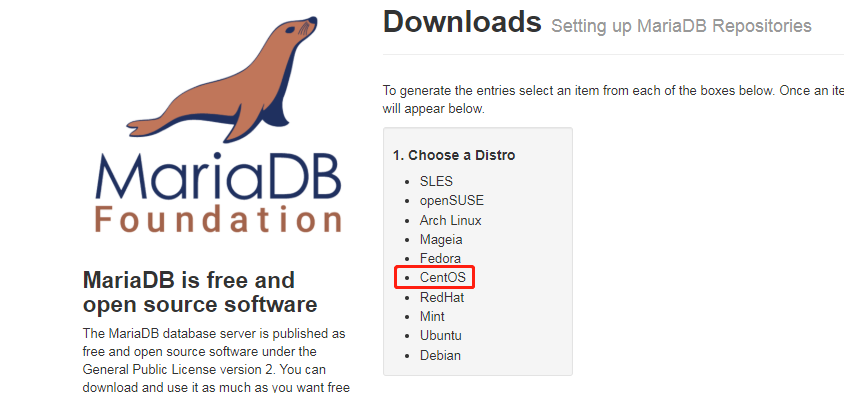
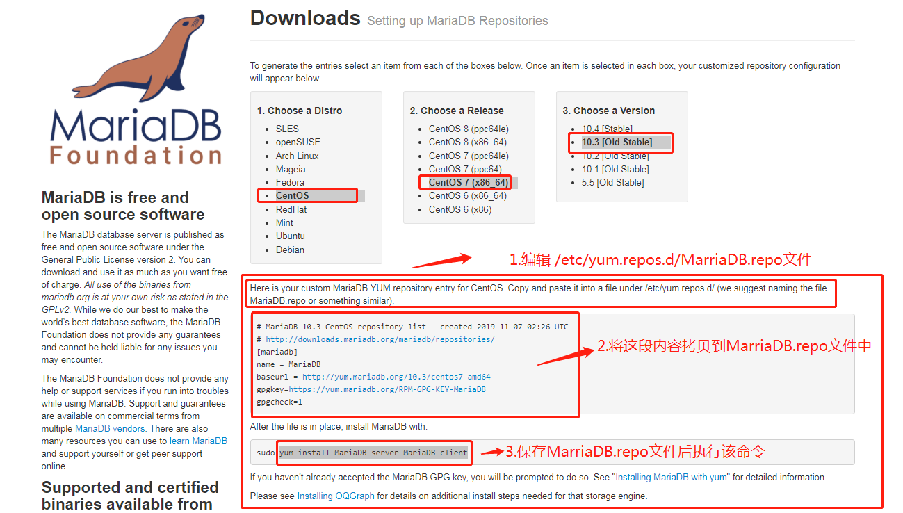
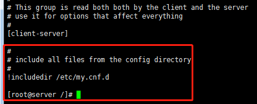

###Linux系统安装MarraiDB

- 查询现有系统是否安装mariadb
````text
rpm -qa | grep mariadb
````
如果有则执行以下命令
```text
yum remove mariadb-libs //移除现有所有的mariadb相关的安装包
```

- 安装MarriaDB        
1.登录MarriaDB官网 https://downloads.mariadb.org/mariadb/repositories/#mirror=coreix                 
2.选择centos系统                                                 
                                   
3.选择对应的系统版本及操作系统位数                 
4.编辑`MariaDB.repo`文件                   
`vi /etc/yum.repos.d/MariaDB.repo`
```text
//该内容应该从官网上获取最新的
# MariaDB 10.3 CentOS repository list - created 2019-11-07 02:26 UTC
# http://downloads.mariadb.org/mariadb/repositories/
[mariadb]
name = MariaDB
baseurl = http://yum.mariadb.org/10.3/centos7-amd64
gpgkey=https://yum.mariadb.org/RPM-GPG-KEY-MariaDB
gpgcheck=1
```
5.保存好文件后执行下述命令      
```text
sudo yum install MariaDB-server MariaDB-client //root用户可以忽略sudo命令
```         
                   


- 初始化配置MarriaDB             
1.启动MarriaDB服务               
执行命令`service mysql start`        
2.登录到服务器                
执行命令`mysql -uroot -p`       
3.简单配置MarriaDB          
执行命令`mysql_secure_installation`配置MarriaDB             
```text
首先是设置密码，会提示先输入密码
Enter current password for root (enter for none):<–初次运行直接回车
设置密码
Set root password? [Y/n] <– 是否设置root用户密码，输入y并回车或直接回车
New password: <– 设置root用户的密码
Re-enter new password: <– 再输入一次你设置的密码
其他配置
Remove anonymous users? [Y/n] <– 是否删除匿名用户，回车
Disallow root login remotely? [Y/n] <–是否禁止root远程登录,回车,
Remove test database and access to it? [Y/n] <– 是否删除test数据库，回车
Reload privilege tables now? [Y/n] <– 是否重新加载权限表，回车
```  
4.配置MariaDB的字符集                    
[查看/etc/my.cnf文件内容，其中包含一句!includedir /etc/my.cnf.d 说明在该配置文件中引入/etc/my.cnf.d 目录下的配置文件]                                   
               
4.1 在my.cnf.d目录下使用vi server.cnf命令编辑server.cnf文件，在[mysqld]标签下添加              
```text
init_connect='SET collation_connection = utf8_unicode_ci' 
init_connect='SET NAMES utf8' 
character-set-server=utf8 
collation-server=utf8_unicode_ci 
skip-character-set-client-handshake
```
4.2 文件/etc/my.cnf.d/client.cnf      
vi /etc/my.cnf.d/client.cnf在[client]中添加     
```text
default-character-set=utf8      
```
4.3 文件/etc/my.cnf.d/mysql-clients.cnf       
vi /etc/my.cnf.d/mysql-clients.cnf在[mysql]中添加       
```text
default-character-set=utf8      
```
4.4重启MarriaDB服务     
        
5配置用户       
5.1添加用户，设置权限        
创建用户命令      
```text
mysql>create user username@localhost identified by 'password';
``` 
5.2直接创建用户并授权的命令     
```text
mysql>grant all on *.* to username@localhost indentified by 'password';
```
5.3授予外网登陆权限         
```text
mysql>grant all privileges on *.* to username@'%' identified by 'password';
```
5.4授予权限并且可以授权       
```text
mysql>grant all privileges on *.* to username@'hostname' identified by 'password' with grant option;
```
6.其他配置      
```text
其中只授予部分权限把 其中 all privileges或者all改为select,insert,update,delete,create,drop,index,alter,grant,references,reload,shutdown,process,file其中一部分。

Linux系统教程：如何检查MariaDB服务端版本  http://www.linuxidc.com/Linux/2015-08/122382.htm
MariaDB Proxy读写分离的实现 http://www.linuxidc.com/Linux/2014-05/101306.htm
Linux下编译安装配置MariaDB数据库的方法 http://www.linuxidc.com/Linux/2014-11/109049.htm
CentOS系统使用yum安装MariaDB数据库 http://www.linuxidc.com/Linux/2014-11/109048.htm
安装MariaDB与MySQL并存 http://www.linuxidc.com/Linux/2014-11/109047.htm
```

            
- 运维MarriaDB            
1.查看MarriaDB运行状态            
```text
systemctl mysql status //systemctl可以用service替代      
```
```text
//命令执行的结果
[root@server /]# systemctl mysql status  //systemctl可以用service替代
 ERROR! MariaDB is not running //尚未运行
[root@server /]# 

```
2.启动MarriaDB服务
```text
systemctl mysql start/restart   //systemctl可以用service替代
```
3.停止MarriaDB服务
```text
systemctl mysql stop   //systemctl可以用service替代
```


- 开机自动启动服务
```text
systemctl enable mariadb
```


参考资料：https://blog.csdn.net/qq_18298439/article/details/80824499

