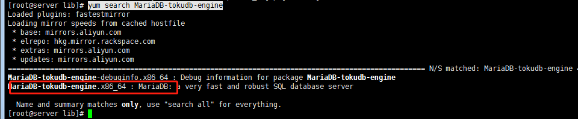
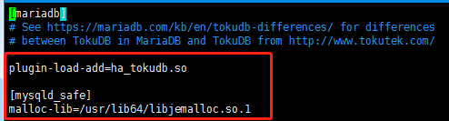
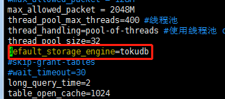

###MarraiDB安装TokuDB引擎

- 安装引擎Installing TokuDB     
查看是否安装引擎
```text
yum search MariaDB-tokudb-engine
```
 
如果没有安装则执行以下安装命令
```text
yum install MariaDB-tokudb-engine
```

- 配置配置文件
```text
cd /etc/my.cnf.d目录下
vim tokudb.cnf
```
 

- heck for Transparent HugePage Support on Linux
```text
cat /sys/kernel/mm/transparent_hugepage/enabled
```
```text
always madvise [never] //如果上述命令得到的结果是这个，则忽略后面的逻辑
```
```text
[always] madvise never //如果上述命令得到的结果是这个，则需要执行以下命令
```
```text
echo never > /sys/kernel/mm/transparent_hugepage/enabled
echo never > /sys/kernel/mm/transparent_hugepage/defrag
```
[关于更多的Transparent HugePage Support信息请参考：http://unix.stackexchange.com/questions/99154/disable-transparent-hugepages]

- 修改默认引擎(推荐)
```text
default_storage_engine=tokudb
```
 

- 重新启动MariadDB服务
```text
service mysql start
```
- mysql命令行修改
```text
INSTALL  SONAME  'ha_tokudb' ;
```

[参考文档:https://mariadb.com/kb/en/library/installing-tokudb/]

