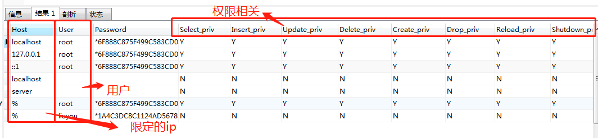

##用户及权限相关

跟用户及权限相关的都在mysql库下的user表中
- 查看用户列表
```text
select * from mysql.user;                   #方式-
SHOW GRANTS FOR 'root'@'%';                 #方式二 涉及到权限
SHOW CREATE USER 'root'@'%';                #方式三

```
['root'@'%'和'root'@'localhost']针对的是本机用户和非本机用户，对于mysql而言会将两者当前两个用户区别对待。@前为用户名，
@后为密码



- 新增用户
```text
CREATE USER 'finley'@'localhost' IDENTIFIED BY 'password';      #finley为用户名 localhost为ip地址 password为用户密码
CREATE USER 'finley'@'%' IDENTIFIED BY 'password';              #%非localhost环境可登陆
```

- 增加权限
```text
CREATE USER 'finley'@'localhost' IDENTIFIED BY 'password';
GRANT ALL ON *.* TO 'finley'@'localhost' WITH GRANT OPTION;     #All所有权限  ON *.*为对哪个库的那个表，第一个星号为库，第二个为表，TO针对哪个网段的哪个用户

CREATE USER 'admin'@'localhost' IDENTIFIED BY 'password'; 
GRANT RELOAD,PROCESS ON *.* TO 'admin'@'localhost';

CREATE USER 'custom'@'%.example.com' IDENTIFIED BY 'password';
GRANT SELECT,INSERT,UPDATE,DELETE,CREATE,DROP ON customer.addresses TO 'custom'@'%.example.com';
```
      
mysql提供的权限列表        
          
   

- 查看用户权限
```text
SHOW GRANTS FOR 'admin'@'localhost';
```   
   

- 删除用户权限
```text
REVOKE ALL ON *.* FROM 'finley'@'%.example.com';                                    #删除用户所有权限
REVOKE RELOAD ON *.* FROM 'admin'@'localhost';                                      #删除用户某一权限 
REVOKE CREATE,DROP ON expenses.* FROM 'custom'@'host47.example.com';                #删除库级别的权限        
REVOKE INSERT,UPDATE,DELETE ON customer.addresses FROM 'custom'@'%.example.com';    #删除表表级别的权限

SHOW GRANTS FOR 'admin'@'localhost';        #查看删除后的效果
```
          
    
      
- 删除用户
```text
DROP USER 'finley'@'localhost';     #finley为用户名 localhost为ip地址 
```
注意:mysql实际上是对用户不同的ip段视为不同的用户，因此删除的时候注意

- 修改密码
```text
语法
SET PASSWORD [FOR user] = password_option

password_option: {
    'auth_string'
  | PASSWORD('auth_string')
}

SET PASSWORD ... = PASSWORD('auth_string') 自MySQL 5.7.6起不推荐使用该语法，并且在将来的MySQL版本中将删除该语法
SET PASSWORD ... = 'auth_string' 语法不被弃用，而是ALTER USER用于帐户更改（包括分配密码）的首选语句
ALTER USER user IDENTIFIED BY 'auth_string';
```
```text
#方式一
SET PASSWORD FOR 'jeffrey'@'localhost' = 'auth_string';

#方式二 前提为当前用户
SET PASSWORD = 'auth_string';                               #当前用户设置密码       SELECT CURRENT_USER();查看当前用户

SET PASSWORD FOR 'jeffrey'@'localhost' = PASSWORD('password');

#方式三
SET old_passwords = 0;
SET PASSWORD FOR 'jeffrey'@'localhost' = PASSWORD('password');

```
如果该old_passwords值与身份验证插件所需的值不同，则该插件返回的哈希密码值 PASSWORD()将不能被该插件使用，并且不会进行客户端连接的正确身份验证。
下表显示了每种密码哈希方法的允许值old_passwords以及哪些身份验证插件使用该哈希方法。        
        
|密码哈希方法|old_passwords值|关联身份验证插件|        
|---|---|---|  
|MySQL 4.1本机哈希|0|mysql_native_password|
|SHA-256哈希|2|sha256_password|

- 密码过期策略
```text
ALTER USER 'jeffrey'@'localhost' PASSWORD EXPIRE;
```

参考:https://dev.mysql.com/doc/refman/5.7/en/set-password.html