###LanProxy内网穿透

- git地址[https://github.com/ffay/lanproxy]

- 硬性要求          
服务端和客户端都必须配置Java环境，且版本是1.7以上

- 配置服务端(代理机器)               
1.下载[proxy-server-0.1.zip]到代理服务器指定目录                 
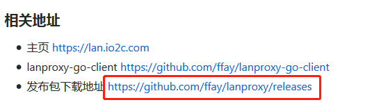                  
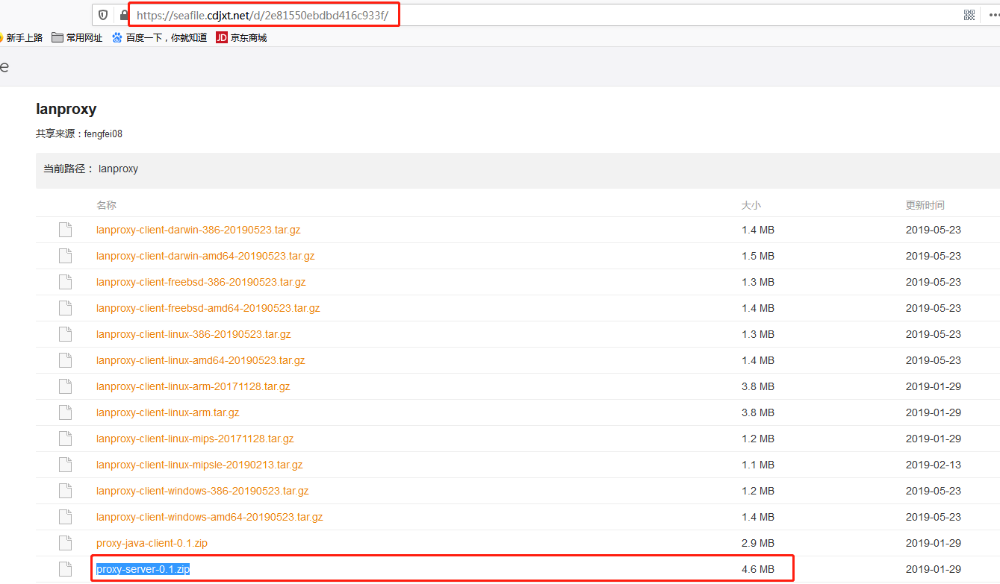                         
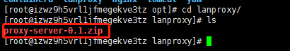                         
2.执行以下命令         
```text
unzip proxy-server-0.1.zip
mv proxy-server-0.1 /usr/local  #此步骤可以不必执行
```
3.配置服务端配置文件            
vim /usr/local/proxy-server-0.1/conf/config.properties  #/usr/local根据自己的实际情况
```text
server.bind=0.0.0.0

#与代理客户端通信端口
server.port=4900

#ssl相关配置
server.ssl.enable=true
server.ssl.bind=0.0.0.0
server.ssl.port=4993
server.ssl.jksPath=test.jks
server.ssl.keyStorePassword=123456
server.ssl.keyManagerPassword=123456

#这个配置可以忽略
server.ssl.needsClientAuth=false

#WEB在线配置管理相关信息
config.server.bind=0.0.0.0
config.server.port=8090   
config.admin.username=admin
config.admin.password=admin
```
根据实际情况修改config.server.port、config.admin.username、config.admin.password
4.启动服务          
```text
cd /usr/local/proxy-server-0.1/bin     #/usr/local根据自己的实际情况
./startup.sh
```
5.访问服务ip:8090            
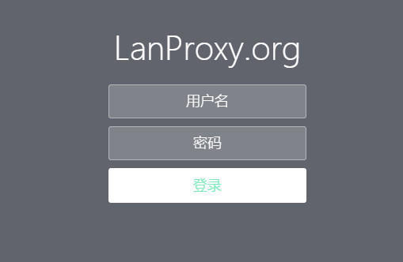   
    
6.添加客户端               
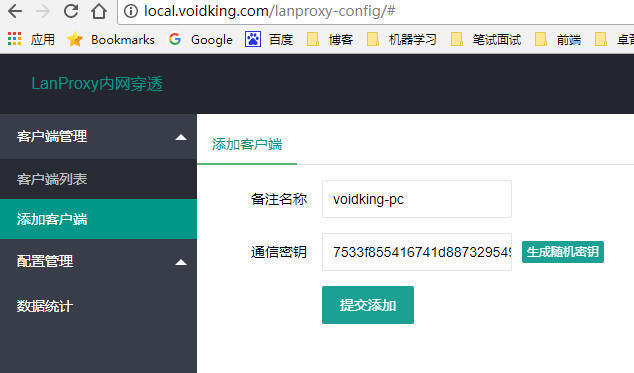             
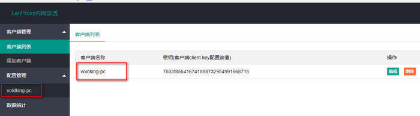      
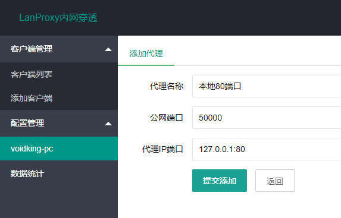      
注意：     
代理名称可以随意填写      
公网端口也没有硬性规定可以随意，只要不被占用即可        
代理ip端口，ip为127.0.0.1不能修改，端口为目标机器中实际应用的端口         

- 配置客户端(目标机器)       
1.下载客户端应用[proxy-java-client-0.1.zip]到目标服务器指定目录          
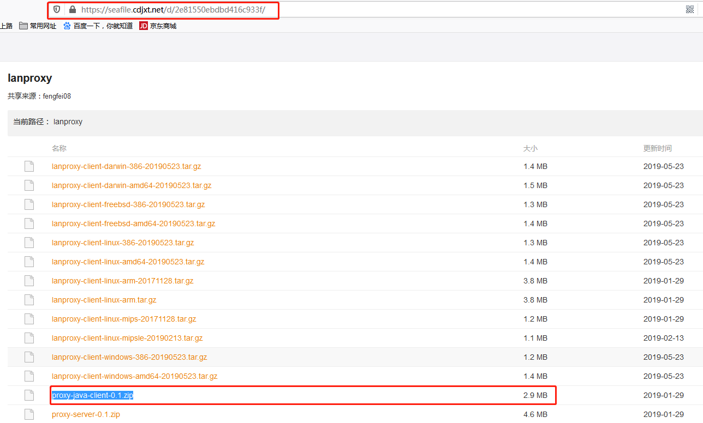              
    
2.解压缩文件                
```text
unzip proxy-java-client-0.1.zip
```

3.配置客户端文件           
进入proxy-client-0.1/conf目录，修改config.properties为
```text
#与在proxy-server配置后台创建客户端时填写的秘钥保持一致；
client.key=         #服务端添加客户端配置时自动生成的密匙
ssl.enable=true
ssl.jksPath=test.jks
ssl.keyStorePassword=123456

#这里填写实际的proxy-server地址；没有服务器默认即可，自己有服务器的更换为自己的proxy-server（IP）地址
server.host=lp.thingsglobal.org   #服务端的ip(公网ip或域名)

#proxy-server ssl默认端口4993，默认普通端口4900
#ssl.enable=true时这里填写ssl端口，ssl.enable=false时这里填写普通端口
server.port=4993    #这里必须要跟服务端配置一致
```
4.启动服务          
进入proxy-client-0.1/bin目录，启动应用
```text
./startup.sh
```
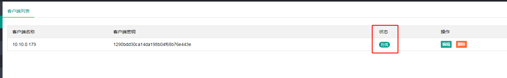          
刷新服务端浏览器，看到上述在线状态时，则表示配置成功
注意：这里需要注意防火墙设置，不仅公网端口要设置安全组规则及防火墙设置，目标应用端口及服务端客户端通信端口4993都需要相应配置

5.刷新页面          
输入http://47.112.21.132:5000/
输入http://10.10.0.179:8080/
两个页面显示的内容应该是一样的,即表示所有的工作配置完成
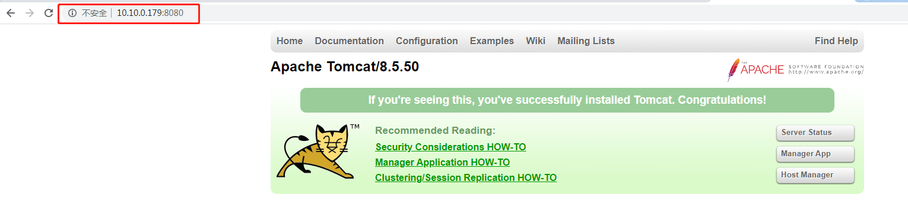 
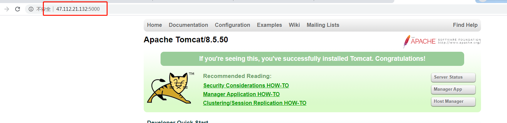 


