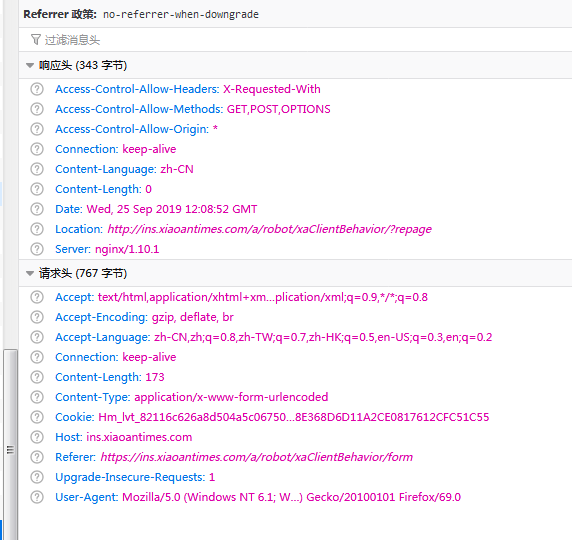
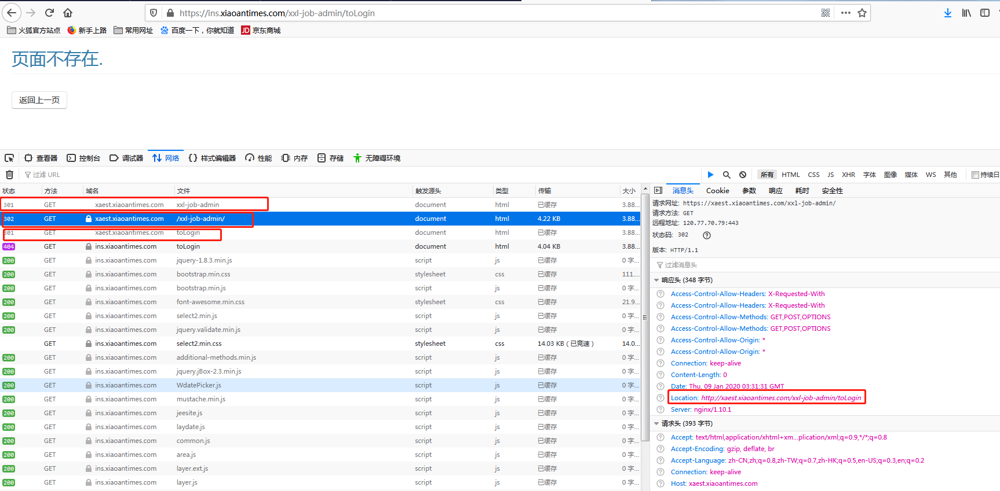

##nginx配置HTTPS时，后台重定向时，返回的路径前缀仍然是http

              
从删除中可以看出当前请求时为https，但重定向后返回的location就变成了http，这就会导致后续一系列的问题，如多个域名监听同一个端口
就会导致出现跳转到其他的服务器页面上，典型的如蓝精灵定时任务后台系统和外呼管理系统，由于蓝精灵定时任务后台系统，登录页面存在
301和302重定向问题，在重定向的时候，配置文件并没有处理返回后的前缀要求信息，所以就会导致，重定向返回是http，继而再次请求服务器
时，就会被跳转到外呼管理系统去，从而报页面不存在错误。而上次外呼管理系统出现这个问题时，是无法响应，即当登录到后台页面后，由于location是
http的，所以导致请求报错。         


修复的思路       
1.后台需要监听80端口，对http请求的转发到443
```text
server {
	listen  80;
	server_name ins.xiaoantimes.com;
	return 301 https://$server_name$request_uri;  #处理301重定向问题
	#rewrite ^(.*)$  https://$host$1 permanent; 
	access_log off;	
}
```
或者以下处理(这种处理方式没有验证)
```text
server {
    listen 80;
    server_name bjubi.com;// 你的域名
    rewrite ^(.*)$ https://$host$1 permanent;// 把http的域名请求转成https
}
```
2.设置后台返回默认为https
```text
set $mscheme $scheme;
if ($http_referer ~* ^https.*) {
    set $mscheme "https";
}
proxy_set_header X-Forwarded-Proto $mscheme;
```
3.所有配置执行完成后
```text
nginx -t    #测试配置文件是否正确
nginx -s reload  #不重启服务的情况下重新加载配置文件
```
4.清理浏览器缓存(一定要清理，否则没有效果，这是个巨坑)


参考文档：
https://blog.csdn.net/baofeidyz/article/details/80435929
https://www.cnblogs.com/zhoudawei/p/9257276.html
https://blog.csdn.net/cloume/article/details/78252319
https://www.cnblogs.com/shihuc/p/9047636.html
https://www.cnblogs.com/fozero/p/10968550.html
