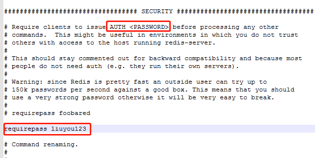

###redis安装部署

redis官网：Http://redis.io

1安装
```text
$ wget http://download.redis.io/releases/redis-6.0.5.tar.gz
$ tar xzf redis-6.0.5.tar.gz
$ cd redis-6.0.5
$ make
```

2配置密码
```text
cd /redis-6.0.5
vim redis.conf
```
  
修改如上配置，保存并退出

3执行命令
```text
service redis restart  #没有配置service启动的 则需要./redis-cli shutdown
./redis-server ../redis-conf
```

4登录redis服务器
```text
./redis-cli -a liuyou123
```

5退出redis服务
```text
./redis-cli -a liuyou123 shutdown
```