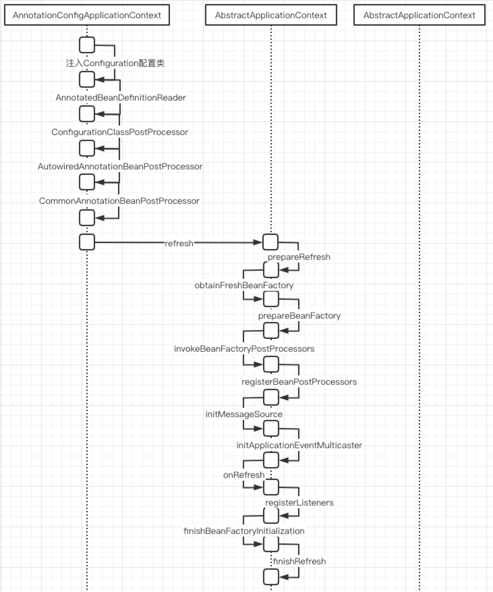

##spring的启动流程

- prepareRefresh()
容器启动前的事情

- obtainFreshBeanFactory()
创建工厂bean DefaultListableBeanFactory 如果是xml的话，这里回去用xmlBedefinitionReader去解析xml

- prepareBeanFactory()
容器刷新前的一些准备工作，注入一些bean的定义，以及事件等

- postProcessBeanFactory()
钩子方法，这个地方bean的定义已经被加载，但是尚未初始化

- invokeBeanFactoryPostProcessors()
调用BeanFactoryPostProcessors，给我们的后置处理器一个机会，修改bean的定义

- registerBeanPostProcessors()
注入BeanPostProcessors，后续修改bean的实例用的

- initMessageSource()

- initApplicationEventMulticaster()

- onRefresh()
给子容器一个机会，去实例话

- registerListeners()
注册监听事件，如ServiceBean

- finishBeanFactoryInitialization()
初始化单例bean

- finishRefresh()