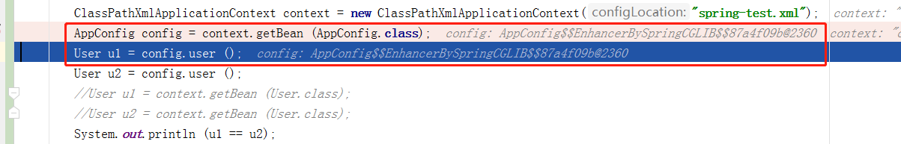
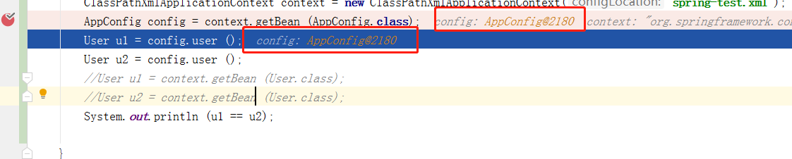

##spring官网文档说明

1.nnotation-config禁用注册AutowiredAnnotationBeanPostProcessor和CommonAnnotationBeanPostProcessor
```text
<context:component-scan base-package="com.xiaoantimes.cn" annotation-config="false"/>
```
当配置文件中如上配置后，spring只做扫描不做AutowiredAnnotationBeanPostProcessor和CommonAnnotationBeanPostProcessor处理器的
注册功能，也即不会再代码中自动装配依赖bean，当然也不会报错
```text
boolean annotationConfig = true;
if (element.hasAttribute(ANNOTATION_CONFIG_ATTRIBUTE)) {
    annotationConfig = Boolean.parseBoolean(element.getAttribute(ANNOTATION_CONFIG_ATTRIBUTE));
}
//默认情况下是true，当设置为false时，将不会注册AutowiredAnnotationBeanPostProcessor等后置处理器
if (annotationConfig) {
    Set<BeanDefinitionHolder> processorDefinitions =
            AnnotationConfigUtils.registerAnnotationConfigProcessors(readerContext.getRegistry(), source);
    for (BeanDefinitionHolder processorDefinition : processorDefinitions) {
        compositeDef.addNestedComponent(new BeanComponentDefinition(processorDefinition));
    }
}
```
2.@Configuration和@Component作为配置类的元注解的差异
使用@Configuration注解spring会将该类当成一个配置类处理，并采用cglib代理的方式来处理
而@Component则只是一个普通的组件，并不会采用cglib代理的方式处理
```text
public void enhanceConfigurationClasses(ConfigurableListableBeanFactory beanFactory) {
    Map<String, AbstractBeanDefinition> configBeanDefs = new LinkedHashMap<>();
    for (String beanName : beanFactory.getBeanDefinitionNames()) {
        BeanDefinition beanDef = beanFactory.getBeanDefinition(beanName);
        Object configClassAttr = beanDef.getAttribute(ConfigurationClassUtils.CONFIGURATION_CLASS_ATTRIBUTE);
        MethodMetadata methodMetadata = null;
        if (beanDef instanceof AnnotatedBeanDefinition) {
            methodMetadata = ((AnnotatedBeanDefinition) beanDef).getFactoryMethodMetadata();
        }
        if ((configClassAttr != null || methodMetadata != null) && beanDef instanceof AbstractBeanDefinition) {
            // Configuration class (full or lite) or a configuration-derived @Bean method
            // -> resolve bean class at this point...
            AbstractBeanDefinition abd = (AbstractBeanDefinition) beanDef;
            if (!abd.hasBeanClass()) {
                try {
                    abd.resolveBeanClass(this.beanClassLoader);
                }
                catch (Throwable ex) {
                    throw new IllegalStateException(
                            "Cannot load configuration class: " + beanDef.getBeanClassName(), ex);
                }
            }
        }
        //判断bean是否是@Configuration注解，在ConfigurationClassParser解析中，如果该类有@Configuration则，直接将
        //ConfigurationClassPostProcessor.configurationClass设置为full
        if (ConfigurationClassUtils.CONFIGURATION_CLASS_FULL.equals(configClassAttr)) {
            if (!(beanDef instanceof AbstractBeanDefinition)) {
                throw new BeanDefinitionStoreException("Cannot enhance @Configuration bean definition '" +
                        beanName + "' since it is not stored in an AbstractBeanDefinition subclass");
            }
            else if (logger.isInfoEnabled() && beanFactory.containsSingleton(beanName)) {
                logger.info("Cannot enhance @Configuration bean definition '" + beanName +
                        "' since its singleton instance has been created too early. The typical cause " +
                        "is a non-static @Bean method with a BeanDefinitionRegistryPostProcessor " +
                        "return type: Consider declaring such methods as 'static'.");
            }
            configBeanDefs.put(beanName, (AbstractBeanDefinition) beanDef);
        }
    }
    if (configBeanDefs.isEmpty()) {
        // nothing to enhance -> return immediately
        return;
    }

    //采用cglib代理
    ConfigurationClassEnhancer enhancer = new ConfigurationClassEnhancer();
    for (Map.Entry<String, AbstractBeanDefinition> entry : configBeanDefs.entrySet()) {
        AbstractBeanDefinition beanDef = entry.getValue();
        // If a @Configuration class gets proxied, always proxy the target class
        beanDef.setAttribute(AutoProxyUtils.PRESERVE_TARGET_CLASS_ATTRIBUTE, Boolean.TRUE);
        // Set enhanced subclass of the user-specified bean class
        Class<?> configClass = beanDef.getBeanClass();
        Class<?> enhancedClass = enhancer.enhance(configClass, this.beanClassLoader);
        if (configClass != enhancedClass) {
            if (logger.isTraceEnabled()) {
                logger.trace(String.format("Replacing bean definition '%s' existing class '%s' with " +
                        "enhanced class '%s'", entry.getKey(), configClass.getName(), enhancedClass.getName()));
            }
            beanDef.setBeanClass(enhancedClass);
        }
    }
}
```
如果是采用@Configuration，则类和@Bean注解的方法不能是final的，也不能是private，默认不写的可以，这是因为@Configuration是采
用cglib代理的方式，而cglib代理是采用子类继承父类的方式重写方法来实现的，因此不能是private和final的，因为子类无法重写。
```text
@Component
public class AppConfig {

    @Bean
    public User user(){
        return new User();
    }

    @Bean
    public School school2(){
        return new School();
    }
}
```
```text
public class AppConfigTest {

    public static void main(String[] args){
        ClassPathXmlApplicationContext context = new ClassPathXmlApplicationContext("spring-test.xml");
        AppConfig config = context.getBean (AppConfig.class);
        User u1 = config.user ();
        User u2 = config.user ();
        System.out.println (u1 == u2);//结果false

    }
}
```

```text
@Configuration
public class AppConfig {

    @Bean
    public User user(){
        return new User();
    }

    @Bean
    public School school2(){
        return new School();
    }
}
```
```text
public class AppConfigTest {

    public static void main(String[] args){
        ClassPathXmlApplicationContext context = new ClassPathXmlApplicationContext("spring-test.xml");
        AppConfig config = context.getBean (AppConfig.class);
        User u1 = config.user ();
        User u2 = config.user ();
        System.out.println (u1 == u2);//结果true

    }
}
```
从两个结果来看，案例1仅仅只是把@Bean注解过的方法当成了一个bean的普通方法，因此每次调用的时候都会产生一个新的对象，而案例2
则不同，config对象已经是代理对象，其调用的user()方法，是子类重写过的，从容器中获取的对象，因此得到的结果是true         
            
        