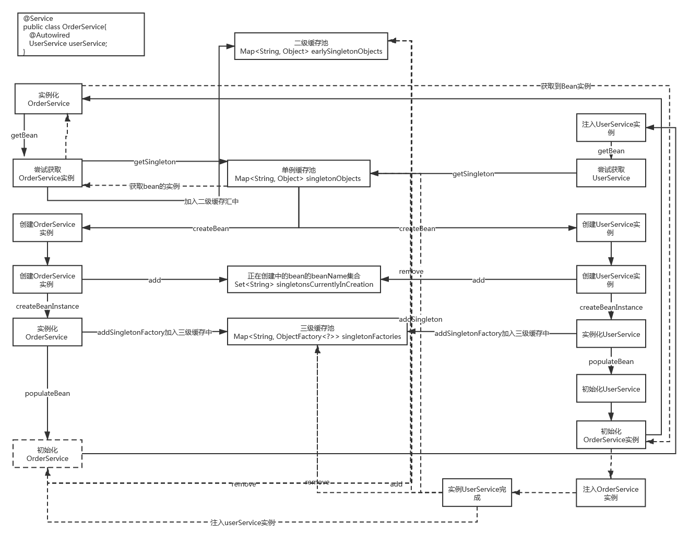

##spring解决循环依赖的问题

####singleton类型
- spring默认支持单例的循环引用的
```text
public abstract class AbstractAutowireCapableBeanFactory extends AbstractBeanFactory
		implements AutowireCapableBeanFactory {
		
    /** Whether to automatically try to resolve circular references between beans. */
    private boolean allowCircularReferences = true;
}
``` 
从这里可以看出spring是默认支持循环引用的，但对构造注入的循环引用spring是不支持的，因为构造注入循环引用无法解决对象之间的
创建问题。

1.当创建某个对象时,spring会首先尝试从单例缓存池中获取，由于是首次创建，所以单例池中肯定不存在该对象
```text
Object sharedInstance = getSingleton(beanName);
```
```text
public Object getSingleton(String beanName) {
    //参数true设置标识允许早期依赖
    return getSingleton(beanName, true);
}
```
```text
protected Object getSingleton(String beanName, boolean allowEarlyReference) {
    #此时单例池中没有
    Object singletonObject = this.singletonObjects.get(beanName);
    if (singletonObject == null && isSingletonCurrentlyInCreation(beanName)) {
        ...
    }
    return singletonObject;
}
```
2.spring开始创建该对象
```text
getSingleton(beanName, () -> {
    try {
        //创建bean的实例
        return createBean(beanName, mbd, args);
    }
    ...
});
```
3.在spring创建对象时，会将该对象的beanName放入到singletonsCurrentlyInCreation Set集合中去，这一步很重要，在后续的循环
引用中会用到
```text
protected void beforeSingletonCreation(String beanName) {
    #beanName加入到singletonsCurrentlyInCreation集合中去
    if (!this.inCreationCheckExclusions.contains(beanName) && !this.singletonsCurrentlyInCreation.add(beanName)) {
        throw new BeanCurrentlyInCreationException(beanName);
    }
}
```
4.然后继续创建对象，在创建完对象实例后，spring会根据条件将暴露单例bean的ObjectFactory对象加入二级缓存中去
```text
//创建bean的实例
instanceWrapper = createBeanInstance(beanName, mbd, args);
```
```text
boolean earlySingletonExposure = (mbd.isSingleton() && this.allowCircularReferences &&
				isSingletonCurrentlyInCreation(beanName));
//如果需要提前曝光
if (earlySingletonExposure) {
    if (logger.isTraceEnabled()) {
        logger.trace("Eagerly caching bean '" + beanName +
                "' to allow for resolving potential circular references");
    }
    //为避免后期循环依赖，可以在bean初始化完成前将创建实例的ObjectFactory加入工厂
    //实际上此时加入的是已经实例化但尚未初始化完成的bean
    //第四次调用后置处理器
    addSingletonFactory(beanName, () -> getEarlyBeanReference(beanName, mbd, bean));
}
```
```text
protected void addSingletonFactory(String beanName, ObjectFactory<?> singletonFactory) {
    Assert.notNull(singletonFactory, "Singleton factory must not be null");
    synchronized (this.singletonObjects) {
        if (!this.singletonObjects.containsKey(beanName)) {
            this.singletonFactories.put(beanName, singletonFactory);
            this.earlySingletonObjects.remove(beanName);
            this.registeredSingletons.add(beanName);
        }
    }
}
```
上述判断中spring主要判断当前bean是否是单例的，且系统是否开启循环依赖，且当前bean是否正在创建中，正常来说bean默认就是单例
的，且该bean已经在步骤3中已经加入到了singletonsCurrentlyInCreation集合中去，因此都满足，而spring默认又是支持循环引用的，
所以earlySingletonExposure提前暴露此时肯定是true，于是spring将提前暴露该bean的ObjectFactory存放到了spring的二级缓存中
singletonFactories中,此时spring创建的bean是不完整的bean，其循环引用的属性尚未赋值。

5.spring继续执行populateBean()方法对其属性进行赋值，即再次重复执行getBean操作，当实例化该属性Bean的时候，同样需要对其循环
依赖bean执行属性注入populateBean()方法，即再次执行getBean逻辑，二次获取当前Bean。

6.当二次对当前bean执行getBean()操作时，此时会再次执行getSingleton()方法,再次判断if (singletonObject == null && 
isSingletonCurrentlyInCreation(beanName))条件，singletonObject == null成立，因为当前bean尚未执行完populateBean()，即尚未
加入到单例缓存池中，isSingletonCurrentlyInCreation(beanName)也成立，因为早在步骤3中当前beanName已经加入到正在创建bean的集
合中，因此程序会继续从二级缓存中获取ObjectFactory对象，并调用getObject()方法，来获取已经暴露的Bean实例
```text
protected Object getSingleton(String beanName, boolean allowEarlyReference) {
		Object singletonObject = this.singletonObjects.get(beanName);
		if (singletonObject == null && isSingletonCurrentlyInCreation(beanName)) {
			synchronized (this.singletonObjects) {
				//三级缓存，提前暴露的单例池
				singletonObject = this.earlySingletonObjects.get(beanName);
				if (singletonObject == null && allowEarlyReference) {
					//当某些方法需要提前初始化的时候则会调用方法将对应的addsingletonFactory方法，将对应的ObjectFactory
					// 初始化策略存储在singletonFactories
					//二级缓存singletonFactories缓存
					ObjectFactory<?> singletonFactory = this.singletonFactories.get(beanName);
					if (singletonFactory != null) {
						//调用addSingletonFactory(beanName, () -> getEarlyBeanReference(beanName, mbd, bean));中的getEarlyBeanReference方法
						//暴露给SmartInstantiationAwareBeanPostProcessor后置处理器进行处理
						singletonObject = singletonFactory.getObject();
						this.earlySingletonObjects.put(beanName, singletonObject);
						this.singletonFactories.remove(beanName);
					}
				}
			}
		}
		return singletonObject;
	}
```
7.当获取到Bean实例时，spring会将其放入三级缓存中去，并从二级缓存将ObjectFactory对象移除，思考为什么spring这么设计，为什么
需要三级缓存。         
三级缓存的存在是性能提升的需要，因为二级缓存ObjectFactory的getObject()方法中，调用了getEarlyBeanReference()中的后置处理器，
其逻辑的复杂和不可控性，spring没有必要每次调用getSingleton()方法都去重复调用ObjectFactory的getObject()方法，反复去执行里
面的逻辑，因而出于性能的考虑，在调用完ObjectFactory的getObject()方法后，spring将得到的bean对象存入三级缓存中去，同时将
ObjectFactory对象从二级缓存中移除，当下次某个对象再次获取同样的对象时，直接从三级缓存中去拿，从而大大减少了构建时间，同时
将二级缓存中的ObjectFactory对象移除也是处于内存节省，提升整体性能的考虑，当ObjectFactory对象gc回收后，其所占用的内存空间
就被释放出来，从而大大提升系统整体的稳健性。

8.当获得bean的实例后，会依次完成属性注入，并回到最初的getSingleton(beanName,singletonFactory)方法中去，继续完成后续的逻辑
即执行addSingleton()方法，将该单例bean放入到单例缓存池中，并依次移除二级三级缓存，到此单例的循环引用问题解决
```text
protected void addSingleton(String beanName, Object singletonObject) {
    synchronized (this.singletonObjects) {
        this.singletonObjects.put(beanName, singletonObject);
        this.singletonFactories.remove(beanName);
        this.earlySingletonObjects.remove(beanName);
        this.registeredSingletons.add(beanName);
    }
}
```
 


####prototype类型
- 该类型的直接报错，spring不支持该类型的循环引用

####spring关闭循环引用
方法1
```text
AnnotationConfigApplicationContext context = new AnnotationConfigApplicationContext();
//关闭循环引用
context.setAllowCircularReferences (false);
context.register (AppConfig.class);
context.refresh ();
```
方法2
```text
@Component
public class MyBeanDefinitionRegistryPostProcessor implements BeanDefinitionRegistryPostProcessor {

    public static boolean flag = false;
    
    #自定义后置处理器设置，正常逻辑不能这样处理，会多次被调用
    public void postProcessBeanFactory (ConfigurableListableBeanFactory configurableListableBeanFactory) throws BeansException {
        System.out.println ("=============我自定义的BeanDefinitionRegistryPostProcessor.postProcessBeanFactory============");
        if(!flag){
            AbstractAutowireCapableBeanFactory factory = (AbstractAutowireCapableBeanFactory)configurableListableBeanFactory;
            factory.setAllowCircularReferences (false);
            flag = true;
        }
    }
}
```

####spring三级缓存
Map<String, Object> singletonObjects              一级缓存，单例缓存池
Map<String, ObjectFactory<?>> singletonFactories  二级缓存池，ObjectFactory缓存
Map<String, Object> earlySingletonObjects         三级缓存
1.为什么设计三级缓存
2.earlySingletonObjects缓存设计的意义
```text
protected Object getSingleton(String beanName, boolean allowEarlyReference) {
    Object singletonObject = this.singletonObjects.get(beanName);
    if (singletonObject == null && isSingletonCurrentlyInCreation(beanName)) {
        synchronized (this.singletonObjects) {
            //三级缓存，提前暴露的单例池
            singletonObject = this.earlySingletonObjects.get(beanName);
            if (singletonObject == null && allowEarlyReference) {
                //当某些方法需要提前初始化的时候则会调用方法将对应的addsingletonFactory方法，将对应的ObjectFactory
                // 初始化策略存储在singletonFactories
                //二级缓存singletonFactories缓存
                ObjectFactory<?> singletonFactory = this.singletonFactories.get(beanName);
                if (singletonFactory != null) {
                    //调用addSingletonFactory(beanName, () -> getEarlyBeanReference(beanName, mbd, bean));中的getEarlyBeanReference方法
                    //暴露给SmartInstantiationAwareBeanPostProcessor后置处理器进行处理
                    singletonObject = singletonFactory.getObject();
                    this.earlySingletonObjects.put(beanName, singletonObject);
                    //二级缓存移除
                    this.singletonFactories.remove(beanName);
                }
            }
        }
    }
    return singletonObject;
}
```
earlySingletonObjects三级缓存设计的意义在于当spring将ObjectFactory对象放入二级缓存中去时，就表明该bean已经经历了一系列的
getObject()方法中的后置处理器的逻辑，为了提高性能在多次获取该bean时，没有必要再次重复调用getObject()方法中的逻辑，出于性
能的考虑，spring设计了三级缓存。

3.singletonFactories设计的意义
对于循环引用而言，当一个bean a引用另一个bean b时，bean b完全有可能是代理对象，也就是说一旦bean a依赖的对象bean b被加入到
缓存中去，再次对该bean操作时并不会改变缓存中的bean的实例，举个简单例子，如果bean b需要实现aop的功能，那么此时将bean b加入
到缓存中去，然后在后续的初始化方法中设置代理对象，实际上此时map缓存中的对象仍然是原对象，而不是代理对象，也即无法实现依赖
注入b对象的代理功能，因此此时就不能简单的只是将bean b加入到map缓存中去，对spring而言在加入到二级map缓存前，将该bean暴露给
ObjectFactory对象，重写其getObject()方法，在getObject()方法内调用getEarlyBeanReference()方法，让spring的BeanPostProcessor
去处理aop的功能，如果bean b需要代理，那么getObject()获得对象便是BeanPostProcessor处理过的代理对象，而不再是原对象，因此此
时将ObjectFactory对象的getObject()方法返回的对象加入到map缓存中，很好的解决了之前存在的不能代理的问题。因此这也是ObjectFactory
和singletonFactories二级缓存存在的目的和意义。

####prototype原型解决循环引用的问题
```text
@Service
@Scope("prototype")
public class OrderServiceImpl implements OrderService{

    @Autowired
    private UserService userService;

    public OrderServiceImpl(){
        System.out.println ("OrderService初始化======");
    }

    public void createOrder (String id, double money) {
        String name = userService.getUserById (id);
        System.out.println ("用户："+name+"正在创建订单，支付金额:"+money);
    }
}
```
```text
@Service
@Scope ("prototype")
public class UserServiceimpl implements UserService {

    @Autowired
    private OrderService orderService;

    public UserServiceimpl(){
        System.out.println ("UserService初始化======");
    }

    public void createUser (String name, String pwd) {

    }

    public String getUserById (String id) {
        return "liuyou";
    }
}
```
```text
    public static void main(String[] args){
        AnnotationConfigApplicationContext context = new AnnotationConfigApplicationContext(new MyDefaultListableBeanFactory());
        context.register (AppConfig.class);
        context.refresh ();

        UserService u2 = context.getBean (UserService.class);
        System.out.println (u2);
        OrderService o2 = context.getBean (OrderService.class);
        System.out.println (o2);
        o2.createOrder ("24",333);
    }
```
```text
public class MyDefaultListableBeanFactory extends DefaultListableBeanFactory {

    @Override
    protected BeanWrapper createBeanInstance (String beanName, RootBeanDefinition mbd, Object[] args) {
        BeanWrapper instance = super.createBeanInstance (beanName, mbd, args);
        addSingleton (beanName,instance.getWrappedInstance ());
        return instance;
    }

    @Override
    protected void populateBean (String beanName, RootBeanDefinition mbd, BeanWrapper bw) {
        super.populateBean (beanName, mbd, bw);
        removeSingleton (beanName);
    }

}
```
解决prototype类型作用域的bean的思路就是在创建实例的时候放入到单例缓存池中去，当属性完成注入以后，从缓存池中删除该bean的实
例即可。
```text
UserService初始化======
OrderService初始化======
com.xiaoantimes.cn.service.UserServiceimpl@1ffaf86
OrderService初始化======
UserService初始化======
com.xiaoantimes.cn.service.OrderServiceImpl@6574a52c
用户：liuyou正在创建订单，支付金额:333.0
```