##spring 循环引用的笔记

```text
IndexService和UserService是相互依赖的、循环依赖、循环引用
@Service
public class IndexService {
   //注入userService
   @Autowired
   UserService userService;

   //构造方法
   public IndexService(){
      System.out.println("index init");
   }
}


@Service
public class UserService {
   //注入 indexService
   @Autowired
   IndexService indexService;
   //构造方法
   public UserService(){
      System.out.println("user init");
   }
}

```
这两个类非常简单，就是相互引用了对方，也就是我们常常的说的循环依赖，spring是允许这样的循环依赖(前提是单例的情况下的)      
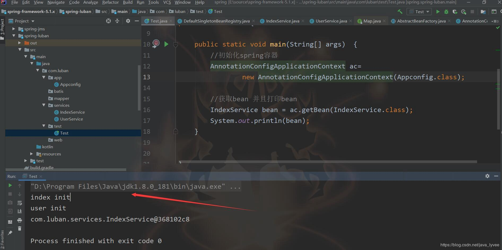      
  
spring默认是支持循环的依赖的？可能在一些非常高级的面试当中，（比如阿里的面试）面试官会问你为什么spring当中默认支持循环依
赖？或者问spring在哪里体现了默认支持循环依赖。从上面的结果我们可以推导出来spring是默认支持循环依赖的，但这仅仅是个结果，
你不可能告诉面试官说你写了个简单的demo从而说明了他默认支持，高级面试中最好是能通过源码设计来说明这个问题。比如spring的循
环依赖其实是可以关闭的，spring提供了api来关闭循环依赖的功能。当然你也可以修改spring源码来关闭这个功能，这里笔者为了逼格
很高，就修改一下spring的源码来关闭这个功能，关于如何直接调用spring提供的api来直接关闭循环引用功能可以和私下问笔者
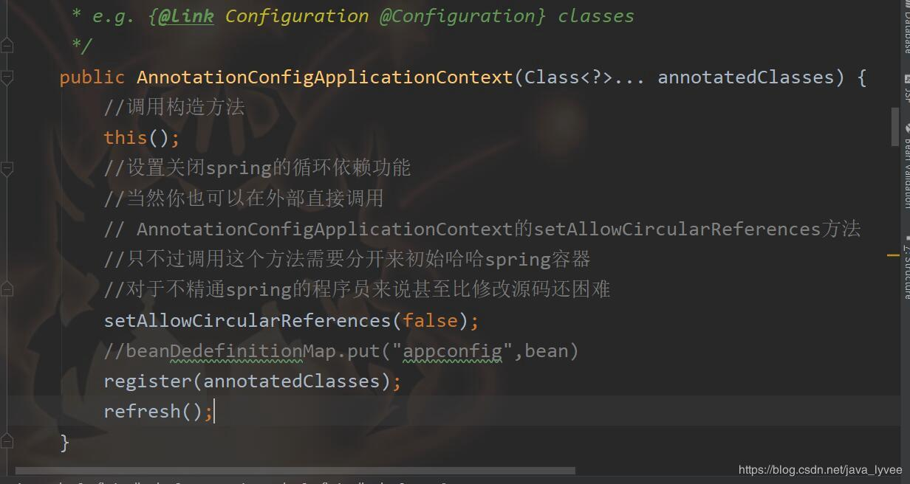            
 
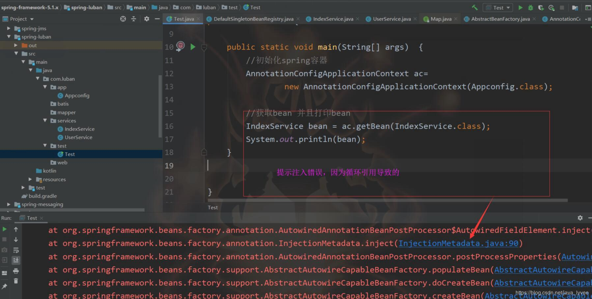  
那么为什么setAllowCircularReferences(false);会关闭循环依赖呢？首要明白spring的循环依赖是怎么做到的呢？spring源码当中是如
何处理循环依赖的？我们来分析一下spring循环依赖这块的源码 其实所谓的循环依赖无非就是属性注入，或者就是大家常常说的自动注入，
故而我们需要去研究spring自动注入的源码

下面笔者介绍一下spring创建一个bean的流程，通过源码结合在idea当中debug截图来说明
1、main方法，初始化spring容器，在初始化容器之后默认的单例bean已经实例化完成了，也就是说spring的默认单例bean创建流程、和所
谓自动注入的功能都在容器初始化的过程中。故而我们需要研究这个容器初始化过程、在哪里体现了自动注入；进入
AnnotationConfigApplicationContext类的构造方法
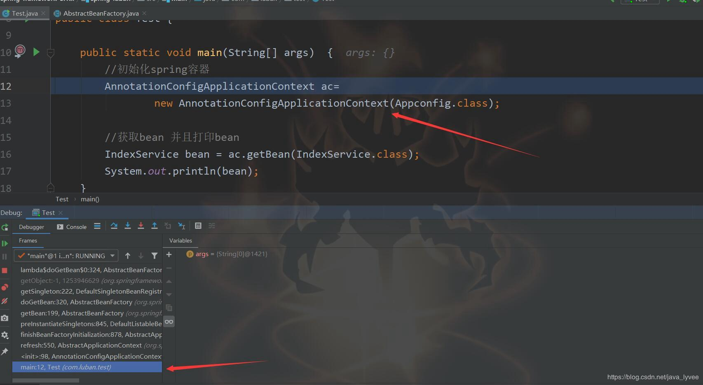 

2、在构造方法中调用了refresh方法，查看refresh方法
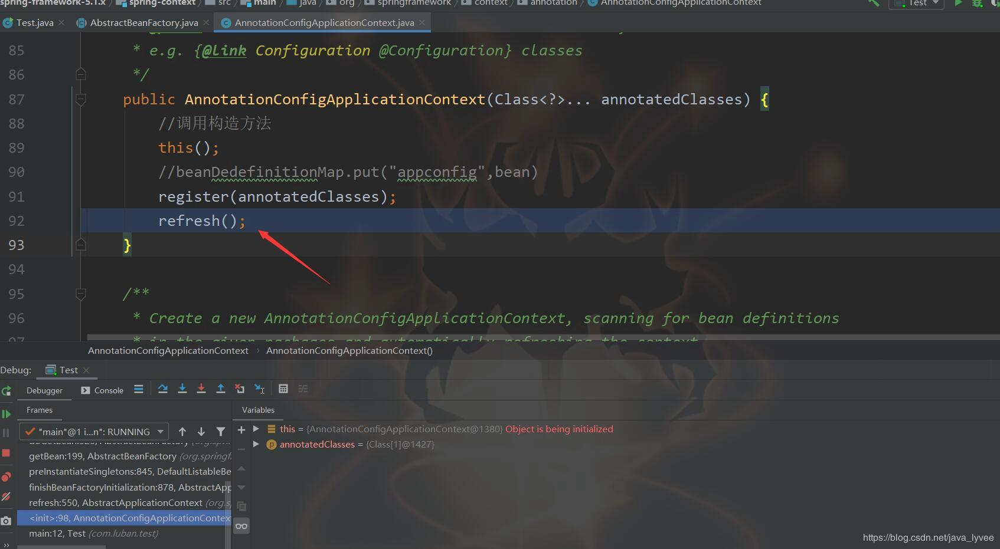

3、refresh方法当中调用finishBeanFactoryInitialization方法来实例化所有扫描出来的类
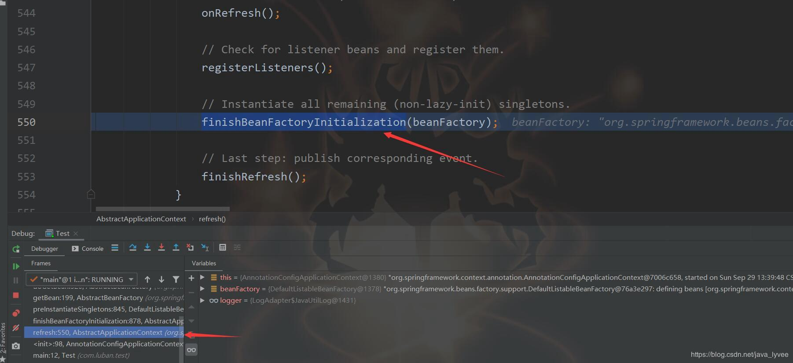

4、finishBeanFactoryInitialization方法当中调用preInstantiateSingletons初始化扫描出来的类
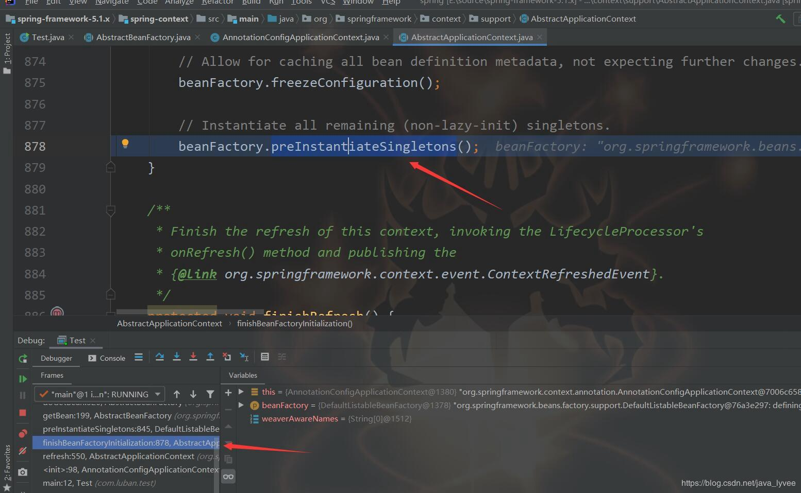

5、preInstantiateSingletons方法经过一系列判断之后会调用getBean方法去实例化扫描出来的类
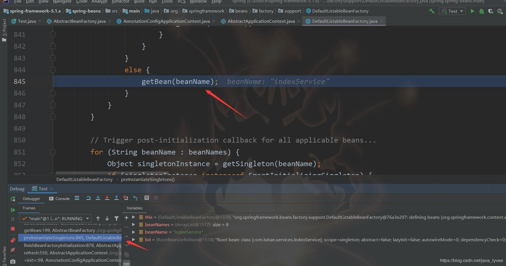

6、getBean方法就是个空壳方法，调用了doGetBean方法
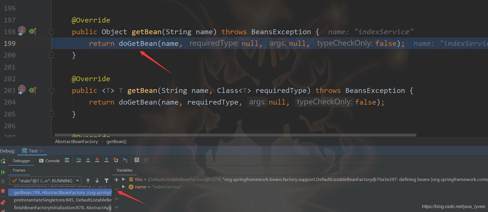        
doGetBean方法内容有点多，这个方法非常重要，不仅仅针对循环依赖，甚至整个spring bean生命周期中这个方法也有着举足轻重的地位，
读者可以认真看看笔者的分析。需要说明的是我为了更好的说清楚这个方法，我把代码放到文章里面进行分析；但是删除了一些无用的代
码；比如日志的记录这些无关紧要的代码。下面重点说这个doGetBean方法
```text
protected <T> T doGetBean(final String name, @Nullable final Class<T> requiredType,
      @Nullable final Object[] args, boolean typeCheckOnly) throws BeansException {
    
    //这个方法非常重要，但是和笔者今天要分析的循环依赖没什么很大的关系
    //读者可以简单的认为就是对beanName做一个校验特殊字符串的功能
    //我会在下次更新博客的时候重点讨论这个方法
    //transformedBeanName(name)这里的name就是bean的名字
   final String beanName = transformedBeanName(name);
   //定义了一个对象，用来存将来返回出来的bean
   Object bean;
   // Eagerly check singleton cache for manu  ally registered singletons.
   /**
    * 注意这是第一次调用getSingleton方法，下面spring还会调用一次
    * 但是两次调用的不是同一个方法；属于方法重载
    * 第一次 getSingleton(beanName) 也是循环依赖最重要的方法
    * 关于getSingleton(beanName)具体代码分析可以参考笔者后面的分析
    * 这里给出这个方法的总结
    * 首先spring会去单例池去根据名字获取这个bean，单例池就是一个map
    * 如果对象被创建了则直接从map中拿出来并且返回
    * 但是问题来了，为什么spring在创建一个bean的时候会去获取一次呢？
    * 因为作为代码的书写者肯定知道这个bean这个时候没有创建？为什么需要get一次呢？
    * 关于这个问题其实原因比较复杂，需要读者对spring源码设计比较精通
    * 笔者不准备来针对这个原因大书特书，稍微解释一下吧
    * 我们可以分析doGetBean这个方法，顾名思义其实是用来获取bean的
    * 为什么创建bean会调用这个doGetBean方法呢？难道是因为spring作者疏忽，获取乱起名字
    * 显然不是，spring的源码以其书写优秀、命名优秀而著名，那么怎么解释这个方法呢？
    * 其实很简单doGetBean这个方法不仅仅在创建bean的时候会被调用，在getBean的时候也会调用
    * 他是创建bean和getBean通用的方法。但是这只是解释了这个方法的名字意义
    * 并么有解释这个方法为什么会在创建bean的时候调用
    * 笔者前面已经说过原因很复杂，和本文有关的就是因为循环引用
    * 由于循环引用需要在创建bean的过程中去获取被引用的那个类
    * 而被引用的这个类如果没有创建，则会调用createBean来创建这个bean
    * 在创建这个被引用的bean的过程中会判断这个bean的对象有没有实例化
    * bean的对象？什么意思呢？
    * 为了方便阅读，请读者一定记住两个概念；什么是bean，什么是对象
    * 笔者以为一个对象和bean是有区别的
    * 对象：只要类被实例化就可以称为对象
    * bean：首先得是一个对象，然后这个对象需要经历一系列的bean生命周期
    * 最后把这个对象put到单例池才能算一个bean
    * 读者千万注意，笔者下文中如果写到bean和写到对象不是随意写的
    * 是和这里的解释有关系的；重点一定要注意；一定；一定；
    * 简而言之就是spring先new一个对象，继而对这个对象进行生命周期回调
    * 接着对这个对象进行属性填充，也是大家说的自动注入
    * 然后在进行AOP判断等等；这一些操作简称----spring生命周期
    * 所以一个bean是一个经历了spring周期的对象，和一个对象有区别
    * 再回到前面说的循环引用，首先spring扫描到一个需要被实例化的类A
    * 于是spring就去创建A；A=new A-a;new A的过程会调用getBean("a"))；
    * 所谓的getBean方法--核心也就是笔者现在写注释的这个getSingleton(beanName)
    * 这个时候get出来肯定为空？为什么是空呢？我写这么多注释就是为了解释这个问题?
    * 可能有的读者会认为getBean就是去容器中获取，所以肯定为空，其实不然，接着往下看
    * 如果getA等于空；spring就会实例化A；也就是上面的new A
    * 但是在实例化A的时候会再次调用一下 
    * getSingleton(String beanName, ObjectFactory<?> singletonFactory)
    * 笔者上面说过现在写的注释给getSingleton(beanName)
    * 也即是第一次调用getSingleton(beanName)
    * 实例化一共会调用两次getSingleton方法；但是是重载
    * 第二次调用getSingleton方法的时候spring会在一个set集合当中记录一下这个类正在被创建
    * 这个一定要记住，在调用完成第一次getSingleton完成之后
    * spring判读这个类没有创建，然后调用第二次getSingleton
    * 在第二次getSingleton里面记录了一下自己已经开始实例化这个类
    * 这是循环依赖做的最牛逼的地方，两次getSingleton的调用
    * 也是回答面试时候关于循环依赖必须要回答道的地方；
    * 需要说明的spring实例化一个对象底层用的是反射；
    * spring实例化一个对象的过程非常复杂，需要推断构造方法等等；
    * 这里笔者先不讨论这个过程，以后有机会更新一下
    * 读者可以理解spring直接通过new关键字来实例化一个对象
    * 但是这个时候对象a仅仅是一个对象，还不是一个完整的bean
    * 接着让这个对象去完成spring的bean的生命周期
    * 过程中spring会判断容器是否允许循环引用，判断循环引用的代码笔者下面会分析
    * 前面说过spring默认是支持循环引用的，笔者后面解析这个判断的源码也是spring默认支持循环引用的证据
    * 如果允许循环依赖，spring会把这个对象(还不是bean)临时存起来，放到一个map当中
    * 注意这个map和单例池是两个map，在spring源码中单例池的map叫做 singletonObjects
    * 而这个存放临时对象的map叫做singletonFactories
    * 当然spring还有一个存放临时对象的map叫做earlySingletonObjects
    * 所以一共是三个map，有些博客或者书籍人也叫做三级缓存
    * 为什么需要三个map呢？先来了解这三个map到底都缓存了什么
    * 第一个map singletonObjects 存放的单例的bean
    * 第二个map singletonFactories 存放的临时对象(没有完整springBean生命周期的对象)
    * 第三个map earlySingletonObjects 存放的临时对象(没有完整springBean生命周期的对象)
    * 笔者为了让大家不懵逼这里吧第二个和第三个map功能写成了一模一样
    * 其实第二个和第三个map会有不一样的地方，但这里不方便展开讲，下文会分析
    * 读者姑且认为这两个map是一样的
    * 第一个map主要为了直接缓存创建好的bean；方便程序员去getBean；很好理解
    * 第二个和第三个主要为了循环引用；为什么为了方便循环引用，接着往下看
    * 把对象a缓存到第二个map之后，会接着完善生命周期；
    * 当然spring bean的生命周期很有很多步骤；本文先不详细讨论；
    * 后面的博客笔者再更新；
    * 当进行到对象a的属性填充的这一周期的时候，发觉a依赖了一个B类
    * 所以spring就会去判断这个B类到底有没有bean在容器当中
    * 这里的判断就是从第一个map即单例池当中去拿一个bean
    * 后面我会通过源码来证明是从第一个map中拿一个bean的
    * 假设没有，那么spring会先去调用createBean创建这个bean
    * 于是又回到和创建A一样的流程，在创建B的时候同样也会去getBean("B")；
    * getBean核心也就是笔者现在写注释的这个getSingleton(beanName)方法
    * 下面我重申一下：因为是重点
    * 这个时候get出来肯定为空？为什么是空呢？我写这么多注释就是为了解释这个问题?
    * 可能有的读者会认为getBean就是去容器中获取；
    * 所以肯定为空，其实不然，接着往下看；
    * 第一次调用完getSingleton完成之后会调用第二次getSingleton
   * 第二次调用getSingleton同样会在set集合当中去记录B正在被创建
   * 请笔者记住这个时候 set集合至少有两个记录了 A和B；
   * 如果为空就 b=new B()；创建一个b对象；
   * 再次说明一下关于实例化一个对象，spring做的很复杂，下次讨论
   * 创建完B的对象之后，接着完善B的生命周期
   * 同样也会判断是否允许循环依赖，如果允许则把对象b存到第二个map当中；
   * 提醒一下笔者这个时候第二个map当中至少有两个对象了，a和b
   * 接着继续生命周期；当进行到b对象的属性填充的时候发觉b需要依赖A
   * 于是就去容器看看A有没有创建，说白了就是从第一个map当中去找a
   * 有人会说不上A在前面创建了a嘛？注意那只是个对象，不是bean;
   * 还不在第一个map当中 对所以b判定A没有创建，于是就是去创建A；
   * 那么又再次回到了原点了，创建A的过程中；首先调用getBean("a")
   * 上文说到getBean("a")的核心就是 getSingleton(beanName)
   * 上文也说了get出来a==null；但是这次却不等于空了
   * 这次能拿出一个a对象；注意是对象不是bean
   * 为什么两次不同？原因在于getSingleton(beanName)的源码
   * getSingleton(beanName)首先从第一个map当中获取bean
   * 这里就是获取a；但是获取不到；然后判断a是不是等于空
   * 如果等于空则在判断a是不是正在创建？什么叫做正在创建？
   * 就是判断a那个set集合当中有没有记录A；
   * 如果这个集合当中包含了A则直接把a对象从map当中get出来并且返回
   * 所以这一次就不等于空了，于是B就可以自动注入这个a对象了
   * 这个时候a还只是对象，a这个对象里面依赖的B还没有注入
   * 当b对象注入完成a之后，把B的周期走完，存到容器当中
   * 存完之后继续返回，返回到a注入b哪里？
   * 因为b的创建时因为a需要注入b；于是去get b
   * 当b创建完成一个bean之后，返回b(b已经是一个bean了)
   * 需要说明的b是一个bean意味着b已经注入完成了a；这点上面已经说明了
   * 由于返回了一个b，故而a也能注入b了；
   * 接着a对象继续完成生命周期，当走完之后a也在容器中了
   * 至此循环依赖搞定
   * 需要说明一下上文提到的正在创建这种说法并没有官方支持
   * 是笔者自己的认为；各位读者可以自行给他取名字
   * 笔者是因为存放那些记录的set集合的名字叫做singletonsCurrentlyInCreation
   * 顾名思义，当前正在创建的单例对象。。。。。
   * 还有上文提到的对象和bean的概念；也没有官方支持
   * 也是笔者为了让读者更好的理解spring源码而提出的个人概念
   * 但是如果你觉得这种方法确实能让你更好的理解spring源码
   * 那么请姑且相信笔者对spring源码的理解，假设10个人相信就会有100个人相信
   * 继而会有更多人相信，就会成为官方说法，哈哈。
   * 以上是循环依赖的整个过程，其中getSingleton(beanName)
   * 这个方法的存在至关重要
   * 最后说明一下getSingleton(beanName)的源码分析，下文会分析
   **/
    Object sharedInstance = getSingleton(beanName);
    
    
  /**
   * 如果sharedInstance不等于空直接返回
   * 当然这里没有直接返回而是调用了getObjectForBeanInstance
   * 关于这方法以后解释，读者可以认为这里可以理解为
   * bean =sharedInstance; 然后方法最下面会返回bean
   * 什么时候不等于空？
   * 再容器初始化完成之后
   * 程序员直接调用getbean的时候不等于空
   * 什么时候等于空？
   * 上文已经解释过了，创建对象的时候调用就会等于空
   */  
   if (sharedInstance != null && args == null) {
      bean = getObjectForBeanInstance(sharedInstance, name, beanName, null);
   }

   else {
      /**
        * 判断这个类是不是在创建过程中
        * 上文说了，一个类是否在创建的过程中是第二次调用getSingleton中决定的
        * 这里还没有执行到，如果就在创建过程中则出异常
        * 
        **/
      //prototypesCurrentlyInCreation 需要联系 getSingleton方法
      if (isPrototypeCurrentlyInCreation(beanName)) {
         throw new BeanCurrentlyInCreationException(beanName);
      }else{
          /**
           * 需要说明的笔者删了很多和本文无用的代码
           * 意思就是源码中执行到这个if的时候有很多其他代码
           * 但是都是一些判断，很本文需要讨论的问题关联不大
           * 这个if就是判断当前需要实例化的类是不是单例的
           * spring默认都是单例的，故而一般都成立的
           * 接下来便是调用第二次 getSingleton
           * 第二次会把当前正在创建的类记录到set集合
           * 然后反射创建这个实例，并且走完生命周期
           * 第二次调用getSingleton的源码分析会在下文
           **/
         if (mbd.isSingleton()) {
            sharedInstance = getSingleton(beanName, () -> {
               try {
                  //完成了目标对象的创建
                  //如果需要代理，还完成了代理
                  return createBean(beanName, mbd, args);
               }
               catch (BeansException ex) {
                  // Explicitly remove instance from singleton cache: It might have been put there
                  // eagerly by the creation process, to allow for circular reference resolution.
                  // Also remove any beans that received a temporary reference to the bean.
                  destroySingleton(beanName);
                  throw ex;
               }
            });
            bean = getObjectForBeanInstance(sharedInstance, name, beanName, mbd);
         }
   return (T) bean;
}

```
第二次调用getSingleton sharedInstance = getSingleton(beanName, () ->代码我做了删减，删了一些本本文无关的代码
```text
public Object getSingleton(String beanName, ObjectFactory<?> singletonFactory) {
   synchronized (this.singletonObjects) {
    
       //首先也是从第一个map即容器中获取
       //再次证明如果我们在容器初始化后调用getBean其实就是从map当中获取一个bean
       //我们这里的场景是初始化对象A第一次调用这个方法
       //那么肯定为空
      Object singletonObject = this.singletonObjects.get(beanName);
      if (singletonObject == null) {
          /**注意这行代码，就是A的名字添加到set集合当中
          也就是笔者说的标识A正在创建过程当中
          这个方法比较简单我就不单独分析了，直接在这里给出
          singletonsCurrentlyInCreation.add就是放到set集合当中
          protected void beforeSingletonCreation(String beanName) {
               if (!this.inCreationCheckExclusions.contains(beanName)
                && !this.singletonsCurrentlyInCreation.add(beanName)) {
                  throw new BeanCurrentlyInCreationException(beanName);
           }
        }
        **/
        
         beforeSingletonCreation(beanName);
         boolean newSingleton = false;
         try {
             //这里便是创建一个bean的入口了
             //spring会首先实例化一个对象，然后走生命周期
             //走生命周期的时候前面说过会判断是否允许循环依赖
             //如果允许则会把创建出来的这个对象放到第二个map当中
             //然后接着走生命周期当他走到属性填充的时候
             //会去get一下B，因为需要填充B，也就是大家认为的自动注入
             //这些代码下文分析，如果走完了生命周期
            singletonObject = singletonFactory.getObject();
            newSingleton = true;
         }
      }
      return singletonObject;
   }
}

```
如果允许则会把创建出来的这个对象放到第二个map当中AbstractAutowireCapableBeanFactory#doCreateBean()方法部分代码由于这个方
法内容过去多，我删减了一些无用代码 上面说的 singletonObject =singletonFactory.getObject();会开始创建bean调用
AbstractAutowireCapableBeanFactory#doCreateBean() 在创建bean；下面分析这个方法
```text
protected Object doCreateBean(final String beanName, final RootBeanDefinition mbd, final @Nullable Object[] args)
      throws BeanCreationException {

   // Instantiate the bean.
   BeanWrapper instanceWrapper = null;
   if (mbd.isSingleton()) {
       //如果你bean指定需要通过factoryMethod来创建则会在这里被创建
       //如果读者不知道上面factoryMethod那你就忽略这行代码
       //你可以认为你的A是一个普通类，不会再这里创建
      instanceWrapper = this.factoryBeanInstanceCache.remove(beanName);
   }
   if (instanceWrapper == null) {
       //这里就通过反射创建一个对象，注意是对象不是bean
       //这个createBeanInstance的方法过于复杂，本文不做分析
       //以后如果有更新再来分析这个代码
       //读者可以理解这里就是new了一个A对象
      instanceWrapper = createBeanInstance(beanName, mbd, args);
   }
   //得到new出来的A，为什么需要得到呢？因为Anew出来之后存到一个对象的属性当中
   final Object bean = instanceWrapper.getWrappedInstance();
   //重点:面试会考
   //这里就是判断是不是支持循环引用和是否单例以及bean是否在创建过程中
   //判断循环引用的是&& this.allowCircularReferences
   //allowCircularReferences在spring源码当中默认就是true
   // private boolean allowCircularReferences = true; 这是spring源码中的定义
   //并且这个属性上面spring写了一行非常重要的注释
   // Whether to automatically try to resolve circular references between beans
   // 读者自行翻译，这是支持spring默认循环引用最核心的证据
   //读者一定要讲给面试官，关于怎么讲，我后面会总结
   boolean earlySingletonExposure = (mbd.isSingleton() 
       && this.allowCircularReferences &&
         isSingletonCurrentlyInCreation(beanName));
   //如果是单例，并且正在创建，并且是没有关闭循环引用则执行
   //所以spring原形是不支持循环引用的这是证据，但是其实可以解决
   //怎么解决原形的循环依赖，笔者下次更新吧      
   if (earlySingletonExposure) {
       //这里就是这个创建出来的A 对象a 放到第二个map当中
       //注意这里addSingletonFactory就是往map当中put
       //需要说明的是他的value并不是一个a对象
       //而是一段表达式，但是包含了这个对象的
       //所以上文说的第二个map和第三个map的有点不同
       //第三个map是直接放的a对象(下文会讲到第三个map的)，
       //第二个放的是一个表达式包含了a对象
       //为什么需要放一个表达式？下文分析吧
      addSingletonFactory(beanName, () -> getEarlyBeanReference(beanName, mbd, bean));
   }

   // Initialize the bean instance.
   Object exposedObject = bean;
   try {
       //填充属性，也就是所谓的自动注入
       //这个代码我同一张图来说明
      populateBean(beanName, mbd, instanceWrapper);
      exposedObject = initializeBean(beanName, exposedObject, mbd);
   }
   return exposedObject;
   }

```
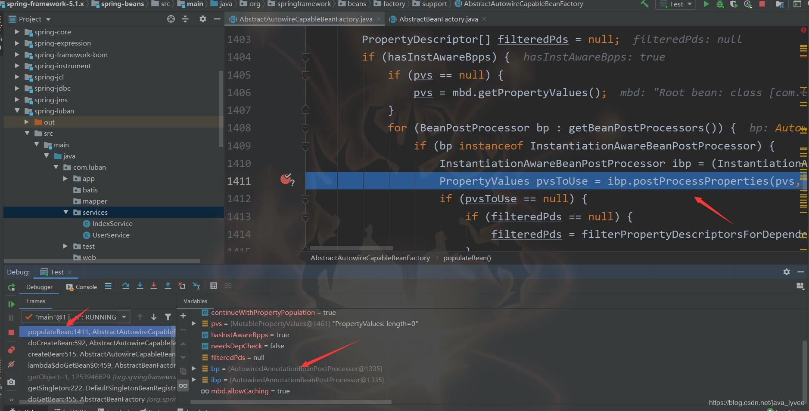  
当A执行到属性填充的时候会调用AutowiredAnnotationBeanPostProcessor的postProcessProperties方法来完成填充或者叫做自动注入b
下图有很多文字注释，可以放大图上的注释
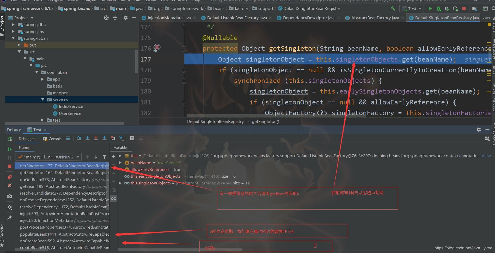  
填充B的时候先从容器中获取B，这个时候b没有创建则等于空，然后看B是不是正在创建，这个时候B只是执行了第一次getSingleton故而
不在第二个map当中，所以返回空，返回空之后会执行创建B的流程；执行第二遍调用getSingleton的时候会把b标识正在创建的过程中，也
就是添加到那个set集合当中；下图做说明

创建B的流程和创建A差不多，把B放到set集合，标识B正在创建，继而实例化b对象，然后执行生命周期流程，把创建的这个b对象放到第
二个map当中，这个时候map当中已经有了a，b两个对象。然后执行b对象的属性填充或者叫自动注入时候发觉需要依赖a，于是重复上面的
getbean步骤，调用getSingleton方法；只不过现在a对象已经可以获取了故而把获取出来的a对象、临时对象注入给b对象，然后走完b的生
命周期流程后返回b所表示bean，跟着把这个b所表示的bean注入给a对象，最后走完a对象的其他生命周期流程；循环依赖流程全部走完；
但是好像没有说到第三个map，第三个map到底充当了什么角色呢？这个知识点非常的重要，关于这个知识不少书籍和博客都说错了，这也
是写这篇文章的意义；笔者说每次读spring源码都不一样的收获，这次最大的收获便是这里了；我们先来看一下代码；场景是这样的，
spring创建A，记住第一次创建A，过程中发觉需要依赖B，于是创建B，创建B的时候发觉需要依赖A，于是再一次创建–第二次创建A，下面
代码就是基于第二次创建的A来分析；第二次创建A的时候依然会调用getSingleton，先获取一下a
```text
protected Object getSingleton(String beanName, boolean allowEarlyReference) {
    //先从第一个map获取a这个bean，也就是单例池获取
   Object singletonObject = this.singletonObjects.get(beanName);
   if (singletonObject == null && isSingletonCurrentlyInCreation(beanName)) {
      synchronized (this.singletonObjects) {
          //然后从第三个map当中获取a这个对象
         singletonObject = this.earlySingletonObjects.get(beanName);
         //如果第三个map获取不到a对象，再看是否允许了循环引用
         //而这里的allowEarlyReference是true
         //为什么是true，上文说了这个方法是spring自己调用的，他默认传了true
         if (singletonObject == null && allowEarlyReference) {
             //然后从第二个map中获取一个表达式
             //这里要非常注意第二个map当中存的不是一个单纯的对象
             //前面说了第二个map当中存的是一个表达式，你可以理解为存了一个工厂
             //或者理解存了一个方法，方法里面有个参数就是这个对象
             //安装spring的命名来分析应该理解为一个工厂singletonFactory
             //一个能够生成a对象的工厂
             //那么他为什么需要这么一个工厂
             //这里我先大概说一下，是为了通过工厂来改变这个对象
             //至于为什么要改变对象，下文我会分析
             //当然大部分情况下是不需要改变这个对象的
             //读者先可以考虑不需要改变这个对象，
             //那么这个map里面存的工厂就生产就是这个原对象，那么和第三个map功能一样
            ObjectFactory<?> singletonFactory = this.singletonFactories.get(beanName);
            if (singletonFactory != null) {
                //调用表达式，说白了就是调用工厂的方法，然后改变对象
                //我们假设对象不需要改变的情况那么返回了原对象就是a
                //需要改变的情况我们下文再分享
               singletonObject = singletonFactory.getObject();
               //然后把这个对象放到第三个map当中
               this.earlySingletonObjects.put(beanName, singletonObject);
               //把这个对象、或者表达式、或者工厂从第二个map中移除
               this.singletonFactories.remove(beanName);
               //重点:面试会考---为什么要放到第三个？为什么要移除第二个？
               首先我们通过分析做一个总结:
                   spring首先从第一个map中拿a这个bean
                   拿不到，从第三个map当中拿a这个对象
                   拿不到，从第二个map拿a这个对象或者工厂
                   拿到之后放到第三个map，移除第二个map里面的表达式、或者工厂
               如果对象需要改变，当改变完成之后就把他放到第三个里面
               这里的情况是b需要a而进行的步骤，试想一下以后如果还有C需要依赖a
               就不需要重复第二个map的工作了，也就是改变对象的工作了。
               因为改变完成之后的a对象已经在第三个map中了。不知道读者能不能懂笔者的意思
               如果对象不需要改变道理是一样的，也同样在第三个map取就是了；
               至于为什么需要移除第二个map里面的工厂、或者表达式就更好理解了
               他已经对a做完了改变，改变之后的对象已经在第三个map了，为了方便gc啊
               下面对为什么需要改变对象做分析
               
            }
         }
      }
   }
   return singletonObject;
}

```
为什么需要改变对象？那个表达式、或者说工厂主要干什么事呢？ 那个工厂、或者表达式主要是调用了下面这个方法
```text
//这个方法内容比较少，但是很复杂，因为是对后置处理器的调用
//关于后置处理器笔者其实要说话很多很多
//现在市面上可见的资料或者书籍对后置处理器的说法笔者一般都不苟同
//我在B站上传过一个4个小时的视频，其中对spring后置处理器做了详细的分析
//也提出了一些自己的理解和主流理解不同的地方，有兴趣同学可以去看看
//其实简单说--这个方法作用主要是为了来处理aop的；
//当然还有其他功能，但是一般的读者最熟悉的就是aop
//这里我说明一下，aop的原理或者流程有很多书籍说到过
//但是笔者今天亲测了，现在市面可见的资料和书籍对aop的说法都不全
//很多资料提到aop是在spring bean的生命周期里面填充属性之后的代理周期完成的
//而这个代理周期甚至是在执行生命周期回调方法之后的一个周期
//那么问题来了？什么叫spring生命周期回调方法周期呢？
// 首先spring bean生命周期和spring生命周期回调方法周期是两个概念
//spring生命周期回调方法是spring bean生命周期的一部分、或者说一个周期
//简单理解就是spring bean的生命的某个过程会去执行spring的生命周期的回调方法
//比如你在某个bean的方法上面写一个加@PostConstruct的方法（一般称bean初始化方法）
//那么这个方法会在spring实例化一个对象之后，填充属性之后执行这个加注解的方法
//我这里叫做spring 生命周期回调方法的生命周期，不是我胡说，有官方文档可以参考的
//在执行完spring生命周期回调方法的生命周期之后才会执行代理生命周期
//在代理这个生命周期当中如果有需要会完成aop的功能
//以上是现在主流的说法，也是一般书籍或者“某些大师”的说法
//但是在循环引用的时候就不一样了，循环引用的情况下这个周期这里就完成了aop的代理
//这个周期严格意义上是在填充属性之前（填充属性也是一个生命周期阶段）
//填充属性的周期甚至在生命周期回调方法之前，更在代理这个周期之前了
//简单来说主流说法代理的生命周期比如在第8个周期或者第八步吧
//但是笔者这里得出的结论，如果一个bean是循环引用的则代理的周期可能在第3步就完成了
//那么为什么需要在第三步就完成呢？
//试想一下A、B两个类，现在对A类做aop处理，也就是需要对A代理
不考虑循环引用 spring 先实例化A，然后走生命周期确实在第8个周期完成的代理
关于这个结论可以去看b站我讲的spring aop源码分析
但是如果是循环依赖就会有问题
比如spring 实例化A 然后发现需要注入B这个时候A还没有走到8步
还没有完成代理，发觉需要注入B，便去创建B，创建B的时候
发觉需要注入A，于是创建A，创建的过程中通过getSingleton
得到了a对象，注意是对象，一个没有完成代理的对象
然后把这个a注入给B？这样做合适吗？注入的a根本没有aop功能；显然不合适
因为b中注入的a需要是一个代理对象
而这个时候a存在第二个map中；不是一个代理对象；
于是我在第二个map中就不能单纯的存一个对象，需要存一个工厂
这个工厂在特殊的时候需要对a对象做改变，比如这里说的代理（需要aop功能的情况）
这也是三个map存在的必要性，不知道读者能不能get到点


protected Object getEarlyBeanReference(String beanName, RootBeanDefinition mbd, Object bean) {
   Object exposedObject = bean;
   if (!mbd.isSynthetic() && hasInstantiationAwareBeanPostProcessors()) {
      for (BeanPostProcessor bp : getBeanPostProcessors()) {
         if (bp instanceof SmartInstantiationAwareBeanPostProcessor) {
            SmartInstantiationAwareBeanPostProcessor ibp = (SmartInstantiationAwareBeanPostProcessor) bp;
            exposedObject = ibp.getEarlyBeanReference(exposedObject, beanName);
         }
      }
   }
   return exposedObject;
}

```
总结关于循环引用，如何回答面试:首先spring在单例的情况下是默认支持循环引用的(当然原形也有办法，今天先不讨论)；在不做任何配
置的情况下，两个bean相互依赖是能初始化成功的；spring源码中在创建bean的时候先创建这个bean的对象，创建对象完成之后通过判断
容器对象的allowCircularReferences属性决定是否允许缓存这个临时对象，如果能被缓存成功则通过缓存提前暴露这个临时对象来完成循
环依赖；而这个属性默认为true，所以说spring默认支持循环依赖的，但是这个属性spring提供了api让程序员来修改，所以spring也提供
了关闭循环引用的功能；再就是spring完成这个临时对象的生命周期的过程中当执行到注入属性或者自动装配的周期时候会通过
getSingleton方法去得到需要注入的b对象；而b对象这个时候肯定不存在故而会创建b对象创建b对象成功后继续b对象的生命周期，当执行
到b对象的自动注入周期时候会要求注入a对象；调用getSingleton；从map缓存中得到a的临时对象（因为这个时候a在set集合中；这里可
以展开讲），而且获取的时候也会判断是否允许循环引用，但是判断的这个值是通过参数传进来的，也就是spring内部调用的，spring源
码当中写死了为true，故而如果需要扩展spring、或者对spring二次开发的的时候程序员可以自定义这个值来实现自己的功能；不管放到
缓存还是从缓存中取出这个临时都需要判断；而这两次判断spring源码当中都是默认为true；这里也能再次说明spring默认是支持循环引
用的；然后面试中可以在说说两次调用getSingleton的意义，正在创建的那个set集合有什么用；最后在说说你在看spring循环引用的时候
得出的aop实例化过程的新发现；就比较完美了

[关于上述中的ObjectFactory存在的意义的说法，这里需要补充一下]
案例
```text
@Service
public class UserServiceimpl implements UserService {

    @Autowired
    private OrderService orderService;

    ...
}
```
```text
@Service
public class OrderServiceImpl implements OrderService{

    @Autowired
    private UserService userService;
    
    ...
}
```
给改service业务包加入Aop功能，代码如下
```text
@Aspect
@Component
public class NotVeryUsefulAspect {

    @Pointcut ("execution(* com.xiaoantimes.cn.service.*.*(..))")
    private void anyOldTransfer() {}

    @Before ("anyOldTransfer()")
    private void before(){
        System.out.println ("===============before()==============");
    }

    @After ("anyOldTransfer()")
    private void after(){
        System.out.println ("===============after()==============");
    }
}
```
执行的结果如下
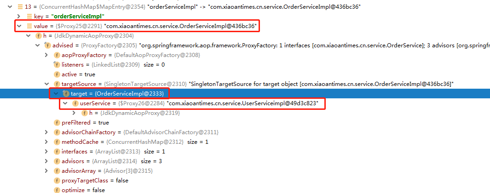 
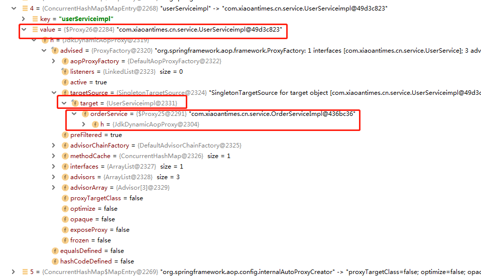 
从结果中我们可以看到，UserServiceimpl和OrderServiceImpl的实例都是代理对象，而其代理类的目标对象都是原Bean本身，其所持有的
各自的引用也都是代理对象的引用。OjectFactory对象存在的意义分析我们从循环引用的构建过程来分析
 
1.首先在spring容器中构建UserServiceimpl的实例，调用getBean()方法获取UserServiceimpl实例，在第一次从容器中获取时，由于此时容
器尚未创建UserServiceimpl的实例bean，因此容器此时会创建UserServiceimpl的实例。
2.在doCreateBean()方法中会将该bean的实例放入到二级缓存中即ObjectFactory缓存中去，同时我们的bean实例也会缓存在ObjectFactory
对象中的getObject()方法中。
3.当完成步骤2后，UserServiceimpl实例bean会接着去注入属性，即注入OrderServiceImpl的实例，调用getBean()方法，获取OrderServiceImpl
的实例bean，但此时容器中尚未构建OrderServiceImpl的实例bean，因此此时容器也会走createBean()方法去创建OrderServiceImpl的实
例bean，当OrderServiceImpl实例构建完成后，容器同样会将该bean的实例存入ObjectFactory二级缓存中，并将OrderServiceImpl的实例
bean存放到ObjectFactory对象中的getObject()方法中去。
4.完成步骤3后，继续进行属性注入操作，将UserServiceimpl的实例注入到OrderServiceImpl实例的属性中去，这个时候，同样也会调用
getBean()的方法，从容器中去获取UserServiceimpl的实例bean，这个时候就需要注意了，因为在spring单例缓存中并没有UserServiceimpl
的实例bean，spring又会继续从三级缓存中获取，同样也没有，这个时候，spring从二级缓存中获取，并调用ObjectFactory对象中的
getObject()方法得到之前存放的实例bean。
```text
ObjectFactory<?> singletonFactory = this.singletonFactories.get(beanName);
if (singletonFactory != null) {
    //调用addSingletonFactory(beanName, () -> getEarlyBeanReference(beanName, mbd, bean));中的getEarlyBeanReference方法
    //暴露给SmartInstantiationAwareBeanPostProcessor后置处理器进行处理
    singletonObject = singletonFactory.getObject();
    this.earlySingletonObjects.put(beanName, singletonObject);
    this.singletonFactories.remove(beanName);
}
```
singletonFactory.getObject();又会去调用getEarlyBeanReference()方法，从而调用后置处理器生成UserServiceimpl实例的代理对象，
并将其存放到三级缓存earlySingletonObjects中
```text
protected Object getEarlyBeanReference(String beanName, RootBeanDefinition mbd, Object bean) {
    //对bean再一次依赖引用，主要应用SmartInstantiationAwareBeanPostProcessor
    //其中我们熟知的AOP就是在这里将advice动态织人bean中，若没有则直接返回bean，不做任何处理
    Object exposedObject = bean;
    if (!mbd.isSynthetic() && hasInstantiationAwareBeanPostProcessors()) {
        for (BeanPostProcessor bp : getBeanPostProcessors()) {
            if (bp instanceof SmartInstantiationAwareBeanPostProcessor) {
                SmartInstantiationAwareBeanPostProcessor ibp = (SmartInstantiationAwareBeanPostProcessor) bp;
                exposedObject = ibp.getEarlyBeanReference(exposedObject, beanName);
            }
        }
    }
    return exposedObject;
}
```
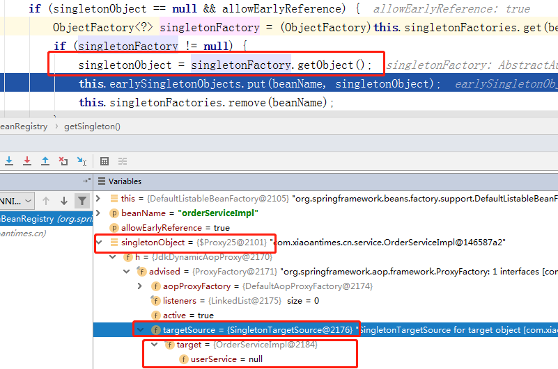 
需要注意的是，默认情况下这里就是bean的实例对象(这里的getObject()调用了getgetEarlyBeanReference()，并循环调用了所有的后置
处理器，这里是有可能改变该bean的实例，所以需要注意，默认情况下，是没有任何处理，即直接返回原对象)，但是对于循环引用的对象
实际上这里就已经创建了代理对象，也即AOP代理功能并非是像普通的bean一样在初始化调用方法中的最后一个后置处理器中完成的，而是
提前到此处即完成了代理对象的生成，这里是需要特别注意的一点。也即此时创建OrderServiceImpl实例时注入UserServiceimpl的实例实
际上就是从ObjectFactory对象中的getObject()方法获取到的原bean的代理对象。到这里OrderServiceImpl对象已经完成了属性注入，
5.当步骤5完成后，程序开始调用调用OrderServiceImpl实例的初始化方法，在这里完成了AOP代理类的生成，并返回了最终代理类的引用。
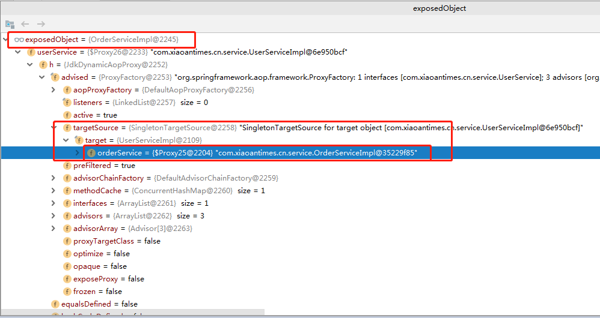 
6.步骤5结束后，代码又会回到对UserServiceimpl实例化方法中的属性注入中来，getbean方法此时已经获取到了OrderServiceImpl的实例(
OrderServiceImpl代理对象，持有OrderServiceImpl目标对象引用，而OrderServiceImpl目标对象又持有UserServiceimpl代理对象引用)，
这时会将获取到的OrderServiceImpl实例(代理对象)进行属性注入。
7.在步骤6属性注入后，程序继续调用初始化方法，由于之前已经完成了UserServiceimpl的代理功能，此时最后一个后置处理器将不再处
理AOP的功能，而是直接返回原实例本身。
```text
if (mbd == null || !mbd.isSynthetic()) {
    //后处理器应用
    //第八次调用后置处理器
    wrappedBean = applyBeanPostProcessorsAfterInitialization(wrappedBean, beanName);
}
```
8.程序会继续判断，由于UserServiceimpl和OrderServiceImpl都是单例对象，都需要提前暴露，所以if (earlySingletonExposure)条件
对两者都会成立，其还是回去调用getSingleton()方法，其实此时是无法获取到对象的，因为尽管在构建UserServiceimpl对象时已经将其
实例对象存入了ObjectFactory的getObject()方法中，但实际上并没有发生调用，也即不会从二级缓存中存入三级缓存，因此此时通过beanName
获取不到UserServiceimpl对象实例，直接返回exposedObject的代理对象。而OrderServiceImpl走这段逻辑时，因为已经将bean实例存入
二级缓存中，且在UserServiceimpl实例注入属性当中已经调用了ObjectFactory的getObject()方法，因此它创建了OrderServiceImpl实例
的代理对象，并将其存入三级缓存中去，因此此时是可以get到OrderServiceImpl实例的代理对象。又因为之前后置处理器并没有处理代理
功能，因此对OrderServiceImpl实例而言if (exposedObject == bean)条件时成立的，所以此时就将从三级缓存获取到的OrderServiceImpl
代理实例返回出去。
```text
if (earlySingletonExposure) {
    Object earlySingletonReference = getSingleton(beanName, false);
    //earlySingletonReference只有在检测到有循环依赖的忻况下才会不为空
    if (earlySingletonReference != null) {
        //／如果exposedObject没有在初始化方法中被改变，也就是没有被增强
        if (exposedObject == bean) {
            exposedObject = earlySingletonReference;
        }
        //检查依赖
        else if (!this.allowRawInjectionDespiteWrapping && hasDependentBean(beanName)) {
            String[] dependentBeans = getDependentBeans(beanName);
            Set<String> actualDependentBeans = new LinkedHashSet<>(dependentBeans.length);
            for (String dependentBean : dependentBeans) {
                if (!removeSingletonIfCreatedForTypeCheckOnly(dependentBean)) {
                    actualDependentBeans.add(dependentBean);
                }
            }
            //因为bean创建后；其所依赖的bean 一定是已经创建的，actualDependentBeans不为空则表示当前bean创建后；
            //其依赖的bean却没有没全部创建完，也就是说存在循环依赖
            if (!actualDependentBeans.isEmpty()) {
                throw new BeanCurrentlyInCreationException(beanName,
                        "Bean with name '" + beanName + "' has been injected into other beans [" +
                        StringUtils.collectionToCommaDelimitedString(actualDependentBeans) +
                        "] in its raw version as part of a circular reference, but has eventually been " +
                        "wrapped. This means that said other beans do not use the final version of the " +
                        "bean. This is often the result of over-eager type matching - consider using " +
                        "'getBeanNamesOfType' with the 'allowEagerInit' flag turned off, for example.");
            }
        }
    }
}
```
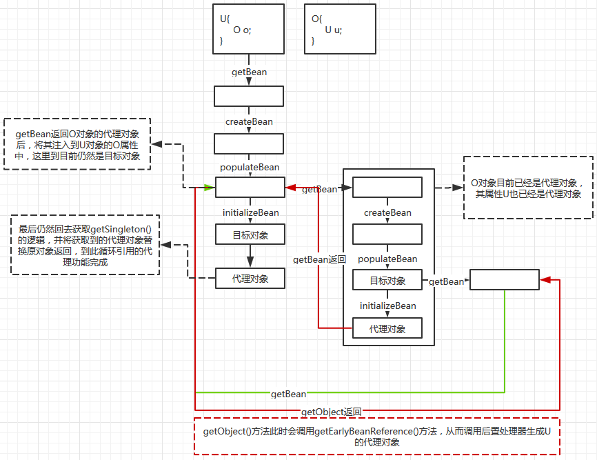 
从上述及上图可以看出，实际上ObjectFactory对象存在的意义，与后续的代理其实没有必然的联系，spring之所以这么做，应该还是处于
代码的扩展性出发，给与了我们一个可以在循环引用中来修改bean的机会。

http://www.freesion.com/article/7024139207/