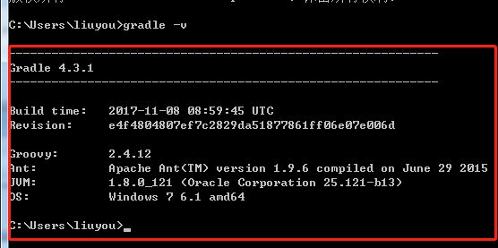

##XmlBeanFactory加载

- 构建spring容器
```text
XmlBeanFactory beanFactory = new XmlBeanFactory(new ClassPathResource("spring-test.xml"));
```

- 容器初始化流程


- 初始化详解
1.构建XmlBeanFactory实例时，spring默认构建了XmlBeanDefinitionReader对象，并将xml的解析委托给了XmlBeanDefinitionReader对象去处理
```text
#初始化XmlBeanFactory时就构建好XmlBeanDefinitionReader对象
XmlBeanDefinitionReader reader = new XmlBeanDefinitionReader(this);
```
```text
public XmlBeanFactory(Resource resource, BeanFactory parentBeanFactory) throws BeansException {
    super(parentBeanFactory);
    //加载BeanDefinition定义
    this.reader.loadBeanDefinitions(resource);
}
```
```text
public int loadBeanDefinitions(Resource resource) throws BeanDefinitionStoreException {
    //EncodedResource对资源进行编码处理，国际化
    return loadBeanDefinitions(new EncodedResource(resource));
}
```
EncodedResource中最重要的就是getReader方法，根据编码格式来获取资源文件，即所谓的国际化
```text
public Reader getReader() throws IOException {
    if (this.charset != null) {
        return new InputStreamReader(this.resource.getInputStream(), this.charset);
    }
    else if (this.encoding != null) {
        return new InputStreamReader(this.resource.getInputStream(), this.encoding);
    }
    else {
        return new InputStreamReader(this.resource.getInputStream());
    }
}
```
spring需要在容器初始化的时候对配置文件即xml进行解析，即将xml文件转换成Document对象，以便后续的解析
```text
protected int doLoadBeanDefinitions(InputSource inputSource, Resource resource)
        throws BeanDefinitionStoreException {

    try {
        //将给定资源转化成Document对象，以便后续的xml元素解析
        Document doc = doLoadDocument(inputSource, resource);
        //解析并注册BeanDefinition
        int count = registerBeanDefinitions(doc, resource);
        ...
    }
    ...
}
```
spring将Document的解析委托给BeanDefinitionDocumentReader处理
```text
public int registerBeanDefinitions(Document doc, Resource resource) throws BeanDefinitionStoreException {
    //对元素的解析委托给BeanDefinitionDocumentReader处理
    BeanDefinitionDocumentReader documentReader = createBeanDefinitionDocumentReader();
    int countBefore = getRegistry().getBeanDefinitionCount();
    //解析并注册BeanDefinition
    documentReader.registerBeanDefinitions(doc, createReaderContext(resource));
    //记录本次加载的BeanDefinition个数
    return getRegistry().getBeanDefinitionCount() - countBefore;
}
```
BeanDefinitionParserDelegate为元素解析策略，在spring的配置文件中存在各种各样的元素标签，有spring默认的元素标签，如beans、alias、import、bean等，
以及用户自定义的元素标签，最典型的就是事务标签及数据源jdbc相关的标签等它不属于spring的默认标签，因此需要根据xml的元素来决定解析的元素的具体策略，
在实际的使用中BeanDefinitionParserDelegate则是被用来处理自定义标签
```text
protected void doRegisterBeanDefinitions(Element root) {
		BeanDefinitionParserDelegate parent = this.delegate;
		//创建默认的元素解析策略，实际上BeanDefinitionParserDelegate是被用来处理自定义的元素标签
		this.delegate = createDelegate(getReaderContext(), root, parent);

		//默认的名称空间还是用户自定义的名称空间
		if (this.delegate.isDefaultNamespace(root)) {
			//解析profile标签 该标签用来指定配置文件是dev环境的还是test环境还是prod生产环境
			String profileSpec = root.getAttribute(PROFILE_ATTRIBUTE);
			if (StringUtils.hasText(profileSpec)) {
				String[] specifiedProfiles = StringUtils.tokenizeToStringArray(
						profileSpec, BeanDefinitionParserDelegate.MULTI_VALUE_ATTRIBUTE_DELIMITERS);
				// We cannot use Profiles.of(...) since profile expressions are not supported
				// in XML config. See SPR-12458 for details.
				if (!getReaderContext().getEnvironment().acceptsProfiles(specifiedProfiles)) {
					if (logger.isDebugEnabled()) {
						logger.debug("Skipped XML bean definition file due to specified profiles [" + profileSpec +
								"] not matching: " + getReaderContext().getResource());
					}
					return;
				}
			}
		}

		//xml解析前处理，钩子方法，留给子类实现
		preProcessXml(root);
		//解析BeanDefinition配置
		parseBeanDefinitions(root, this.delegate);
		//xml解析后处理，钩子方法，留给子类实现
		postProcessXml(root);

		this.delegate = parent;
	}
```
`PROFILE_ATTRIBUTE`标签即`profile`属性，该属性是用来指定不同的环境作用域的，同如下示例，我们可以根据不同的环境来指定不同的配置信息
```text
<beans profile="development">
    <bean id="dataSource" class="org.springframework.jdbc.datasource.SimpleDriverDataSource">
      <property name="driverClass" value="${jdbc.driver}" />
      <property name="url" value="${jdbc.url}" />
      <property name="username" value="${jdbc.username}" />
      <property name="password" value="${jdbc.password}" />
    </bean>
</beans>

<beans profile="test">
    <bean id="dataSource" class="org.springframework.jdbc.datasource.SimpleDriverDataSource">
      <property name="driverClass" value="${jdbc.driver}" />
      <property name="url" value="${jdbc.url}" />
      <property name="username" value="${jdbc.username}" />
      <property name="password" value="${jdbc.password}" />
    </bean>
</beans>
```
在spring解析xml配置文件时，又需要根据实际情况，针对spring默认的元素一级用户自定义的元素进行不同的策略解析，而这个过程则交由
BeanDefinitionParserDelegate去处理
```text
protected void parseBeanDefinitions(Element root, BeanDefinitionParserDelegate delegate) {
    //判断元素是否是默认名称空间如beans等标签
    if (delegate.isDefaultNamespace(root)) {
        NodeList nl = root.getChildNodes();
        for (int i = 0; i < nl.getLength(); i++) {
            Node node = nl.item(i);
            if (node instanceof Element) {
                Element ele = (Element) node;
                if (delegate.isDefaultNamespace(ele)) {
                    //spring默认的标签解析
                    parseDefaultElement(ele, delegate);
                }
                else {
                    //用户自定义的解析器如事务标签解析，aop标签等
                    delegate.parseCustomElement(ele);
                }
            }
        }
    }
    else {
        //用户自定义的解析器如事务标签解析，aop标签等
        delegate.parseCustomElement(root);
    }
}
```
在parseDefaultElement方法中，spring会递归循环的去处理import、alias、bean、beans等标签，最终会调用processBeanDefinition针对bean的解析
```text
private void parseDefaultElement(Element ele, BeanDefinitionParserDelegate delegate) {
    //对import 标签的处理
    if (delegate.nodeNameEquals(ele, IMPORT_ELEMENT)) {
        importBeanDefinitionResource(ele);
    }
    //对alias标签的处理
    else if (delegate.nodeNameEquals(ele, ALIAS_ELEMENT)) {
        processAliasRegistration(ele);
    }
    //对bean标签的处理，同时将bean的信息注册到伪IOC容器中去
    else if (delegate.nodeNameEquals(ele, BEAN_ELEMENT)) {
        processBeanDefinition(ele, delegate);
    }
    //对beans标签的处理
    else if (delegate.nodeNameEquals(ele, NESTED_BEANS_ELEMENT)) {
        // recurse
        //递归解析
        doRegisterBeanDefinitions(ele);
    }
}
```
importBeanDefinitionResource对import标签解析时，首先是获取到resource元素，解析给定资源的路径定义，然后判断是否是spring表达式,
并对其进行处理，然后去判断该路径是相对路径还是绝对路径，最后根据不同的资源路径定义来加载bean的定义信息
```text
protected void importBeanDefinitionResource(Element ele) {
    String location = ele.getAttribute(RESOURCE_ATTRIBUTE);
    ...

    // Resolve system properties: e.g. "${user.dir}"
    //解析系统属性
    location = getReaderContext().getEnvironment().resolveRequiredPlaceholders(location);

    Set<Resource> actualResources = new LinkedHashSet<>(4);

    // Discover whether the location is an absolute or relative URI
    //判定location 是绝对URI 还是相对URI
    boolean absoluteLocation = false;
    try {
        absoluteLocation = ResourcePatternUtils.isUrl(location) || ResourceUtils.toURI(location).isAbsolute();
    }
    ...

    // Absolute or relative?
    if (absoluteLocation) {
        try {
            //如果是绝对URI 则直接根据地址加载对应的配置文件
            int importCount = getReaderContext().getReader().loadBeanDefinitions(location, actualResources);
            if (logger.isTraceEnabled()) {
                logger.trace("Imported " + importCount + " bean definitions from URL location [" + location + "]");
            }
        }
        ...
    }
    else {
        // No URL -> considering resource location as relative to the current file.
        //如果是相对地址则根据相对地址计算出绝对地址
        try {
            int importCount;
            //Resource 存在多个子实现类，女H VfsResource 、FileSystemResource 等，
            //而每个resource 的createRelative方式实现都不一样，所以这里先使用子类的方法尝试解析
            //如果在构建XmlBeanFactory使用的是ClasspathResource则createRelative的逻辑是applyRelativePath根据原资源文件路径来定位相对位置
            Resource relativeResource = getReaderContext().getResource().createRelative(location);
            if (relativeResource.exists()) {
                //r囡构建是默认使用的是XmlBeanFactory，则走XmlBeanDefinitionReader
                importCount = getReaderContext().getReader().loadBeanDefinitions(relativeResource);
                actualResources.add(relativeResource);
            }
            //如果解析不成功， 则使用默认的解析器ResourcePatternResolver进行解析
            else {
                String baseLocation = getReaderContext().getResource().getURL().toString();
                importCount = getReaderContext().getReader().loadBeanDefinitions(
                        StringUtils.applyRelativePath(baseLocation, location), actualResources);
            }
            ...
        }
       ...
    }
    ...
}
```
```text
<?xml version="1.0" encoding="UTF-8"?>
<beans xmlns="http://www.springframework.org/schema/beans"
	xmlns:xsi="http://www.w3.org/2001/XMLSchema-instance" xmlns:context="http://www.springframework.org/schema/context"
	xsi:schemaLocation="http://www.springframework.org/schema/beans
    http://www.springframework.org/schema/beans/spring-beans.xsd
    http://www.springframework.org/schema/context
    http://www.springframework.org/schema/context/spring-context.xsd">

	<import resource="classpath:applicationContext-datasource.xml" />
	<import resource="classpath:applicationContext-dao-config.xml" />

</beans>
```
spring针对别名的处理比较简单，只是获取到别名注册即可
```text
protected void processAliasRegistration(Element ele) {
		String name = ele.getAttribute(NAME_ATTRIBUTE);
		String alias = ele.getAttribute(ALIAS_ATTRIBUTE);
		boolean valid = true;
		...
		if (valid) {
			try {
				//注册别名
				getReaderContext().getRegistry().registerAlias(name, alias);
			}
			...
		}
	}
```
别名的标签，一般是有特定场景需求，针对同一个bean可以有不同的别名，然后在不同的地方根据别名来获取同一个bean，大部分场景中
这种用法比较少，知道即可
```text
<bean id="some" class="src.com.Some"/>
<alias name="some" alias="someJava,oneBean,twoBean"/>
```
```text
protected void processBeanDefinition(Element ele, BeanDefinitionParserDelegate delegate) {
    //bean的属性解析
    //委托BeanDefinitionParserDelegate 类的parseBeanDefinitionElement 方法进行元素解析
    //bdHolder 实例已经包含了配置文件中配置的各种属性了，例如class 、name、id 、alias 之类的
    BeanDefinitionHolder bdHolder = delegate.parseBeanDefinitionElement(ele);
    if (bdHolder != null) {
        /**
         * decorateBeanDefinitionIfRequired如果必要就对BeanDefinition进行包装
         * 若存在默认标签的子节点下有自定义属性， 还需要再次对自定义标签进行解析
         * <bean>
         *     <myname></myname>
         * </bean>
         * 需要注意的是这里的包装处理与之前的对bean的处理parseDefaultElement和parseCustomElement方法
         * 不同，前者是针对bean元素的子元素的自定义解析，而后者则是针对与bean元素同级别的元素的自定义解析，如最常用的
         * 事务属性注解
         */
        bdHolder = delegate.decorateBeanDefinitionIfRequired(ele, bdHolder);
        try {
            // Register the final decorated instance.
            //注册BeanDefinition
            BeanDefinitionReaderUtils.registerBeanDefinition(bdHolder, getReaderContext().getRegistry());
        }
        catch (BeanDefinitionStoreException ex) {
            getReaderContext().error("Failed to register bean definition with name '" +
                    bdHolder.getBeanName() + "'", ele, ex);
        }
        // Send registration event.
        //发出响应事件，通知相关的监昕器，这个bean 已经加载完成了
        getReaderContext().fireComponentRegistered(new BeanComponentDefinition(bdHolder));
    }
}
```
```text
public BeanDefinitionHolder parseBeanDefinitionElement(Element ele, @Nullable BeanDefinition containingBean) {
    ...

    //检查bean的唯一性
    if (containingBean == null) {
        checkNameUniqueness(beanName, aliases, ele);
    }

    //元素解析
    AbstractBeanDefinition beanDefinition = parseBeanDefinitionElement(ele, beanName, containingBean);
    if (beanDefinition != null) {
        if (!StringUtils.hasText(beanName)) {
            try {
                //如果不存在beanName 那么根据Spring中提供的命名规则为当前bean 生成对应的beanName
                if (containingBean != null) {
                    beanName = BeanDefinitionReaderUtils.generateBeanName(
                            beanDefinition, this.readerContext.getRegistry(), true);
                }
                else {
                    beanName = this.readerContext.generateBeanName(beanDefinition);
                    // Register an alias for the plain bean class name, if still possible,
                    // if the generator returned the class name plus a suffix.
                    // This is expected for Spring 1.2/2.0 backwards compatibility.
                    String beanClassName = beanDefinition.getBeanClassName();
                    if (beanClassName != null &&
                            beanName.startsWith(beanClassName) && beanName.length() > beanClassName.length() &&
                            !this.readerContext.getRegistry().isBeanNameInUse(beanClassName)) {
                        aliases.add(beanClassName);
                    }
                }
                ...
            }
            ...
        }
        String[] aliasesArray = StringUtils.toStringArray(aliases);
        //将bean的信息保存到BeanDefinitionHolder中
        return new BeanDefinitionHolder(beanDefinition, beanName, aliasesArray);
    }

    return null;
}
```
parseBeanDefinitionElement方法中针对bean的各种属性解析，并返回AbstractBeanDefinition定义对象
```text
public AbstractBeanDefinition parseBeanDefinitionElement(
			Element ele, String beanName, @Nullable BeanDefinition containingBean) {

    this.parseState.push(new BeanEntry(beanName));

    String className = null;
    //class标签解析
    if (ele.hasAttribute(CLASS_ATTRIBUTE)) {
        //获取class信息
        className = ele.getAttribute(CLASS_ATTRIBUTE).trim();
    }
    String parent = null;
    //获取parent标签
    if (ele.hasAttribute(PARENT_ATTRIBUTE)) {
        parent = ele.getAttribute(PARENT_ATTRIBUTE);
    }

    try {
        //创建用于承载属性的AbstractBeanDefinition 类型的GenericBeanDefinition
        //设置父bean
        AbstractBeanDefinition bd = createBeanDefinition(className, parent);

        //硬编码解析默认bean的各种属性
        parseBeanDefinitionAttributes(ele, beanName, containingBean, bd);
        //提取description
        bd.setDescription(DomUtils.getChildElementValueByTagName(ele, DESCRIPTION_ELEMENT));

        /**
         * 解析元数据
         * <bean id="myTestBean" class="bean.MyTestBean">
         *      <meta key="testStr" value="aaaaaaaa"/>
         * </bean>
         */
        parseMetaElements(ele, bd);
        //解析 lockup-method 属性 提供可插拔式开发 案例见《spring源码深度解析》
        parseLookupOverrideSubElements(ele, bd.getMethodOverrides());
        //解析replace-method属性  案例见《spring源码深度解析》
        parseReplacedMethodSubElements(ele, bd.getMethodOverrides());

        //解析构造函数参数
        parseConstructorArgElements(ele, bd);
        //解析properties子元素
        parsePropertyElements(ele, bd);
        //解析qualifier子元素
        parseQualifierElements(ele, bd);

        bd.setResource(this.readerContext.getResource());
        bd.setSource(extractSource(ele));

        return bd;
    }
    catch (ClassNotFoundException ex) {
        error("Bean class [" + className + "] not found", ele, ex);
    }
    catch (NoClassDefFoundError err) {
        error("Class that bean class [" + className + "] depends on not found", ele, err);
    }
    catch (Throwable ex) {
        error("Unexpected failure during bean definition parsing", ele, ex);
    }
    finally {
        this.parseState.pop();
    }

    return null;
}
```
parent属性解析，为某个bean指定父bean，也即我们常说的继承关系
```text
<bean id="abstractServiceThread" class="com.project.schedual.ServiceThread" abstract="true">
    <property name="baseDao" ref="baseDAO"></property>
</bean>
<bean id="docReceiveFlowThread" parent="abstractServiceThread">
    <property name="svc" ref="docReceiveFlowService"></property>
</bean>
```
createBeanDefinition方法主要是创建GenericBeanDefinition对象用来存储bean的父bean名称及class信息
```text
public static AbstractBeanDefinition createBeanDefinition(
			@Nullable String parentName, @Nullable String className, @Nullable ClassLoader classLoader) throws ClassNotFoundException {

    GenericBeanDefinition bd = new GenericBeanDefinition();
    //parentName可能为空
    bd.setParentName(parentName);
    if (className != null) {
        if (classLoader != null) {
            //如果classLoader 不为空， 则使用以传人的classLoader 同－虚拟机加载类对象，否则只是记录className
            bd.setBeanClass(ClassUtils.forName(className, classLoader));
        }
        else {
            bd.setBeanClassName(className);
        }
    }
    return bd;
}
```
parseBeanDefinitionAttributes方法则是硬编码解析元素的各种属性标签，部分属性的解析，如lazyInit、autowire-candidate等spring在
BeanDefinitionParserDelegate.initDefaults方法中完成，及解析元素创建createDelegate解析策略对象BeanDefinitionParserDelegate时，
便完成initDefaults初始默认值的设置
```text
protected BeanDefinitionParserDelegate createDelegate(
			XmlReaderContext readerContext, Element root, @Nullable BeanDefinitionParserDelegate parentDelegate) {

    BeanDefinitionParserDelegate delegate = new BeanDefinitionParserDelegate(readerContext);
    //初始化默认的属性值
    delegate.initDefaults(root, parentDelegate);
    return delegate;
}
```
```text
public void initDefaults(Element root, @Nullable BeanDefinitionParserDelegate parent) {
    //默认属性的处理(如是否是懒加载等)
    populateDefaults(this.defaults, (parent != null ? parent.defaults : null), root);
    this.readerContext.fireDefaultsRegistered(this.defaults);
}
```
```text
protected void populateDefaults(DocumentDefaultsDefinition defaults, @Nullable DocumentDefaultsDefinition parentDefaults, Element root) {
    //lazyInit属性设置默认值
    String lazyInit = root.getAttribute(DEFAULT_LAZY_INIT_ATTRIBUTE);
    if (isDefaultValue(lazyInit)) {
        // Potentially inherited from outer <beans> sections, otherwise falling back to false.
        lazyInit = (parentDefaults != null ? parentDefaults.getLazyInit() : FALSE_VALUE);
    }
    defaults.setLazyInit(lazyInit);

    //属性合并merge设置默认值
    String merge = root.getAttribute(DEFAULT_MERGE_ATTRIBUTE);
    if (isDefaultValue(merge)) {
        // Potentially inherited from outer <beans> sections, otherwise falling back to false.
        merge = (parentDefaults != null ? parentDefaults.getMerge() : FALSE_VALUE);
    }
    defaults.setMerge(merge);

    //autowire自动注入设置默认值
    String autowire = root.getAttribute(DEFAULT_AUTOWIRE_ATTRIBUTE);
    if (isDefaultValue(autowire)) {
        // Potentially inherited from outer <beans> sections, otherwise falling back to 'no'.
        autowire = (parentDefaults != null ? parentDefaults.getAutowire() : AUTOWIRE_NO_VALUE);
    }
    defaults.setAutowire(autowire);

    //设置autowire-candidate
    if (root.hasAttribute(DEFAULT_AUTOWIRE_CANDIDATES_ATTRIBUTE)) {
        defaults.setAutowireCandidates(root.getAttribute(DEFAULT_AUTOWIRE_CANDIDATES_ATTRIBUTE));
    }
    else if (parentDefaults != null) {
        defaults.setAutowireCandidates(parentDefaults.getAutowireCandidates());
    }

    //设置init-method
    if (root.hasAttribute(DEFAULT_INIT_METHOD_ATTRIBUTE)) {
        defaults.setInitMethod(root.getAttribute(DEFAULT_INIT_METHOD_ATTRIBUTE));
    }
    else if (parentDefaults != null) {
        defaults.setInitMethod(parentDefaults.getInitMethod());
    }

    //设置destroy-method
    if (root.hasAttribute(DEFAULT_DESTROY_METHOD_ATTRIBUTE)) {
        defaults.setDestroyMethod(root.getAttribute(DEFAULT_DESTROY_METHOD_ATTRIBUTE));
    }
    else if (parentDefaults != null) {
        defaults.setDestroyMethod(parentDefaults.getDestroyMethod());
    }

    defaults.setSource(this.readerContext.extractSource(root));
}
```
之后便是对各种标签进行解析
```text
public AbstractBeanDefinition parseBeanDefinitionAttributes(Element ele, String beanName,
			@Nullable BeanDefinition containingBean, AbstractBeanDefinition bd) {
    //singlton解析
    if (ele.hasAttribute(SINGLETON_ATTRIBUTE)) {
        error("Old 1.x 'singleton' attribute in use - upgrade to 'scope' declaration", ele);
    }
    //scope解析
    else if (ele.hasAttribute(SCOPE_ATTRIBUTE)) {
        bd.setScope(ele.getAttribute(SCOPE_ATTRIBUTE));
    }
    else if (containingBean != null) {
        // Take default from containing bean in case of an inner bean definition.
        //在嵌入beanDifinition 情况下且没有单独指定scope 属性则使用父类默认的属性
        bd.setScope(containingBean.getScope());
    }

    //abstract解析
    if (ele.hasAttribute(ABSTRACT_ATTRIBUTE)) {
        bd.setAbstract(TRUE_VALUE.equals(ele.getAttribute(ABSTRACT_ATTRIBUTE)));
    }

    //lazyinit解析
    String lazyInit = ele.getAttribute(LAZY_INIT_ATTRIBUTE);
    if (isDefaultValue(lazyInit)) {
        lazyInit = this.defaults.getLazyInit();
    }
    bd.setLazyInit(TRUE_VALUE.equals(lazyInit));

    //autowite解析
    String autowire = ele.getAttribute(AUTOWIRE_ATTRIBUTE);
    bd.setAutowireMode(getAutowireMode(autowire));

    //depends-on解析
    if (ele.hasAttribute(DEPENDS_ON_ATTRIBUTE)) {
        String dependsOn = ele.getAttribute(DEPENDS_ON_ATTRIBUTE);
        bd.setDependsOn(StringUtils.tokenizeToStringArray(dependsOn, MULTI_VALUE_ATTRIBUTE_DELIMITERS));
    }

    //autowire-candidate解析
    String autowireCandidate = ele.getAttribute(AUTOWIRE_CANDIDATE_ATTRIBUTE);
    if (isDefaultValue(autowireCandidate)) {
        String candidatePattern = this.defaults.getAutowireCandidates();
        if (candidatePattern != null) {
            String[] patterns = StringUtils.commaDelimitedListToStringArray(candidatePattern);
            bd.setAutowireCandidate(PatternMatchUtils.simpleMatch(patterns, beanName));
        }
    }
    else {
        bd.setAutowireCandidate(TRUE_VALUE.equals(autowireCandidate));
    }

    //primary解析
    if (ele.hasAttribute(PRIMARY_ATTRIBUTE)) {
        bd.setPrimary(TRUE_VALUE.equals(ele.getAttribute(PRIMARY_ATTRIBUTE)));
    }

    //init-method解析
    if (ele.hasAttribute(INIT_METHOD_ATTRIBUTE)) {
        String initMethodName = ele.getAttribute(INIT_METHOD_ATTRIBUTE);
        bd.setInitMethodName(initMethodName);
    }
    else if (this.defaults.getInitMethod() != null) {
        bd.setInitMethodName(this.defaults.getInitMethod());
        bd.setEnforceInitMethod(false);
    }

    //destroy-method解析
    if (ele.hasAttribute(DESTROY_METHOD_ATTRIBUTE)) {
        String destroyMethodName = ele.getAttribute(DESTROY_METHOD_ATTRIBUTE);
        bd.setDestroyMethodName(destroyMethodName);
    }
    else if (this.defaults.getDestroyMethod() != null) {
        bd.setDestroyMethodName(this.defaults.getDestroyMethod());
        bd.setEnforceDestroyMethod(false);
    }

    //factory-method解析
    if (ele.hasAttribute(FACTORY_METHOD_ATTRIBUTE)) {
        bd.setFactoryMethodName(ele.getAttribute(FACTORY_METHOD_ATTRIBUTE));
    }

    //factory-bean解析
    if (ele.hasAttribute(FACTORY_BEAN_ATTRIBUTE)) {
        bd.setFactoryBeanName(ele.getAttribute(FACTORY_BEAN_ATTRIBUTE));
    }

    return bd;
}
```
parseLookupOverrideSubElements该方法可以提供可插拔时开发
```text
public void parseLookupOverrideSubElements(Element beanEle, MethodOverrides overrides) {
    NodeList nl = beanEle.getChildNodes();
    for (int i = 0; i < nl.getLength(); i++) {
        Node node = nl.item(i);
        //lookup-method解析
        if (isCandidateElement(node) && nodeNameEquals(node, LOOKUP_METHOD_ELEMENT)) {
            Element ele = (Element) node;
            String methodName = ele.getAttribute(NAME_ATTRIBUTE);
            String beanRef = ele.getAttribute(BEAN_ELEMENT);
            LookupOverride override = new LookupOverride(methodName, beanRef);
            override.setSource(extractSource(ele));
            overrides.addOverride(override);
        }
    }
}
```
可插拔案例，spring可以通过以下的方式来实现插拔式开发，这样可以极大的降低系统或者代码之间的耦合度
```text
// 定义一个水果类
public class Fruit {
    public Fruit() {
        System.out.println("I got Fruit");
    }
}

// 苹果
public class Apple extends Fruit {
    public Apple() {
        System.out.println("I got a fresh apple");
    }
}

// 香蕉
public class Bananer extends Fruit {
    public Bananer () {
        System.out.println("I got a  fresh bananer");
    }
}

// 水果盘，可以拿到水果
public abstract class FruitPlate{
    // 抽象方法获取新鲜水果
    protected abstract Fruit getFruit();
}
```
```text
<!-- 这是2个非单例模式的bean -->
<bean id="apple" class="cn.com.willchen.test.di.Apple" scope="prototype"/>
<bean id="bananer" class="cn.com.willchen.test.di.Bananer " scope="prototype"/>
 
<bean id="fruitPlate1" class="cn.com.willchen.test.di.FruitPlate">
    <lookup-method name="getFruit" bean="apple"/>
</bean>
<bean id="fruitPlate2" class="cn.com.willchen.test.di.FruitPlate">
    <lookup-method name="getFruit" bean="bananer"/>
</bean>
```
parseReplacedMethodSubElements解析replaced-method属性，替换方法，用来偷梁换柱，不过要求用来替换的类需要实现MethodReplacer接口
```text
public void parseReplacedMethodSubElements(Element beanEle, MethodOverrides overrides) {
		NodeList nl = beanEle.getChildNodes();
		for (int i = 0; i < nl.getLength(); i++) {
			Node node = nl.item(i);
			//replaced-method解析
			//仅当在Spring 默认bean 的子元素下且为<replaced-method时才有效
			if (isCandidateElement(node) && nodeNameEquals(node, REPLACED_METHOD_ELEMENT)) {
				Element replacedMethodEle = (Element) node;
				//要替换旧的方法
				String name = replacedMethodEle.getAttribute(NAME_ATTRIBUTE);
				//要提取的新的替换对象
				String callback = replacedMethodEle.getAttribute(REPLACER_ATTRIBUTE);
				ReplaceOverride replaceOverride = new ReplaceOverride(name, callback);
				// Look for arg-type match elements.
				List<Element> argTypeEles = DomUtils.getChildElementsByTagName(replacedMethodEle, ARG_TYPE_ELEMENT);
				for (Element argTypeEle : argTypeEles) {
					//记录参数
					String match = argTypeEle.getAttribute(ARG_TYPE_MATCH_ATTRIBUTE);
					match = (StringUtils.hasText(match) ? match : DomUtils.getTextValue(argTypeEle));
					if (StringUtils.hasText(match)) {
						replaceOverride.addTypeIdentifier(match);
					}
				}
				replaceOverride.setSource(extractSource(replacedMethodEle));
				overrides.addOverride(replaceOverride);
			}
		}
	}
```
replaced-method属性具体使用案例
```text
public class OriginalDog {
    public void sayHello() {
        System.out.println("Hello,I am a black dog...");
    }

    public void sayHello(String name) {
        System.out.println("Hello,I am a black dog, my name is " + name);
    }
}

public class ReplaceDog implements MethodReplacer {
    @Override
    public Object reimplement(Object obj, Method method, Object[] args) throws Throwable {
        System.out.println("Hello, I am a white dog...");

        Arrays.stream(args).forEach(str -> System.out.println("参数:" + str));
        return obj;
    }
}
```
```text
<bean id="dogReplaceMethod" class="com.lyc.cn.v2.day01.method.replaceMethod.ReplaceDog"/>
<bean id="originalDogReplaceMethod" class="com.lyc.cn.v2.day01.method.replaceMethod.OriginalDog">
    <replaced-method name="sayHello" replacer="dogReplaceMethod">
        <arg-type match="java.lang.String"></arg-type>
    </replaced-method>
</bean>
```
解析构造器constructor-arg
```text
public void parseConstructorArgElements(Element beanEle, BeanDefinition bd) {
    NodeList nl = beanEle.getChildNodes();
    for (int i = 0; i < nl.getLength(); i++) {
        Node node = nl.item(i);
        if (isCandidateElement(node) && nodeNameEquals(node, CONSTRUCTOR_ARG_ELEMENT)) {
            //解析constructor-arg元素
            parseConstructorArgElement((Element) node, bd);
        }
    }
}
```
解析Property标签
```text
public void parsePropertyElements(Element beanEle, BeanDefinition bd) {
    NodeList nl = beanEle.getChildNodes();
    for (int i = 0; i < nl.getLength(); i++) {
        Node node = nl.item(i);
        /**
         * 解析property子元素
         * <bean id= "test" class="test.TestClass">
         * <property name= "testStr" value="aaa" />
         * </bean>
         */
        if (isCandidateElement(node) && nodeNameEquals(node, PROPERTY_ELEMENT)) {
            parsePropertyElement((Element) node, bd);
        }
    }
}
```
解析qualifier元素，当IOC容器中存在多个类型相同的bean时，可以通过此元素来指定唯一引用的bean，这个可以参考@Qualifier，两者的功能是一样的
@Autowired是根据类型进行自动装配的。如果当Spring上下文中存在不止一个UserDao类型的bean时，就会抛出BeanCreationException异常;
如果Spring上下文中不存在UserDao类型的bean，也会抛出BeanCreationException异常。我们可以使用@Qualifier配合@Autowired来解决这些问题。
```text
public void parseQualifierElements(Element beanEle, AbstractBeanDefinition bd) {
    NodeList nl = beanEle.getChildNodes();
    for (int i = 0; i < nl.getLength(); i++) {
        Node node = nl.item(i);
        /**
         * 解析qualifier子元素
         * <bean id="myTestBean" class="bean.MyTestBea" >
         * <qualifier type="org.Springframework.beans.factory.annotation.Qualifier" value="gf" />
         * </bean>
         */
        if (isCandidateElement(node) && nodeNameEquals(node, QUALIFIER_ELEMENT)) {
            parseQualifierElement((Element) node, bd);
        }
    }
}
```
@Qualifier的使用案例
```text
@Autowired   
public void setUserDao(@Qualifier("userDao") UserDao userDao) {   
    this.userDao = userDao;   
}  

@Autowired   
@Qualifier("userServiceImpl")   
public IUserService userService;   
```
decorateBeanDefinitionIfRequired主要是针对元素标签及子元素标签中存在的自定义标签或属性，需要根据名称空间来找到对应的解析器解析
```text
public BeanDefinitionHolder decorateBeanDefinitionIfRequired(
			Element ele, BeanDefinitionHolder originalDef, @Nullable BeanDefinition containingBd) {

    BeanDefinitionHolder finalDefinition = originalDef;

    // Decorate based on custom attributes first.
    //遍历所有的属性，看看是否有适用于修饰的属性
    NamedNodeMap attributes = ele.getAttributes();
    for (int i = 0; i < attributes.getLength(); i++) {
        Node node = attributes.item(i);
        finalDefinition = decorateIfRequired(node, finalDefinition, containingBd);
    }

    // Decorate based on custom nested elements.
    //遍历所有的子节点，看看是否有适用于修饰的属性
    NodeList children = ele.getChildNodes();
    for (int i = 0; i < children.getLength(); i++) {
        Node node = children.item(i);
        if (node.getNodeType() == Node.ELEMENT_NODE) {
            finalDefinition = decorateIfRequired(node, finalDefinition, containingBd);
        }
    }
    return finalDefinition;
}
```
根据名称空间找到对应的NamespaceHandler来处理
```text
public BeanDefinitionHolder decorateIfRequired(
			Node node, BeanDefinitionHolder originalDef, @Nullable BeanDefinition containingBd) {

    //获取自定义标签的名称空间
    String namespaceUri = getNamespaceURI(node);
    if (namespaceUri != null && !isDefaultNamespace(namespaceUri)) {
        //对于非默认的名称空间标签，根据名称空间找到对应的处理器
        NamespaceHandler handler = this.readerContext.getNamespaceHandlerResolver().resolve(namespaceUri);
        if (handler != null) {
            //进行修饰
            BeanDefinitionHolder decorated =
                    handler.decorate(node, originalDef, new ParserContext(this.readerContext, this, containingBd));
            if (decorated != null) {
                return decorated;
            }
        }
        else if (namespaceUri.startsWith("http://www.springframework.org/schema/")) {
            error("Unable to locate Spring NamespaceHandler for XML schema namespace [" + namespaceUri + "]", node);
        }
        else {
            // A custom namespace, not to be handled by Spring - maybe "xml:...".
            if (logger.isDebugEnabled()) {
                logger.debug("No Spring NamespaceHandler found for XML schema namespace [" + namespaceUri + "]");
            }
        }
    }
    return originalDef;
}
```
spring在createReaderContext方法中，会加载默认的NamespaceHandlerResolver转换器
```text
public int registerBeanDefinitions(Document doc, Resource resource) throws BeanDefinitionStoreException {
    //对元素的解析委托给BeanDefinitionDocumentReader处理
    BeanDefinitionDocumentReader documentReader = createBeanDefinitionDocumentReader();
    int countBefore = getRegistry().getBeanDefinitionCount();
    //解析并注册BeanDefinition
    documentReader.registerBeanDefinitions(doc, createReaderContext(resource));
    //记录本次加载的BeanDefinition个数
    return getRegistry().getBeanDefinitionCount() - countBefore;
}
```
DefaultNamespaceHandlerResolver在resolve处理时，会将所有的NamespaceHandler加载到内存中去，默认情况下会去找META-INF/spring.handlers，
如aop模块下的[http\://www.springframework.org/schema/aop=org.springframework.aop.config.AopNamespaceHandler]的解析器和jdbc模块下的，
[http\://www.springframework.org/schema/jdbc=org.springframework.jdbc.config.JdbcNamespaceHandler]的解析器，都会在这个时候被加载进入
缓存中去
```text
public NamespaceHandler resolve(String namespaceUri) {
    //获取所有已配置的handlerMappings映射
    Map<String, Object> handlerMappings = getHandlerMappings();
    //根据名称空间找到对应的NamespaceHandler
    Object handlerOrClassName = handlerMappings.get(namespaceUri);
    if (handlerOrClassName == null) {
        return null;
    }
    //已经做过解析的情况，直接从缓存中读取
    else if (handlerOrClassName instanceof NamespaceHandler) {
        return (NamespaceHandler) handlerOrClassName;
    }
    else {
        //没有做过解析的，则返回的是类路径
        String className = (String) handlerOrClassName;
        try {
            Class<?> handlerClass = ClassUtils.forName(className, this.classLoader);
            if (!NamespaceHandler.class.isAssignableFrom(handlerClass)) {
                throw new FatalBeanException("Class [" + className + "] for namespace [" + namespaceUri +
                        "] does not implement the [" + NamespaceHandler.class.getName() + "] interface");
            }
            //初始化
            NamespaceHandler namespaceHandler = (NamespaceHandler) BeanUtils.instantiateClass(handlerClass);
            /**
             * 调用自定义的NamespaceHandler的初始化方法
             * init方法中注册了名称空间的具体解析类
             */
            namespaceHandler.init();
            //记录缓存
            handlerMappings.put(namespaceUri, namespaceHandler);
            return namespaceHandler;
        }
        catch (ClassNotFoundException ex) {
            throw new FatalBeanException("Could not find NamespaceHandler class [" + className +
                    "] for namespace [" + namespaceUri + "]", ex);
        }
        catch (LinkageError err) {
            throw new FatalBeanException("Unresolvable class definition for NamespaceHandler class [" +
                    className + "] for namespace [" + namespaceUri + "]", err);
        }
    }
}
```
AopNamespaceHandler的处理逻辑及各个标签的解析器
```text
public class AopNamespaceHandler extends NamespaceHandlerSupport {

	/**
	 * Register the {@link BeanDefinitionParser BeanDefinitionParsers} for the
	 * '{@code config}', '{@code spring-configured}', '{@code aspectj-autoproxy}'
	 * and '{@code scoped-proxy}' tags.
	 */
	@Override
	public void init() {
		// In 2.0 XSD as well as in 2.1 XSD.
		registerBeanDefinitionParser("config", new ConfigBeanDefinitionParser());
		registerBeanDefinitionParser("aspectj-autoproxy", new AspectJAutoProxyBeanDefinitionParser());
		registerBeanDefinitionDecorator("scoped-proxy", new ScopedProxyBeanDefinitionDecorator());

		// Only in 2.0 XSD: moved to context namespace as of 2.1
		registerBeanDefinitionParser("spring-configured", new SpringConfiguredBeanDefinitionParser());
	}

}
```
JdbcNamespaceHandler的处理器及各个标签的解析器
```text
public class JdbcNamespaceHandler extends NamespaceHandlerSupport {

	@Override
	public void init() {
		registerBeanDefinitionParser("embedded-database", new EmbeddedDatabaseBeanDefinitionParser());
		registerBeanDefinitionParser("initialize-database", new InitializeDatabaseBeanDefinitionParser());
	}
}
```
这里需要注意的是像registerBeanDefinitionParser以xxxParser结尾的都是元素解析处理器，像registerBeanDefinitionDecorator以xxxDecorator
结尾的是将xml定义信息转成BeanDefinition的，且两者的调用时机不同
以xxxDecorator在delegate.parseCustomElement(root)中调用
```text
protected void parseBeanDefinitions(Element root, BeanDefinitionParserDelegate delegate) {
    //判断元素是否是默认名称空间如beans等标签
    if (delegate.isDefaultNamespace(root)) {
        NodeList nl = root.getChildNodes();
        for (int i = 0; i < nl.getLength(); i++) {
            Node node = nl.item(i);
            if (node instanceof Element) {
                Element ele = (Element) node;
                if (delegate.isDefaultNamespace(ele)) {
                    //spring默认的标签解析
                    parseDefaultElement(ele, delegate);
                }
                else {
                    //用户自定义的解析器如事务标签解析，aop标签等
                    delegate.parseCustomElement(ele);
                }
            }
        }
    }
    else {
        //用户自定义的解析器如事务标签解析，aop标签等
        delegate.parseCustomElement(root);
    }
}
```
根据名称空间找到对应的NamespaceHandler，然后调用handler.parse方法
```text
public BeanDefinition parseCustomElement(Element ele, @Nullable BeanDefinition containingBd) {
    //获取自定义标签的名称空间
    String namespaceUri = getNamespaceURI(ele);
    if (namespaceUri == null) {
        return null;
    }
    //根据自定义标签的名称空间获取对应的解析器，这里是默认的DefaultNamespaceHandlerResolver
    NamespaceHandler handler = this.readerContext.getNamespaceHandlerResolver().resolve(namespaceUri);
    if (handler == null) {
        error("Unable to locate Spring NamespaceHandler for XML schema namespace [" + namespaceUri + "]", ele);
        return null;
    }
    //解析自定义标签
    return handler.parse(ele, new ParserContext(this.readerContext, this, containingBd));
}
```
在DefaultNamespaceHandlerResolver的resolve方法中，初始加载时，会将所有的NamespaceHandler加载到内存中去，然后调用init方法，
也就会加子类中的所有init中注册的xxxParser和...Decorator类存入Map<String, BeanDefinitionParser> parsers和
Map<String, BeanDefinitionDecorator> decorators中去
```text
public class AopNamespaceHandler extends NamespaceHandlerSupport {

	/**
	 * Register the {@link BeanDefinitionParser BeanDefinitionParsers} for the
	 * '{@code config}', '{@code spring-configured}', '{@code aspectj-autoproxy}'
	 * and '{@code scoped-proxy}' tags.
	 */
	@Override
	public void init() {
		// In 2.0 XSD as well as in 2.1 XSD.
		registerBeanDefinitionParser("config", new ConfigBeanDefinitionParser());
		registerBeanDefinitionParser("aspectj-autoproxy", new AspectJAutoProxyBeanDefinitionParser());
		registerBeanDefinitionDecorator("scoped-proxy", new ScopedProxyBeanDefinitionDecorator());

		// Only in 2.0 XSD: moved to context namespace as of 2.1
		registerBeanDefinitionParser("spring-configured", new SpringConfiguredBeanDefinitionParser());
	}

}
```
当调用NamespaceHandler的parse方法时，会从Map<String, BeanDefinitionParser> parsers缓存中获取
```text
public BeanDefinition parse(Element element, ParserContext parserContext) {
    //获取到元素解析器
    BeanDefinitionParser parser = findParserForElement(element, parserContext);
    return (parser != null ? parser.parse(element, parserContext) : null);
}
```
而以xxxDecorator结尾的则是在delegate.decorateBeanDefinitionIfRequired方法中去处理的，
详细的自定义元素标签，可以参考[spring自定义标签扩展模块]
```text
protected void processBeanDefinition(Element ele, BeanDefinitionParserDelegate delegate) {
    //bean的属性解析
    //委托BeanDefinitionParserDelegate 类的parseBeanDefinitionElement 方法进行元素解析
    //bdHolder 实例已经包含了配置文件中配置的各种属性了，例如class 、name、id 、alias 之类的
    BeanDefinitionHolder bdHolder = delegate.parseBeanDefinitionElement(ele);
    if (bdHolder != null) {
        /**
         * decorateBeanDefinitionIfRequired如果必要就对BeanDefinition进行包装
         * 若存在默认标签的子节点下有自定义属性， 还需要再次对自定义标签进行解析
         * <bean>
         *     <myname></myname>
         * </bean>
         * 需要注意的是这里的包装处理与之前的对bean的处理parseDefaultElement和parseCustomElement方法
         * 不同，前者是针对bean元素的子元素的自定义解析，而后者则是针对与bean元素同级别的元素的自定义解析，如最常用的
         * 事务属性注解
         */
        bdHolder = delegate.decorateBeanDefinitionIfRequired(ele, bdHolder);
        try {
            // Register the final decorated instance.
            //注册BeanDefinition
            BeanDefinitionReaderUtils.registerBeanDefinition(bdHolder, getReaderContext().getRegistry());
        }
        catch (BeanDefinitionStoreException ex) {
            getReaderContext().error("Failed to register bean definition with name '" +
                    bdHolder.getBeanName() + "'", ele, ex);
        }
        // Send registration event.
        //发出响应事件，通知相关的监昕器，这个bean 已经加载完成了
        getReaderContext().fireComponentRegistered(new BeanComponentDefinition(bdHolder));
    }
}
```
向容器中注入BeanDefinition
```text
public static void registerBeanDefinition(
			BeanDefinitionHolder definitionHolder, BeanDefinitionRegistry registry)
			throws BeanDefinitionStoreException {

    // Register bean definition under primary name.
    //适用beanName作为唯一标识注册
    String beanName = definitionHolder.getBeanName();
    registry.registerBeanDefinition(beanName, definitionHolder.getBeanDefinition());

    // Register aliases for bean name, if any.
    //注册所有的别名
    String[] aliases = definitionHolder.getAliases();
    if (aliases != null) {
        for (String alias : aliases) {
            registry.registerAlias(beanName, alias);
        }
    }
}
```
向容器中注册BeanDefinition，实际上就是保存到beanDefinitionMap中，同时将beanName保存到beanDefinitionNames中去
```text
public void registerBeanDefinition(String beanName, BeanDefinition beanDefinition)
			throws BeanDefinitionStoreException {

    ...

    if (beanDefinition instanceof AbstractBeanDefinition) {
        try {
            //注册前的最后一次校验，这里的校验不同于之前的xml校验，主要是对AbstractBeanDefinition中的methodOverrides校验
            //校验methodOverrides是否与工厂方法并存或者methodOverrides对应的方法根本不存在
            ((AbstractBeanDefinition) beanDefinition).validate();
        }
        ...
    }

    BeanDefinition existingDefinition = this.beanDefinitionMap.get(beanName);
    if (existingDefinition != null) {
        if (!isAllowBeanDefinitionOverriding()) {
            throw new BeanDefinitionOverrideException(beanName, beanDefinition, existingDefinition);
        }
        else if (existingDefinition.getRole() < beanDefinition.getRole()) {
            ...
        }
        else if (!beanDefinition.equals(existingDefinition)) {
            ...
        }
        else {
            ...
        }
        //将beanDefinition注入到beanDefinitionMap中去，到此完成了bean的配置解析
        this.beanDefinitionMap.put(beanName, beanDefinition);
    }
    else {
        //判断是否之前已经创建过bean，如果是alreadyCreated则不为空，也意味着beanDefinitionMap不为空。不存在并发的可能性
        if (hasBeanCreationStarted()) {
            // Cannot modify startup-time collection elements anymore (for stable iteration)
            synchronized (this.beanDefinitionMap) {
                //将bean的信息保存在beanDefinitionMap中，也即伪IOC容器
                this.beanDefinitionMap.put(beanName, beanDefinition);
                List<String> updatedDefinitions = new ArrayList<>(this.beanDefinitionNames.size() + 1);
                updatedDefinitions.addAll(this.beanDefinitionNames);
                updatedDefinitions.add(beanName);
                this.beanDefinitionNames = updatedDefinitions;
                removeManualSingletonName(beanName);
            }
        }
        else {
            // Still in startup registration phase
            //将bean的信息保存在beanDefinitionMap中，也即伪IOC容器
            this.beanDefinitionMap.put(beanName, beanDefinition);
            this.beanDefinitionNames.add(beanName);
            removeManualSingletonName(beanName);
        }
        this.frozenBeanDefinitionNames = null;
    }

    if (existingDefinition != null || containsSingleton(beanName)) {
        resetBeanDefinition(beanName);
    }
}
```

- 容器加载BeanDefinition的整个流程                      
            


