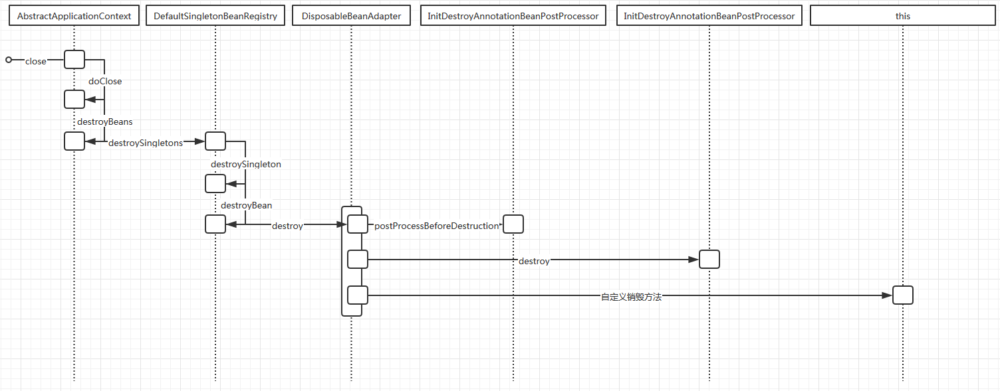

##spring bean的销毁流程

容器关闭方法开始
```text
public void close() {
		synchronized (this.startupShutdownMonitor) {
			doClose();
			// If we registered a JVM shutdown hook, we don't need it anymore now:
			// We've already explicitly closed the context.
			if (this.shutdownHook != null) {
				try {
					Runtime.getRuntime().removeShutdownHook(this.shutdownHook);
				}
				catch (IllegalStateException ex) {
					// ignore - VM is already shutting down
				}
			}
		}
	}
```
```text
protected void doClose() {
	...	
    // Destroy all cached singletons in the context's BeanFactory.
    //这里调用bean的销毁方法
    destroyBeans();
    ...
}
```
```text
protected void destroyBeans() {
    getBeanFactory().destroySingletons();
}
```
这里需要注意的是在创建bean的实例时，已经在初始化之后将bean的实例注册调销毁容器中去了
```text
public void destroySingletons() {
    if (logger.isTraceEnabled()) {
        logger.trace("Destroying singletons in " + this);
    }
    synchronized (this.singletonObjects) {
        this.singletonsCurrentlyInDestruction = true;
    }

    String[] disposableBeanNames;
    synchronized (this.disposableBeans) {
        disposableBeanNames = StringUtils.toStringArray(this.disposableBeans.keySet());
    }
    //调用bean的销毁方法
    for (int i = disposableBeanNames.length - 1; i >= 0; i--) {
        destroySingleton(disposableBeanNames[i]);
    }

    this.containedBeanMap.clear();
    this.dependentBeanMap.clear();
    this.dependenciesForBeanMap.clear();

    clearSingletonCache();
}
```
创建bean时注册需要销毁的bean及回调方法
```text
protected void registerDisposableBeanIfNecessary(String beanName, Object bean, RootBeanDefinition mbd) {
    AccessControlContext acc = (System.getSecurityManager() != null ? getAccessControlContext() : null);
    if (!mbd.isPrototype() && requiresDestruction(bean, mbd)) {
        if (mbd.isSingleton()) {
            // Register a DisposableBean implementation that performs all destruction
            // work for the given bean: DestructionAwareBeanPostProcessors,
            // DisposableBean interface, custom destroy method.
            //单例模式下注册需要销毁的bean，此方法中会处理实现DisposableBean的bean,并且对所有的bean使用
            //DestructionAwareBeanPostProcessors处型DisposableBean DestructionAwareBeanPostProcessors
            registerDisposableBean(beanName,
                    new DisposableBeanAdapter(bean, beanName, mbd, getBeanPostProcessors(), acc));
        }
        else {
            // A bean with a custom scope...
            //自定义scope 的处理
            Scope scope = this.scopes.get(mbd.getScope());
            if (scope == null) {
                throw new IllegalStateException("No Scope registered for scope name '" + mbd.getScope() + "'");
            }
            scope.registerDestructionCallback(beanName,
                    new DisposableBeanAdapter(bean, beanName, mbd, getBeanPostProcessors(), acc));
        }
    }
}
```
开始执行销毁bean的流程
```text
public void destroySingleton(String beanName) {
    // Remove a registered singleton of the given name, if any.
    removeSingleton(beanName);

    // Destroy the corresponding DisposableBean instance.
    //注册的需要销毁的bean
    DisposableBean disposableBean;
    synchronized (this.disposableBeans) {
        disposableBean = (DisposableBean) this.disposableBeans.remove(beanName);
    }
    destroyBean(beanName, disposableBean);
}
```
```text
protected void destroyBean(String beanName, @Nullable DisposableBean bean) {
    // Trigger destruction of dependent beans first...
    Set<String> dependencies;
    synchronized (this.dependentBeanMap) {
        // Within full synchronization in order to guarantee a disconnected Set
        dependencies = this.dependentBeanMap.remove(beanName);
    }
    if (dependencies != null) {
        if (logger.isTraceEnabled()) {
            logger.trace("Retrieved dependent beans for bean '" + beanName + "': " + dependencies);
        }
        for (String dependentBeanName : dependencies) {
            destroySingleton(dependentBeanName);
        }
    }

    // Actually destroy the bean now...
    if (bean != null) {
        try {
            //执行bean的销毁方法
            bean.destroy();
        }
        catch (Throwable ex) {
            if (logger.isWarnEnabled()) {
                logger.warn("Destruction of bean with name '" + beanName + "' threw an exception", ex);
            }
        }
    }

    // Trigger destruction of contained beans...
    Set<String> containedBeans;
    synchronized (this.containedBeanMap) {
        // Within full synchronization in order to guarantee a disconnected Set
        containedBeans = this.containedBeanMap.remove(beanName);
    }
    if (containedBeans != null) {
        for (String containedBeanName : containedBeans) {
            destroySingleton(containedBeanName);
        }
    }

    // Remove destroyed bean from other beans' dependencies.
    synchronized (this.dependentBeanMap) {
        for (Iterator<Map.Entry<String, Set<String>>> it = this.dependentBeanMap.entrySet().iterator(); it.hasNext();) {
            Map.Entry<String, Set<String>> entry = it.next();
            Set<String> dependenciesToClean = entry.getValue();
            dependenciesToClean.remove(beanName);
            if (dependenciesToClean.isEmpty()) {
                it.remove();
            }
        }
    }

    // Remove destroyed bean's prepared dependency information.
    this.dependenciesForBeanMap.remove(beanName);
}
```
```text
public void destroy() {
    if (!CollectionUtils.isEmpty(this.beanPostProcessors)) {
        for (DestructionAwareBeanPostProcessor processor : this.beanPostProcessors) {
            processor.postProcessBeforeDestruction(this.bean, this.beanName);
        }
    }
    
    //如果bean实现了DisposableBean接口，则需要调用接口的destroy()方法
    if (this.invokeDisposableBean) {
        if (logger.isTraceEnabled()) {
            logger.trace("Invoking destroy() on bean with name '" + this.beanName + "'");
        }
        try {
            if (System.getSecurityManager() != null) {
                AccessController.doPrivileged((PrivilegedExceptionAction<Object>) () -> {
                    ((DisposableBean) this.bean).destroy();
                    return null;
                }, this.acc);
            }
            else {
                ((DisposableBean) this.bean).destroy();
            }
        }
        catch (Throwable ex) {
            String msg = "Invocation of destroy method failed on bean with name '" + this.beanName + "'";
            if (logger.isDebugEnabled()) {
                logger.warn(msg, ex);
            }
            else {
                logger.warn(msg + ": " + ex);
            }
        }
    }

    //调用自定义的方法
    if (this.destroyMethod != null) {
        invokeCustomDestroyMethod(this.destroyMethod);
    }
    else if (this.destroyMethodName != null) {
        Method methodToInvoke = determineDestroyMethod(this.destroyMethodName);
        if (methodToInvoke != null) {
            invokeCustomDestroyMethod(ClassUtils.getInterfaceMethodIfPossible(methodToInvoke));
        }
    }
}
```
调用注解的销毁方法
```text
public void postProcessBeforeDestruction(Object bean, String beanName) throws BeansException {
    LifecycleMetadata metadata = findLifecycleMetadata(bean.getClass());
    try {
        //调用注解的销毁方法
        metadata.invokeDestroyMethods(bean, beanName);
    }
    catch (InvocationTargetException ex) {
        String msg = "Destroy method on bean with name '" + beanName + "' threw an exception";
        if (logger.isDebugEnabled()) {
            logger.warn(msg, ex.getTargetException());
        }
        else {
            logger.warn(msg + ": " + ex.getTargetException());
        }
    }
    catch (Throwable ex) {
        logger.warn("Failed to invoke destroy method on bean with name '" + beanName + "'", ex);
    }
}
```
从spring bean的初始化和销毁流程可以看出spring调用生命周期回调函数的顺序是
```text
1.spring首先会调用后置处理器处理@PostConstruct和@PreDestroy注解的方法
2.spring其次会调用实现了InitializingBean和DisposableBean接口的方法
3.spring最后才会调用bean的生命周期回调函数中的自定的init()和destroy()方法，名称随意定
```

spring bean的销毁方法调用流程            
 