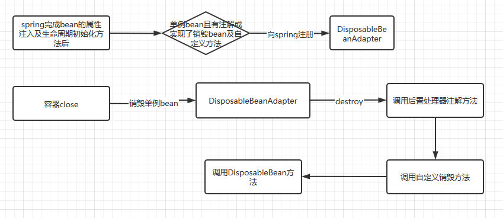
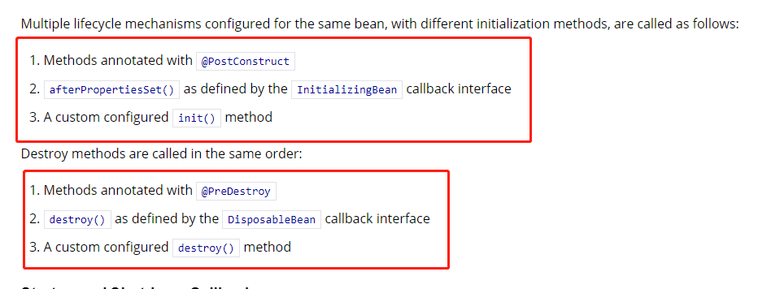

###spring生命周期回调函数

#####bean初始化生命周期函数
- Aware实例       
实现了Aware接口的实例或实现了Aware子接口的实例，如BeanNameAware、BeanClassLoaderAware、BeanFactoryAware

- spring后置处理器 
    1.CommonAnnotationBeanPostProcessor后置处理器    
    主要是处理@PostConstruct和@PreDestroy生命生命周期函数，CommonAnnotationBeanPostProcessor实现了BeanPostProcessor关于bean
    初始化前后的逻辑

    2.ApplicationContextAwareProcessor后置处理器     
    实现了BeanPostProcessor接口的后置处理器实现类，ApplicationContextAwareProcessor在这里处理了诸如EnvironmentAware、
    EmbeddedValueResolverAware、ResourceLoaderAware、ApplicationEventPublisherAware、MessageSourceAware、ApplicationContextAware
    以ApplicationContextAware为例，ApplicationContextAware中有一个setApplicationContext，就是在bean创建的过程中将容器的上下文
    对象设置到当前bean中，以方便该bean实现查找注入等功能。  

    3.需要注意的是CommonAnnotationBeanPostProcessor要先于ApplicationContextAwareProcessor加入集合中，所以基于注解的生命周期方法
    要先于实现接口的方法调用

- 调用InitializingBean实现的afterPropertiesSet方法

- 自定义的初始化方法

#####bean销毁生命周期函数     
  
- CommonAnnotationBeanPostProcessor后置处理器
    CommonAnnotationBeanPostProcessor后置处理器继承自InitDestroyAnnotationBeanPostProcessor后置处理器，定义了关于bean销毁前后的处理逻辑
    
- DisposableBean实现方法

- 自定义的销毁方法

spring销毁的生命周期函数的逻辑主要是DisposableBeanAdapter的逻辑处理
        

