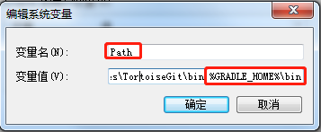

###构建spring源码

#####下载安装gradle 
下载地址:https://gradle.org/releases
解压缩后配置环境变量
GRADLE_HOME D:\tools\gradle-4.3.1   
    

```text
gradle -v
```

到此gradle环境配置成功

#####spring源码下载
- github上下载spring源码


执行命令
```text
gradlew.bat spring-oxm:compileTestJava
```

导入IDEA等待spring编译下载jar包

