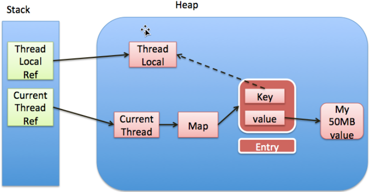

##ThreadLocal原理及内存泄漏分析

####ThreadLocal原理
ThreadLocal提供了线程独有的局部变量，可以在整个线程存活的过程中随时取用，极大地方便了一些逻辑的实现。常见的ThreadLocal用法有：
1.存储单个线程上下文信息。比如存储id等;
2.使变量线程安全。变量既然成为了每个线程内部的局部变量，自然就不会存在并发问题了
3.减少参数传递。比如做一个trace工具，能够输出工程从开始到结束的整个一次处理过程中所有的信息，从而方便debug。由于需要在工程各处随时取用，可放入ThreadLocal

原理：
每个Thread内部都有一个Map，我们每当定义一个ThreadLocal变量，就相当于往这个Map里放了一个key，并定义一个对应的value。每当使用ThreadLocal，就相当于get(key)，寻找其对应的value。
每个Thread都有一个{@link Thread#threadLocals}变量，它就是放k-v的map，类型为{@link java.lang.ThreadLocal.ThreadLocalMap}。这个map的entry是{@link java.lang.ThreadLocal.ThreadLocalMap.Entry}，
具体的key和value类型分别是{@link ThreadLocal}（我们定义ThreadLocal变量就是在定义这个key）和 {@link Object}（我们定义ThreadLocal变量的值就是在定义这个value）。
(注：实际上key是指向ThreadLocal类型变量的弱引用WeakReference<ThreadLocal<?>>，但可以先简单理解为ThreadLocal。)
当设置一个ThreadLocal变量时，这个map里就多了一对ThreadLocal -> Object的映射。


```text
public class ThreadLocalDemo {

    private static final ThreadLocal<Integer> TL_INT = ThreadLocal.withInitial(() -> 6);
    private static final ThreadLocal<String> TL_STRING = ThreadLocal.withInitial(() -> "Hello, world");

    public static void main(String... args) {
	    // 6
        System.out.println(TL_INT.get());
        TL_INT.set(TL_INT.get() + 1);
        // 7
        System.out.println(TL_INT.get());
        TL_INT.remove();
        // 会重新初始化该value，6
        System.out.println(TL_INT.get());
    }
}
```
分析一下其中一个ThreadLocal变量TL_INT在JVM运行时数据区的位置：
1.Stack-ThreadLocalRef：TL_INT，变量的引用，在栈上；
2.Stack-CurrentThreadRef： 当前线程的线程栈，线程私有变量的引用都在线程栈上；
3.Heap-ThreadLocal：TL_INT引用所对应的ThreadLocal实例对象；
4.Heap-Map：当前线程内部的threadLocals变量所对应的map实例；
5.Heap-Entry：上述map的entry；
6.Heap-Entry-Key：上述entry的键的弱引用；
7.Heap-Entry-Value：上述entry的值的强引用
对于上述程序，实际上我们在当前线程的threadlocals这个map里放了如下内容：
```text
1 | TL_INT    -> 6
2 | TL_STRING -> "Hello, world"
```

对于一个普通的map，取其中某个key对应的值分两步：
1.找到这个map；
2.在map中，给出key，得到value。

想取出我们存放在当前线程里的map里的值同样需要这两步。但是，我们不需要告诉jvm map在哪儿，因为jvm知道当前线程，也知道其局部变量map。
所以最终的get操作只需要知道key就行了：int localInt = TL_INT.get();看起来有些奇怪，不同于常规的map的get操作的接口的样子。

为什么key使用弱引用     
不妨反过来想想，如果使用强引用，当ThreadLocal对象（假设为ThreadLocal@123456）的引用（即：TL_INT，是一个强引用，指向ThreadLocal@123456）
被回收了，ThreadLocalMap本身依然还持有ThreadLocal@123456的强引用，如果没有手动删除这个key，则ThreadLocal@123456不会被回收，所以只要当前
线程不消亡，ThreadLocalMap引用的那些对象就不会被回收，可以认为这导致Entry内存泄漏。那使用弱引用的好处呢？如果使用弱引用，那指向ThreadLocal@123456
对象的引用就两个：TL_INT强引用，和ThreadLocalMap中Entry的弱引用。一旦TL_INT被回收，则指向ThreadLocal@123456的就只有弱引用了，在下次gc的时候，这个
ThreadLocal@123456就会被回收。那么问题来了，ThreadLocal@123456对象只是作为ThreadLocalMap的一个key而存在的，现在它被回收了，但是它对应的value并没
有被回收，内存泄露依然存在！而且key被删了之后，变成了null，value更是无法被访问到了！针对这一问题，ThreadLocalMap类的设计本身已经有了这一问题的解
决方案，那就是在每次get()/set()/remove()ThreadLocalMap中的值的时候，会自动清理key为null的value。如此一来，value也能被回收了。既然对key使用弱引用，
能使key自动回收，那为什么不对value使用弱引用？答案显而易见，假设往ThreadLocalMap里存了一个value，gc过后value便消失了，那就无法使用ThreadLocalMap来
达到存储全线程变量的效果了。(但是再次访问该key的时候，依然能取到value，此时取得的value是该value的初始值。即在删除之后，如果再次访问，取到null，会
重新调用初始化方法。)


####ThreadLocal内存泄漏分析
- 案例1
```text
//虚拟机参数-Xms20m -Xmx20m -XX:+PrintGCDetails
public class ThreadLocalDemo {
    private static ThreadLocal<byte[]> local = new ThreadLocal ();
    public static void main(String[] args) throws InterruptedException {
        byte[] arr = new byte[8 * 1024 * 1024];
        local.set (arr);
        arr= null;
        //local.remove ();
        local = null;
        System.out.println ("gc开始工作");
        System.gc ();
        byte[] arr2 = new byte[8 * 1024 * 1024];
        Thread.sleep (2000);
        arr2 = null;
        Thread.sleep (1000);
        System.out.println ("gc开始工作");
        System.gc ();
    }
}
```
```text
gc开始工作
[GC (System.gc()) [PSYoungGen: 2020K->488K(6144K)] 10212K->8840K(19968K), 0.0099056 secs] [Times: user=0.00 sys=0.00, real=0.01 secs] 
[Full GC (System.gc()) [PSYoungGen: 488K->0K(6144K)] [ParOldGen: 8352K->8822K(13824K)] 8840K->8822K(19968K), [Metaspace: 3431K->3431K(1056768K)], 0.0153899 secs] [Times: user=0.01 sys=0.02, real=0.02 secs] 
[GC (Allocation Failure) [PSYoungGen: 0K->0K(6144K)] 8822K->8822K(19968K), 0.0003622 secs] [Times: user=0.00 sys=0.00, real=0.00 secs] 
[GC (Allocation Failure) [PSYoungGen: 0K->0K(6144K)] 8822K->8822K(19968K), 0.1324747 secs] [Times: user=0.22 sys=0.00, real=0.13 secs] 
[Full GC (Allocation Failure) [PSYoungGen: 0K->0K(6144K)] [ParOldGen: 8822K->8821K(13824K)] 8822K->8821K(19968K), [Metaspace: 3433K->3433K(1056768K)], 0.0046545 secs] [Times: user=0.05 sys=0.00, real=0.00 secs] 
[GC (Allocation Failure) [PSYoungGen: 0K->0K(6144K)] 8821K->8821K(19968K), 0.0002111 secs] [Times: user=0.00 sys=0.00, real=0.00 secs] 
[Full GC (Allocation Failure) [PSYoungGen: 0K->0K(6144K)] [ParOldGen: 8821K->8804K(13824K)] 8821K->8804K(19968K), [Metaspace: 3433K->3433K(1056768K)], 0.0057124 secs] [Times: user=0.00 sys=0.00, real=0.01 secs] 
Exception in thread "main" java.lang.OutOfMemoryError: Java heap space
	at thread.demo.ThreadLocalDemo.main(ThreadLocalDemo.java:20)
Heap
 PSYoungGen      total 6144K, used 281K [0x00000000ff980000, 0x0000000100000000, 0x0000000100000000)
  eden space 5632K, 5% used [0x00000000ff980000,0x00000000ff9c67f8,0x00000000fff00000)
  from space 512K, 0% used [0x00000000fff80000,0x00000000fff80000,0x0000000100000000)
  to   space 512K, 0% used [0x00000000fff00000,0x00000000fff00000,0x00000000fff80000)
 ParOldGen       total 13824K, used 8804K [0x00000000fec00000, 0x00000000ff980000, 0x00000000ff980000)
  object space 13824K, 63% used [0x00000000fec00000,0x00000000ff4990d8,0x00000000ff980000)
 Metaspace       used 3499K, capacity 4498K, committed 4864K, reserved 1056768K
  class space    used 388K, capacity 390K, committed 512K, reserved 1048576K

Process finished with exit code 1
```

- 案例2
```text
//虚拟机参数-Xms20m -Xmx20m -XX:+PrintGCDetails
public class ThreadLocalDemo {
    private static ThreadLocal<byte[]> local = new ThreadLocal ();
    public static void main(String[] args) throws InterruptedException {
        byte[] arr = new byte[8 * 1024 * 1024];
        local.set (arr);
        arr= null;
        local.remove ();
        local = null;
        System.out.println ("gc开始工作");
        System.gc ();
        byte[] arr2 = new byte[8 * 1024 * 1024];
        Thread.sleep (2000);
        arr2 = null;
        Thread.sleep (1000);
        System.out.println ("gc开始工作");
        System.gc ();
    }
}
```
```text
gc开始工作
[GC (System.gc()) [PSYoungGen: 2142K->488K(6144K)] 10334K->8888K(19968K), 0.0011862 secs] [Times: user=0.00 sys=0.00, real=0.00 secs] 
[Full GC (System.gc()) [PSYoungGen: 488K->0K(6144K)] [ParOldGen: 8400K->659K(13824K)] 8888K->659K(19968K), [Metaspace: 3489K->3489K(1056768K)], 0.0084162 secs] [Times: user=0.03 sys=0.00, real=0.01 secs] 
gc开始工作
[GC (System.gc()) [PSYoungGen: 1004K->448K(6144K)] 9855K->9307K(19968K), 0.0010698 secs] [Times: user=0.00 sys=0.00, real=0.00 secs] 
[Full GC (System.gc()) [PSYoungGen: 448K->0K(6144K)] [ParOldGen: 8859K->985K(13824K)] 9307K->985K(19968K), [Metaspace: 3987K->3987K(1056768K)], 0.0128897 secs] [Times: user=0.02 sys=0.00, real=0.01 secs] 
Heap
 PSYoungGen      total 6144K, used 169K [0x00000000ff980000, 0x0000000100000000, 0x0000000100000000)
  eden space 5632K, 3% used [0x00000000ff980000,0x00000000ff9aa558,0x00000000fff00000)
  from space 512K, 0% used [0x00000000fff80000,0x00000000fff80000,0x0000000100000000)
  to   space 512K, 0% used [0x00000000fff00000,0x00000000fff00000,0x00000000fff80000)
 ParOldGen       total 13824K, used 985K [0x00000000fec00000, 0x00000000ff980000, 0x00000000ff980000)
  object space 13824K, 7% used [0x00000000fec00000,0x00000000fecf6618,0x00000000ff980000)
 Metaspace       used 3993K, capacity 4568K, committed 4864K, reserved 1056768K
  class space    used 447K, capacity 460K, committed 512K, reserved 1048576K

Process finished with exit code 0
```

- remove、get、set源码分析
```text
private void remove(ThreadLocal<?> key) {
    Entry[] tab = table;
    int len = tab.length;
    int i = key.threadLocalHashCode & (len-1);
    for (Entry e = tab[i];
         e != null;
         e = tab[i = nextIndex(i, len)]) {
        if (e.get() == key) {
            e.clear();//将Entry的key指向null 针对key进行gc处理
            expungeStaleEntry(i);
            return;
        }
    }
}
```
```text
 private int expungeStaleEntry(int staleSlot) {
    Entry[] tab = table;
    int len = tab.length;

    // expunge entry at staleSlot
    tab[staleSlot].value = null;
    tab[staleSlot] = null;
    size--;

    // Rehash until we encounter null
    Entry e;
    int i;
    for (i = nextIndex(staleSlot, len);
         (e = tab[i]) != null;
         i = nextIndex(i, len)) {
        ThreadLocal<?> k = e.get();
        if (k == null) {//当前数组下的Entry的key为null 则需要将Entry的value同步指向null gc垃圾回收避免内存溢出
            e.value = null;
            tab[i] = null;
            size--;
        } else {
            int h = k.threadLocalHashCode & (len - 1);
            if (h != i) {
                tab[i] = null;

                // Unlike Knuth 6.4 Algorithm R, we must scan until
                // null because multiple entries could have been stale.
                while (tab[h] != null)
                    h = nextIndex(h, len);
                tab[h] = e;
            }
        }
    }
    return i;
}
```
```text
private void set(ThreadLocal<?> key, Object value) {

    // We don't use a fast path as with get() because it is at
    // least as common to use set() to create new entries as
    // it is to replace existing ones, in which case, a fast
    // path would fail more often than not.

    Entry[] tab = table;
    int len = tab.length;
    int i = key.threadLocalHashCode & (len-1);

    for (Entry e = tab[i];
         e != null;
         e = tab[i = nextIndex(i, len)]) {
        ThreadLocal<?> k = e.get();

        if (k == key) {
            e.value = value;
            return;
        }

        if (k == null) {
            replaceStaleEntry(key, value, i);
            return;
        }
    }

    tab[i] = new Entry(key, value);
    int sz = ++size;
    if (!cleanSomeSlots(i, sz) && sz >= threshold)//执行清理操作
        rehash();
}
```
```text
private boolean cleanSomeSlots(int i, int n) {
    boolean removed = false;
    Entry[] tab = table;
    int len = tab.length;
    do {
        i = nextIndex(i, len);
        Entry e = tab[i];
        if (e != null && e.get() == null) {
            n = len;
            removed = true;
            i = expungeStaleEntry(i);//执行清理操作
        }
    } while ( (n >>>= 1) != 0);
    return removed;
}
```
```text
private Entry getEntry(ThreadLocal<?> key) {
    int i = key.threadLocalHashCode & (table.length - 1);
    Entry e = table[i];
    if (e != null && e.get() == key)
        return e;
    else
        return getEntryAfterMiss(key, i, e);
}
```
```text
private Entry getEntryAfterMiss(ThreadLocal<?> key, int i, Entry e) {
    Entry[] tab = table;
    int len = tab.length;

    while (e != null) {
        ThreadLocal<?> k = e.get();
        if (k == key)
            return e;
        if (k == null)
            expungeStaleEntry(i);//执行清理操作
        else
            i = nextIndex(i, len);
        e = tab[i];
    }
    return null;
}
```
出现内存溢出的原因分析
```text
class Thread{
    ThreadLocal.ThreadLocalMap inheritableThreadLocals = null;
}
```
```text
static class ThreadLocalMap {
    private Entry[] table;
    /**
     * The entries in this hash map extend WeakReference, using
     * its main ref field as the key (which is always a
     * ThreadLocal object).  Note that null keys (i.e. entry.get()
     * == null) mean that the key is no longer referenced, so the
     * entry can be expunged from table.  Such entries are referred to
     * as "stale entries" in the code that follows.
     */
    static class Entry extends WeakReference<ThreadLocal<?>> {
        /** The value associated with this ThreadLocal. */
        Object value;

        Entry(ThreadLocal<?> k, Object v) {
            super(k);
            value = v;
        }
    }
}
```
ThreadLocal自身并不储存值，而是作为一个key来让线程从ThreadLocal获取value。Entry是中的key是弱引用，所以jvm在垃圾回收时如果
外部没有强引用来引用它，ThreadLocal必然会被回收。但是，作为ThreadLocalMap的key，ThreadLocal被回收后，ThreadLocalMap就会存
在null，但value不为null的Entry。若当前线程一直不结束，可能是作为线程池中的一员，线程结束后不被销毁，或者分配（当前线程又
创建了ThreadLocal对象）使用了又不再调用get/set方法，就可能引发内存泄漏。其次，就算线程结束了，操作系统在回收线程或进程的
时候不是一定杀死线程或进程的，在繁忙的时候，只会清除线程或进程数据的操作，重复使用线程或进程（线程id可能不变导致内存泄漏）
。因此，key弱引用并不是导致内存泄漏的原因，而是因为ThreadLocalMap的生命周期与当前线程一样长，并且没有手动删除对应key。

原因总结：当ThreadLocal被回收后，作为线程的成员变量ThreadLocalMap并不会被回收，但是作为ThreadLocalMap的key，ThreadLocal被
回收后，就会出现Entry中key为null但value仍然有可能是强引用对象，这个value是我们在调用ThreadLocal的set方法设置的，如果set的
value是强引用对象，那么在整个线程活动期间，该对象就不可能被垃圾回收，尽管Entry中key为null，这样就会造成系统内存泄漏的风险。

从源码上分析remove、set、get方法都有对Entry中key为null的清理动作，从而保证了避免内存溢出的情况
```text
if (k == null) {//当前数组下的Entry的key为null 则需要将Entry的value同步指向null gc垃圾回收避免内存溢出
    e.value = null;//将Entry的value的强引用断开，让GCroot不可达，从而下次gc时被垃圾回收
    tab[i] = null;
    size--;
}
```
