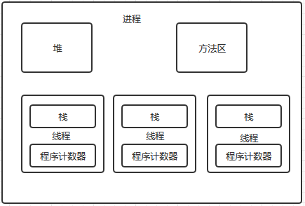
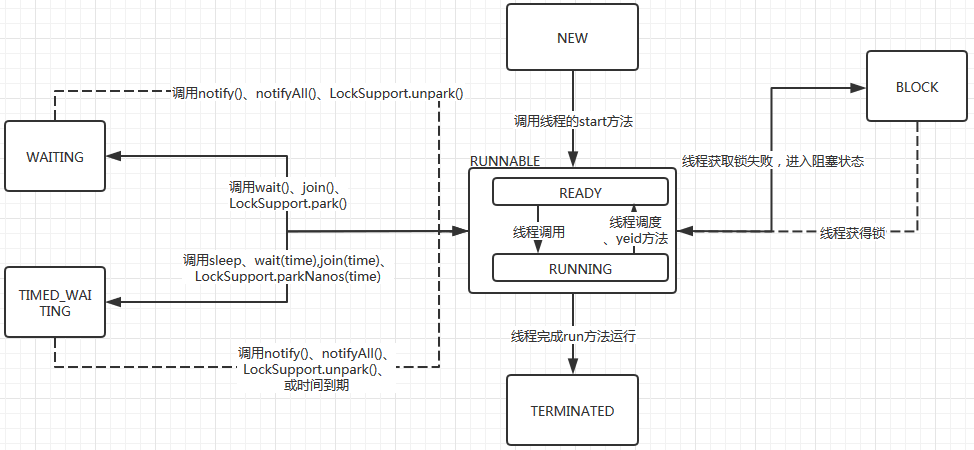

##Java并发编程相关

####Java并发编程基础

1.线程进程的概念
1.1什么是线程，什么是进程      
    
对操作系统资源而言，进程是系统资源分配的最小单元，但对CPU而言，线程是CPU时间分配的最小单位。一个进程至少有一个线程，多个线程共享线程内的资源，
同时也有自己独立的资源，这些资源是不能被其他线程访问的。
    
2.线程的六种状态
NEW、RUNNABLE、BLOCK、WAITING、TIMED_WAITING、TERMINATED     
        
六种状态之间的相互转换示意图          
        
          
 
3.多线程中的常用的几种方法的说明
3.1wait()、wait(time)\notify()、notifyAll()
    这一组方法，主要是线程获取锁之后，由于条件不满足而进入等待状态，需要注意的是wait方法会释放到线程持有的锁资源，notify
    是唤醒因wait方法而进入等待状态的线程，这种唤醒是随机的，并不具备公平性。notifyAll是唤醒所有因为调用监视器的wait方法而
    进入等待状态的线程。这里需要注意的是防止线程虚假唤醒，因此线程进入等待的条件必须是在循环中进行的。
```text
synchronized(object){
    while(条件不成立){
        object.wait();
    }
}
```   
3.2sleep()、sleep(time)
3.3join
    该方法的调用，会使调用该方法所在的线程阻塞，直到调用该方法的线程结束运行为止
```text
    Thread threadA = new Thread("AA",()->{
        for(;;){}
    });
    threadA.start();
    
    threadA.join()//主线程阻塞，等待threadA线程结束运行为止
    
```
3.4stop、suspend、resume等方法
    这几个方法现在已经申明为废弃的方法，不推荐使用，原因在于其会导致一些线程安全问题，详细的见
    /../technotes/guides/concurrency/threadPrimitiveDeprecation.html
需要注意的是wait、sleep、join等方法都会抛出InterruptedException，原因见线程的阻塞和唤醒机制说明
4.实现多线程的几种方式
4.1继承Thread类
4.2实现Runnable接口
4.3实现Callable接口，并结合FutureTask类
4.4线程池

5线程的阻塞和唤醒机制说明
5.1如何优雅的退出线程
5.1.1利用volatile关键字
```text
public class MyThread implements Runnable{
    public void volatile boolean isFlag = false;
    
    public void stop(){
        isFlag = true;
    }
    
    public void run(){
        while(!isFlag){
        }
    }
}
```
5.1.2利用线程本身提供的interrupt(),需要注意的是该方法对处于NEW、TERMINATED状态下的线程无效
```text
public class MyThread extends Thread{
    public static void main(String[] args) throws Exception{
        Thread threadA = new Thread("AA",()->{
            while(!Thread.isInterrupted()){
            }
            System.out.println("当前线程已终止");
        });
        
        threadA.stat();
        
        Thread.sleep(2000);
        
        threadA.interrupt();
        
        System.out.println(threadA.getName()+"当前线程的终止状态："+threadA.isInterrupted());
    }
}
```
5.1.3利用InterruptedException
```text
public class MyThread extends Thread{
    public static void main(Sting[] args) throws Exception{
        Thread threadA = new Thread("AA",()->{
            try{
                Thread.sleep(20000);
            }catch(Exception e){
                e.printStackTrace();
            }
            System.out.println("当前线程已终止");
        });
        
        threadA.start();
        Thread.sleep(2000);
        threadA.interrupt();
    }
}
```
注意这里绝对不推荐使用stop等方式退出线程
5.2线程的阻塞和唤醒机制
这里主要是说明interrupt()、interrupted()、isInterrupted()方法，为什么wait、sleep、join等方法都会抛出InterruptedException，
是因为当一个线程因为调用这些方法进入等待状态后，我们可以通过调用interrupt()方法来让处于等待状态的线程，重新进入RUNNABLE状态
激活该线程并进入执行状态，这是JDK提供给我们的一种方式，而抛出这种异常的目的就是一种显示的提醒，表示该线程曾经收到过中断请求，
但并不意味着该线程就会中断运行，线程仍然会继续执行。
interrupt()方法会让处于等待状态的线程再次被激活，isInterrupted()方法探测调用该方法的线程当前是否收到过中断请求，如果调用过
interrupt()方法则其返回值就是true，需要注意多次调用isInterrupted()方法并不会对该线程的中断标志进行复位
interrupted()需要特别注意，该方法并非是调用线程，而调用该方法所在的当前线程是否收到过中断请求，如果收到过，会同时将中断请
求复位，这一点一定需要多加注意
```text
public static boolean interrupted() {
    return currentThread().isInterrupted(true);
}
```
关于这部分的内容可以参考《Java并发编程之美》